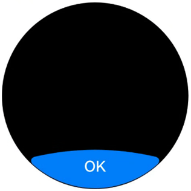
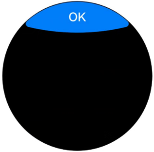

# ArkUI使用文本控件指南文档示例

### 介绍

本示例通过使用[ArkUI指南文档](https://gitcode.com/openharmony/docs/tree/master/zh-cn/application-dev/ui)中各场景的开发示例，展示在工程中，帮助开发者更好地理解ArkUI提供的弧形组件及组件属性并合理使用。该工程中展示的代码详细描述可查链接：[弧形按钮 (arcbutton)](https://gitcode.com/openharmony/docs/blob/master/zh-cn/application-dev/ui/arkts-advanced-components-arcbutton.md)。
### 效果预览

| 下弧形按钮效果                      | 上弧形按钮效果                     |
|----------------------------------|----------------------------------|
|  |  |

### 使用说明

1. 在主界面，可以点击对应卡片，选择需要参考的组件示例。

3. 进入示例界面，查看参考示例。

4. 通过自动测试框架可进行测试及维护。

### 工程目录
```
entry/src/main/ets/
|---entryability
|---pages
|   |---ButtonAlignBottom.ets
|   |---ButtonAlignTop.ets
|   |---ButtonBcgColor.ets
|   |---ButtonBrightness.ets
|   |---ButtonFontColor.ets
|   |---ButtonShadow.ets 
|   |---Index.ets                      // 应用主页面
entry/src/ohosTest/
|---ets
|   |---index.test.ets                 // 示例代码测试代码
```
### 具体实现
实现了弧形按钮使用用例，包含亮度值显示、滑动调节滑块和重置按钮。以下是详细实现过程：
1. 数据定义
   在结构体BrightnessPage中定义了两个核心数据：
   @Local brightnessValue: number = 30：用@Local装饰器声明的本地状态变量，记录当前亮度值，初始值为 30（单位：%）。
   private defaultBrightnessValue: number = 50：私有变量，存储默认亮度值（50%），用于重置功能。
2. 布局容器
   使用RelativeContainer作为根容器，通过对齐规则（alignRules） 管理子组件的位置关系，特点是：
   容器尺寸设置为width('100%')和height('100%')，占满整个父容器。
   背景色设为Color.Black（黑色），形成深色主题。
3. 子组件实现
   （1）标题文本（Text）
   显示内容：$r('app.string.Brightness')，通过资源管理器引用字符串资源（“亮度”）。
   样式：白色字体（Color.White）、字号 24、顶部外边距 16px。
   位置：通过alignRules设置水平居中（middle对齐容器的HorizontalAlign.Center）。
   （2）亮度值显示文本（Text）
   显示内容：${this.brightnessValue} %，动态展示当前亮度值（如 “30 %”）。
   样式：白色字体、左侧外边距 16px。
   位置：
   start对齐容器的HorizontalAlign.Start（左对齐容器左侧）。
   center对齐容器的VerticalAlign.Center（垂直居中于容器）。
   （3）亮度调节滑块（Slider）
   核心配置：
   value: this.brightnessValue：滑块当前值绑定到brightnessValue。
   min: 0、max: 100：调节范围 0~100（对应亮度百分比）。
   style: SliderStyle.InSet：滑块样式为内嵌模式（通常用于紧凑布局）。
   样式：
   滑块轨道未选中部分：trackColor('#ADD8E6')（浅蓝色）。
   选中部分：selectedColor('#4169E1')（皇家蓝）。
   滑块按钮：blockColor('#191970')（深靛蓝）。
   宽度 150px，左右外边距 16px。
   交互：onChange事件监听滑块值变化，实时更新brightnessValue（双向绑定）。
   位置：
   center对齐亮度文本（id_brightness_min_text）的垂直中心。
   start对齐亮度文本的右侧（HorizontalAlign.End），即滑块紧接在文本右侧。
   （4）重置按钮（ArcButton）
   配置：通过ArcButtonOptions设置弧形按钮属性：
   文本：$r('app.string.Reset')（引用 “重置” 字符串资源）。
   样式：styleMode: ArcButtonStyleMode.EMPHASIZED_LIGHT（高亮浅色模式，适合深色背景）。
   字号：19fp（基于字体像素的自适应单位）。
   点击事件：onClick回调中将brightnessValue重置为defaultBrightnessValue（50%）。
   位置：
   middle对齐容器水平中心（水平居中）。
   bottom对齐容器底部（垂直靠下）。
4. 整体效果
   页面呈现一个深色背景的亮度调节界面：
   顶部居中显示 “亮度” 标题。
   中间左侧显示当前亮度值（如 “30 %”），右侧紧接一个滑块，可拖动调节亮度（0~100%），滑块值实时同步到文本。
   底部居中显示 “重置” 按钮，点击后亮度值恢复为 50%。

### 相关权限

不涉及。

### 依赖

不涉及。

### 约束与限制

1.本示例仅支持标准系统上运行, 支持设备：RK3568。

2.本示例为Stage模型，支持API21版本SDK，版本号：6.0.0.254，镜像版本号：OpenHarmony_5.0.2.57。

3.本示例需要使用DevEco Studio NEXT Developer Preview2 (Build Version: 5.0.5.306， built on December 12, 2024)及以上版本才可编译运行。

### 下载

如需单独下载本工程，执行如下命令：

````
git init
git config core.sparsecheckout true
echo code/DocsSample/ArkUISample/ButtonComponent > .git/info/sparse-checkout
git remote add origin https://gitcode.com/openharmony/applications_app_samples.git
git pull origin master
````