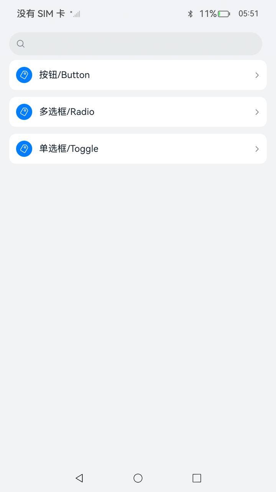
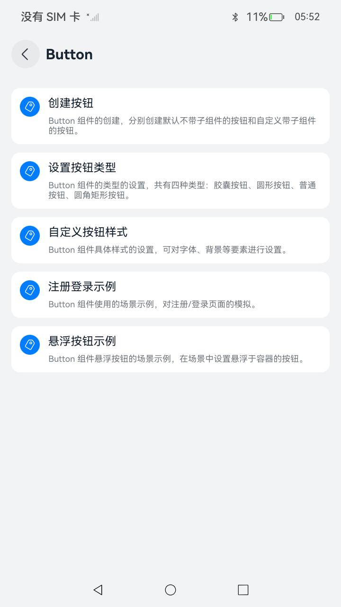
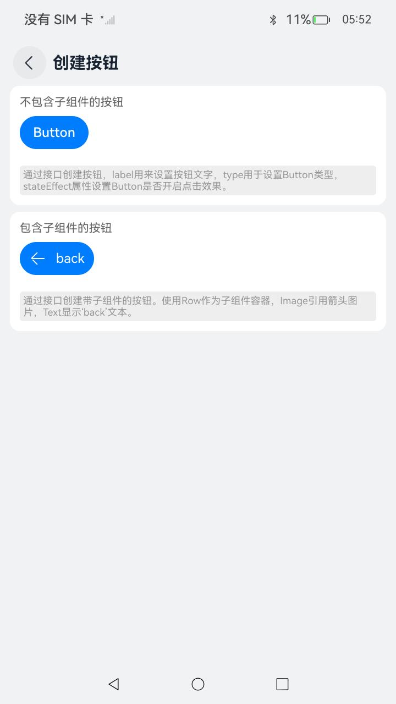

# ArkUI表单与选择组件指南文档示例

### 介绍

本示例通过使用[ArkUI指南文档](https://gitcode.com/openharmony/docs/tree/master/zh-cn/application-dev/ui)中各场景的开发示例，展示在工程中，帮助开发者更好地理解ArkUI提供的组件及组件属性并合理使用。该工程中展示的代码详细描述可查如下链接：

1. [按钮 (Button)](https://gitcode.com/openharmony/docs/blob/master/zh-cn/application-dev/ui/arkts-common-components-button.md)。
2. [单选框 (Radio)](https://gitcode.com/openharmony/docs/blob/master/zh-cn/application-dev/ui/arkts-common-components-radio-button.md)。
3. [切换按钮 (Toggle)](https://gitcode.com/openharmony/docs/blob/master/zh-cn/application-dev/ui/arkts-common-components-switch.md)。

### 效果预览

| 首页                                 | 按钮组件目录                             | 创建按钮场景示例                           |
|------------------------------------|------------------------------------|------------------------------------|
|  |  |  |

### 使用说明

1. 在主界面，可以点击对应卡片，选择需要参考的组件示例。

2. 在组件目录选择详细的示例参考。

3. 进入示例界面，查看参考示例。

4. 通过自动测试框架可进行测试及维护。

### 工程目录
```
entry/src/main/ets/
|---entryability
|---pages
|     |---button
|     |      |---ButtionCase1.ets                       // 按钮创建示例代码
|     |      |---ButtionCase2.ets                       // 按钮创建示例代码
|     |      |---CreateButton.ets                       // 按钮创建示例代码
|     |      |---ButtonCustomStyle.ets                  // 按钮自定义示例代码
|     |      |---FloatingButton.ets                       // 按钮悬浮场景示例代码
|     |      |---HoverButtonExample.ets                 // 按钮悬浮场景示例代码
|     |      |---Index.ets                           // 第二层级目录
|     |      |---SetButtonType.ets                       // 按钮类型设置示例代码
|     |      |---SubmitForm.ets                       // 按钮注册场景示例代码
|     |---radio
|     |      |---RadioButton.ets                         // 2个单选框场景示例代码
|     |      |---RadioSample.ets                         // 单选框场景示例代码
|     |      |---Index.ets                           // 第二层级目录
|     |---toggle
|     |      |---CreateToggle.ets                       // 切换按钮创建示例代码
|     |      |---ToggleCustomStyle.ets              // 切换按钮自定义示例代码
|     |      |---ToggleCaseExample.ets                       // 切换按钮场景示例代码
|     |      |---Index.ets                           // 第二层级目录
|---pages
|   |---Index.ets                       // 应用主页面
entry/src/ohosTest/
|---ets
|   |---index.test.ets                       // 示例代码测试代码
```

## 具体实现

1. 按钮 (Button)

   * Button是按钮组件，通常用于响应用户的点击操作，其类型包括胶囊按钮、圆形按钮、普通按钮、圆角矩形按钮。Button作为容器使用时可以通过添加子组件实现包含文字、图片等元素的按钮。
   * Button通过调用接口来创建，接口调用有两种形式，第一种通过label和ButtonOptions创建不包含子组件的按钮，第二种通过ButtonOptions创建包含子组件的按钮。
   * 设置按钮类型：Button有四种可选类型，分别为胶囊类型（Capsule）、圆形按钮（Circle）、普通按钮（Normal）和圆角矩形按钮（ROUNDED_RECTANGLE），通过type进行设置。

2. 单选框 (Radio)

   * Radio是单选框组件，通常用于提供相应的用户交互选择项，同一组的Radio中只有一个可以被选中。
   * Radio通过调用RadioOptions来创建，Radio支持设置选中状态和非选中状态的样式。
   * Radio添加事件：除支持通用事件外，Radio还用于选中后触发某些操作，可以绑定onChange事件来响应选中操作后的自定义行为。

3. 切换按钮 (Toggle)

   * Toggle组件提供状态按钮样式、勾选框样式和开关样式，一般用于两种状态之间的切换。
   * Toggle通过调用ToggleOptions来创建，其对应接口描述是“Toggle(options: { type: ToggleType, isOn?: boolean })”。接口调用有两种形式，第一种是创建不包含子组件的Toggle，当ToggleType为Checkbox或者Switch时，用于创建不包含子组件的Toggle，第二种是创建包含子组件的Toggle，当ToggleType为Button时，只能包含一个子组件，如果子组件有文本设置，则相应的文本内容会显示在按钮上。
   * Toggle自定义样式：通过selectedColor属性设置Toggle打开选中后的背景颜色。

### 相关权限

不涉及。

### 依赖

不涉及。

### 约束与限制

1.本示例仅支持标准系统上运行, 支持设备：RK3568。

2.本示例为Stage模型，支持API20版本SDK，版本号：6.0.0.47，镜像版本号：OpenHarmony_6.0.0 Release。

3.本示例需要使用DevEco Studio 6.0.0 Release (Build Version: 6.0.0.858, built on September 24, 2025)及以上版本才可编译运行。

4.测试用例运行时候需要将时间限制设置大于150。

### 下载

如需单独下载本工程，执行如下命令：

````
git init
git config core.sparsecheckout true
echo code/DocsSample/ArkUISample/ChooseComponent > .git/info/sparse-checkout
git remote add origin https://gitcode.com/openharmony/applications_app_samples.git
git pull origin master
````