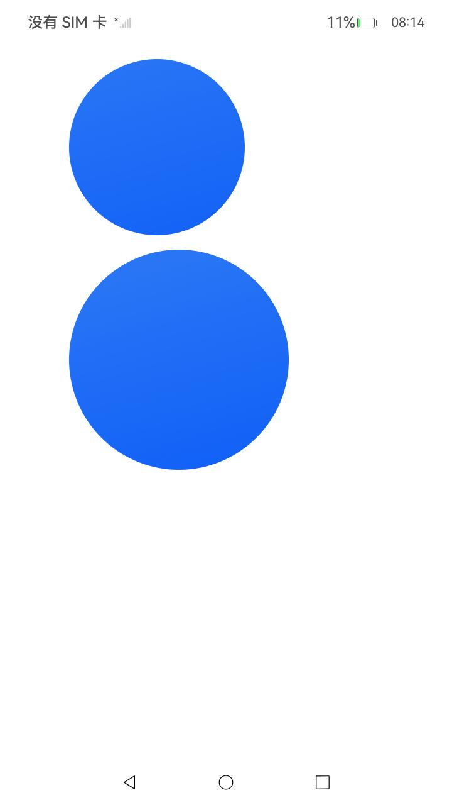

# ArkUI使用形状裁剪（clipShape）指南文档示例

### 介绍


本示例通过使用[ArkUI指南文档](https://gitcode.com/openharmony/docs/tree/master/zh-cn/application-dev/ui)中各场景的开发示例，展示在工程中，帮助开发者更好地理解ArkUI提供的组件及组件属性并合理使用。该工程中展示的代码详细描述可查如下链接：

1.[线性布局 (Column)](https://gitcode.com/openharmony/docs/blob/OpenHarmony-5.0.1-Release/zh-cn/application-dev/ui/arkts-layout-development-linear.md)。
2.[图片](https://docs.openharmony.cn/pages/v4.1/en/application-dev/reference/apis-arkui/arkui-ts/ts-basic-components-image.md)
3.[形状裁剪](https://docs.openharmony.cn/pages/v5.1/zh-cn/application-dev/reference/apis-arkui/arkui-ts/ts-universal-attributes-sharp-clipping.md)

| 裁剪圆形                                | 裁剪椭圆形                               | 裁剪矩形                                | 裁剪不规则形状                          |
|------------------------------------|-------------------------------------|-------------------------------------|------------------------------------|
|  |  |  |


### 具体实现
1. 基本功能与原理
   核心作用：将组件裁剪为指定形状，保留形状覆盖部分，移除其余部分
   工作机制：通过 clipShape 接口设置裁剪形状，裁剪形状本身不可见
   适用范围：可用于任何可视化组件，如 Image、Text、Column 等
   主要优势：简化复杂形状实现，提高渲染性能，支持动态形状变化
2. 支持的形状类型
   圆形 (CircleShape)：
   参数：width、height（直径）
   示例：new CircleShape({ width: '280px', height: '280px' })
   椭圆形 (EllipseShape)：
   参数：width（长轴）、height（短轴）
   示例：new EllipseShape({ width: '280px', height: '200px' })
   矩形 (RectShape)：
   参数：width、height
   示例：new RectShapeShape({ width: '200px', height: '200px' })
   自定义路径 (PathShape)：
   参数：commands（SVG 路径命令）
   示例：new PathShape({ commands: 'M0 0 H400 V200 H0 Z' })
3. 使用方式与代码示例
   基本语法：
   Component()
   .clipShape(shapeInstance)
   .width('xxx')
   .height('xxx')
   图片圆形裁剪示例：
   import { CircleShape } from '@kit.ArkUI';

Image($r('app.media.background'))
.clipShape(new CircleShape({ width: '280px', height: '280px' }))
.width('500px').height('280px')

```
ClipShape
├─ AppScope
│  ├─ app.json5
│  └─ resources
│     └─ base
│        ├─ element
│        │  └─ string.json
│        └─ media
│           ├─ background.png
│           ├─ foreground.png
│           └─ layered_image.json
├─ code-linter.json5
├─ entry
│  ├─ hvigorfile.ts
│  ├─ obfuscation-rules.txt
│  ├─ oh-package.json5
│  └─ src
│     ├─ main
│     │  ├─ ets
│     │  │  ├─ View 
│     │  │  │  ├─ ClipShapeExample1.ets          // 裁剪圆形
│     │  │  │  ├─ ClipShapeExample2.ets          // 裁剪椭圆形
│     │  │  │  ├─ ClipShapeExample3.ets          // 裁剪矩形
│     │  │  │  └─ ClipShapeExample4.ets          // 裁剪不规则形状
│     │  │  ├─ entryability
│     │  │  │  └─ EntryAbility.ets
│     │  │  ├─ entrybackupability
│     │  │  │  └─ EntryBackupAbility.ets
│     │  │  └─ pages
│     │  │     └─ Index.ets                    // 启动页
│     │  ├─ module.json5
│     │  └─ resources
│     │     ├─ base
│     │     │  ├─ element
│     │     │  │  ├─ color.json
│     │     │  │  ├─ float.json
│     │     │  │  └─ string.json
│     │     │  ├─ media
│     │     │  │  ├─ background.png
│     │     │  │  ├─ foreground.png
│     │     │  │  ├─ layered_image.json
│     │     │  │  └─ startIcon.png
│     │     │  └─ profile
│     │     │     ├─ backup_config.json
│     │     │     └─ main_pages.json
│     │     ├─ dark
│     │     │  └─ element
│     │     │     └─ color.json
│     │     └─ rawfile
│     ├─ mock
│     │  └─ mock-config.json5
│     ├─ ohosTest
│     │  ├─ ets
│     │  │  └─ test
│     │  │     ├─ Ability.test.ets
│     │  │     └─ List.test.ets
│     │  └─ module.json5
│     ├─ screenshots             // 效果截图
│     │  └─ device
│     │     ├─ image1.jpeg
│     │     ├─ image2.jpeg
│     │     ├─ image3.jpeg
│     │     └─ image4.jpeg
│     └─ test
│        ├─ List.test.ets
│        └─ LocalUnit.test.ets
├─ hvigor
│  └─ hvigor-config.json5
├─ hvigorfile.ts
├─ oh-package-lock.json5
├─ oh-package.json5
└─ README.md

```

### 相关权限

不涉及。

### 依赖

不涉及。

### 约束与限制

1.本示例仅支持标准系统上运行, 支持设备：RK3568。

2.本示例为Stage模型，支持API20版本SDK，版本号：6.0.0.33，镜像版本号：OpenHarmony_6.0.0.33。

3.本示例需要使用DevEco Studio 6.0.0 Canary1 (Build Version: 6.0.0.270， built on May 9, 2025)及以上版本才可编译运行。

### 下载

如需单独下载本工程，执行如下命令：

````
git init
git config core.sparsecheckout true
echo code/DocsSample/ArkUISample/ClipShape > .git/info/sparse-checkout
git remote add origin https://gitcode.com/openharmony/applications_app_samples.git
git pull origin master
````