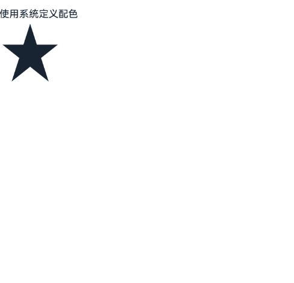
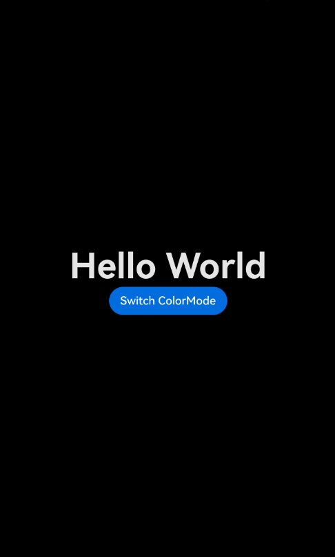

# ArkUI应用深浅色适配指南文档示例

### 介绍

本示例通过使用[ArkUI指南文档](https://gitcode.com/openharmony/docs/tree/master/zh-cn/application-dev/ui)中各场景的开发示例，展示在工程中，帮助开发者更好地理解ArkUI提供的组件及组件属性并合理使用。该工程中展示的代码详细描述可查如下链接：

1. [应用深浅色适配](https://gitcode.com/openharmony/docs/blob/master/zh-cn/application-dev/ui/ui-dark-light-color-adaptation.md)。


### 效果预览
| 深浅模式切换效果                                 | 图片及文字深浅模式适配效果                                    | 应用页面局部深浅色效果                                            |
| ------------------------------------ | --------------------------------------------- | --------------------------------------------------- |
|  |  |  |

### 使用说明

1. 在主界面，可以点击对应页面，选择需要参考的组件示例。

2. 在组件目录选择详细的示例参考。

3. 进入示例界面，查看参考示例。

4. 通过自动测试框架可进行测试及维护。

### 工程目录
```
entry/src/main/ets/
├── entryability
│   └── EntryAbility.ets
├── entrybackupability
│   └── EntryBackupAbility.ets
└── pages
    ├── BuilderNodeAdaptation.ets         // 自定义节点适配
    ├── ImageAdaptation.ets               // 图片资源适配
    ├── Index.ets
    └── SwitchColorMode.ets               // 切换颜色模式
entry/src/ohosTest/
├── ets
│   └── test
│       ├── Ability.test.ets
│       ├── Index.test.ets                // 测试用例代码
│       └── List.test.ets
└── module.json5
```

### 具体实现

1. 应用跟随系统的深浅色模式：自定义节点BuilderNode和ComponentContent需手动传递系统环境变化事件，触发节点的全量更新；应用可以主动监听系统深浅色模式变化，进行资源初始化等自定义逻辑。无论应用是否跟随系统深浅色模式变化，该监听方式均可生效。

2. 应用主动设置深浅色模式：应用默认配置为跟随系统切换深浅色模式，如不希望应用跟随系统深浅色模式变化，可主动设置应用的深浅色风格。设置后，应用的深浅色模式固定，不会随系统改变。

### 相关权限

不涉及。

### 依赖

不涉及。

### 约束与限制

1.本示例仅支持标准系统上运行, 支持设备：RK3568。

2.本示例为Stage模型，支持API20版本SDK，版本号：6.0.0.33，镜像版本号：OpenHarmony_6.0.0.33。

3.本示例需要使用DevEco Studio 6.0.0 Release (Build Version: 6.0.0.858， built on September 24, 2025)及以上版本才可编译运行。

### 下载

如需单独下载本工程，执行如下命令：

````
git init
git config core.sparsecheckout true
echo code/DocsSample/ArkUISample/ColorAdaptionSys > .git/info/sparse-checkout
git remote add origin https://gitcode.com/openharmony/applications_app_samples.git
git pull origin master
````