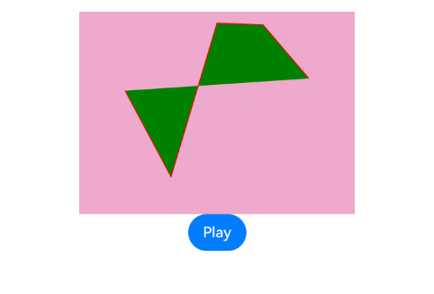
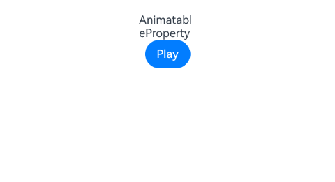
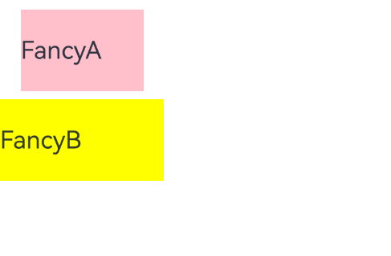

# ArkUI的装饰器指南文档示例

### 介绍

本示例通过使用[ArkUI指南文档](https://gitcode.com/openharmony/docs/tree/master/zh-cn/application-dev/ui)中各场景的开发示例，展示在工程中，帮助开发者更好地理解ArkUI提供的组件及组件属性并合理使用。该工程中展示的代码详细描述可查如下链接：

1. [@Styles装饰器](https://gitcode.com/openharmony/docs/blob/master/zh-cn/application-dev/ui/state-management/arkts-style.md)。
2. [@AnimatableExtend装饰器](https://gitcode.com/openharmony/docs/blob/master/zh-cn/application-dev/ui/state-management/arkts-animatable-extend.md)。


### 效果预览

| 折线的动画效果                                 | 改变Text组件宽度实现逐帧布局效果                                    | @Styles和全局@Styles的用法效果展示                                            | @Styles里通过事件来改变状态变量的值效果                                            |
| ------------------------------------ | --------------------------------------------- | --------------------------------------------------- | ------------------------------------ |
|  |  |  |  |

### 使用说明

1. 在主界面，可以点击对应页面，选择需要参考的组件示例。

2. 在组件目录选择详细的示例参考。

3. 进入示例界面，查看参考示例。

4. 通过自动测试框架可进行测试及维护。

### 工程目录
```
entry/src/main/ets/
├── common
│   └── resource.ets
├── entryability
│   └── EntryAbility.ets
├── entrybackupability
│   └── EntryBackupAbility.ets
└── pages
    ├── AnimatableExtendDecorator
    │   ├── AnimatablePropertyExample.ets          // 实现折线的动画效果
    │   └── AnimatablePropertyText.ets             // 实现逐帧布局的效果
    ├── Index.ets
    ├── StylesDecorator
    │   ├── StylesDecorator1.ets                   // 全局@Styles的用法
    │   └── StylesDecorator2.ets                   // 组件内的@Styles用法
    └── common
        └── Index.ets
entry/src/ohosTest/
├── ets
│   └── test
│       ├── Ability.test.ets
│       ├── Index.test.ets                         // 测试用例代码
│       └── List.test.ets
└── module.json5
```

### 具体实现

1. @Styles可以定义在组件内或全局，在全局定义时需在方法名前面添加function关键字，组件内定义时则不需要添加function关键字。组件内@Styles的优先级高于全局@Styles。框架优先找当前组件内的@Styles，如果找不到，则会全局查找。

2. @AnimatableExtend装饰器用于自定义可动画的属性方法，在这个属性方法中修改组件不可动画的属性。在动画执行过程中，通过逐帧回调函数修改不可动画属性值，让不可动画属性也能实现动画效果。也可通过逐帧回调函数修改可动画属性的值，实现逐帧布局的效果。可动画属性：如果一个属性方法在animation属性前调用，改变这个属性的值可以使animation属性的动画效果生效，这个属性称为可动画属性。比如height、width、backgroundColor、translate属性，和Text组件的fontSize属性等。不可动画属性：如果一个属性方法在animation属性前调用，改变这个属性的值不能使animation属性的动画效果生效，这个属性称为不可动画属性。比如Polyline组件的points属性等。

### 相关权限

不涉及。

### 依赖

不涉及。

### 约束与限制

1.本示例仅支持标准系统上运行, 支持设备：RK3568。

2.本示例为Stage模型，支持API20版本SDK，版本号：6.0.0.33，镜像版本号：OpenHarmony_6.0.0.33。

3.本示例需要使用DevEco Studio 6.0.0 Release (Build Version: 6.0.0.858， built on September 24, 2025)及以上版本才可编译运行。

### 下载

如需单独下载本工程，执行如下命令：

````
git init
git config core.sparsecheckout true
echo code/DocsSample/ArkUISample/ComponentExtension > .git/info/sparse-checkout
git remote add origin https://gitcode.com/openharmony/applications_app_samples.git
git pull origin master
````