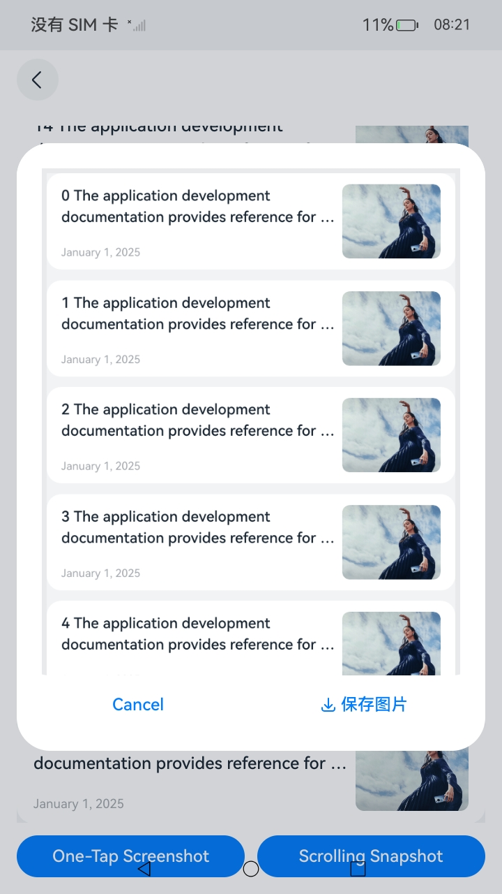
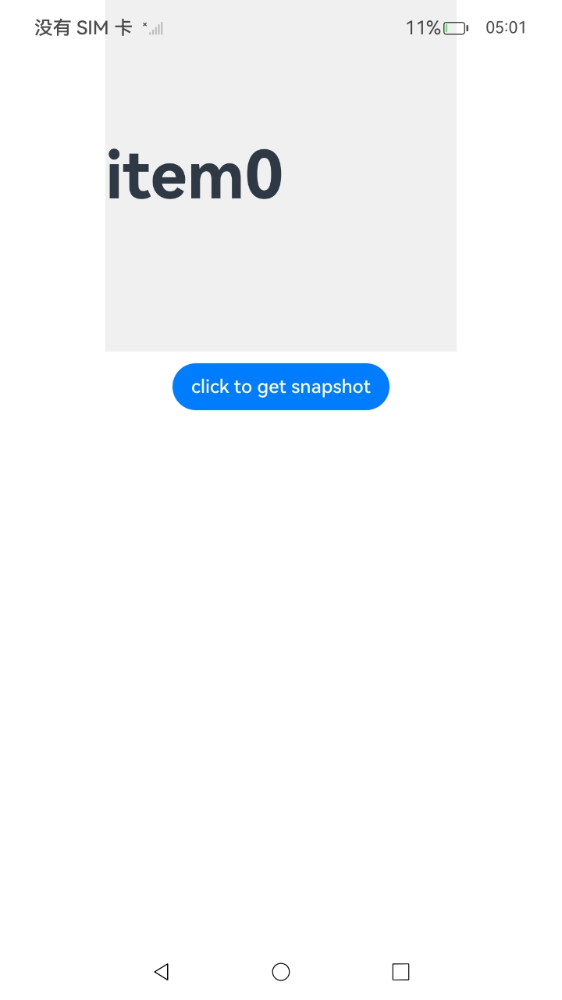

# ArkUI指南文档示例

### 介绍

组件截图是将应用内一个组件节点树的渲染结果生成位图的能力，支持两种方式：一种是对已挂树显示的组件进行截图，另一种是对通过Builder或ComponentContent实现的离线组件进行截图。

本示例为[使用组件截图](https://gitcode.com/openharmony/docs/blob/master/zh-cn/application-dev/ui/arkts-uicontext-component-snapshot.md)的配套示例工程。 

本示例展示了组件截图能力的常见使用方式和典型使用场景。

### 效果预览

| 一键截图                      |滚动截图|封装全局截图接口|
|------------------------------------|---|---|
|           | ||

### 使用说明

1. 点击应用首页"ScrollSnapshot"按钮，跳转到对应的界面。

2. 在"ScrollSnapshot"页面，点击"One-Tap Screenshot"按钮，稍等后自动生成整个滚动组件页面长截图缩略图，点击缩略图可以进行放大预览，点击“保存图片”按钮，图片会保存到图库。

3. 在"ScrollSnapshot"页面，点击"Scroll Screenshot"按钮，列表视图会自动滚动，此时点击列表或者直到列表滑动到底部，会自动生成从滑动开始到滑动结束这段期间的的长截图，缩略图操作与步骤2相同。

4. 点击应用首页"GlobalSnapshot"按钮，跳转到对应的界面。

5. 在"GlobalSnapshot"界面点击"click to get snapshot"触发封装全局截图接口。


### 工程目录
```
├──entry/src/main/ets/
│  ├──common
│  │  ├──CommonUtils.ets                  // 通用工具类
│  │  ├──ImageUtils.ets                   // 图片处理工具类
│  │  ├──LazyDataSource.ets               // 懒加载数据源管类
│  │  ├──Logger.ets                       // 日志打印工具类
│  │  └──PopupUtils.ets                   // 弹窗位置计算工具类
│  ├──entryability
│  │  └──EntryAbility.ets                 // 程序入口类
│  ├──entrybackupability
│  │  └──EntryBackupAbility.ets           // 数据备份恢复类
│  ├──pages
│  │  └──Index.ets                        // 应用入口页
│  │  └──GlobalSnapshot.ets               // 封装全局截图接口测试页
│  │  └──ScrollSnapshot.ets               // 滚动截图测试页
│  └──view
│     ├──NewsItem.ets                     // List列表项视图
│     ├──ScrollSnapshot.ets               // 滚动组件长截图视图
│     ├──SnapshotPreview.ets              // 长截图预览弹窗
│     └──GlobalScreenshot.ets             // 封装全局截图接口
└──entry/src/main/resources               // 应用静态资源目录
```

### 具体实现

1. 实现长内容滚动截图（滚动 + 拼接）。源码参考[ScrollSnapshot.ets](https://gitcode.com/openharmony/applications_app_samples/blob/master/code/DocsSample/ArkUISample/ComponentSnapshot/entry/src/main/ets/view/ScrollSnapshot.ets)

    * 添加滚动控制器及事件监听，为了能够模拟滚动，以及监听组件滚动的具体offset，需要为List（此处以列表为例）组件添加滚动控制器以及滚动监听。

    * 循环滚动截图并缓存，通过实现一个递归方法滚动循环截图，并在滚动过程配合一些动效实现。

    * 拼接长截图，使用image.createPixelMapSync()方法创建长截图longPixelMap，并遍历之前保存的图像片段数据（this.areaArray），构建image.PositionArea对象area，然后调用longPixelMap.writePixelsSync(area)方法将这些片段逐个写入到正确的位置，从而拼接成一个完整的长截图。

    * 保存截图，使用安全控件SaveButton实现截图保存到相册。

    * 保存完成后释放位图，当位图对象不再使用时，应及时将其赋值为空。
    
### 相关权限

不涉及。

### 依赖

不涉及。

### 约束与限制

1.本示例仅支持标准系统上运行, 支持设备：RK3568。

2.本示例为Stage模型，支持API20版本SDK，版本号：6.0.0.41，镜像版本号：OpenHarmony_6.0.0.41。

3.本示例需要使用DevEco Studio 5.0.5 Release (Build Version: 5.0.13.200, built on May 13, 2025)及以上版本才可编译运行。

### 下载

如需单独下载本工程，执行如下命令：

````
git init
git config core.sparsecheckout true
echo code/DocsSample/ArkUISample/ComponentSnapshot > .git/info/sparse-checkout
git remote add origin https://gitcode.com/openharmony/applications_app_samples.git
git pull origin master
````