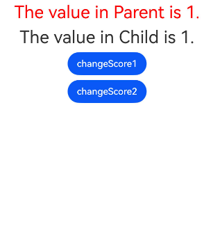
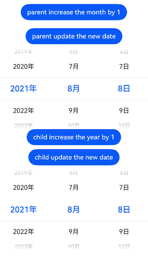
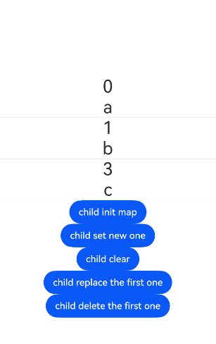
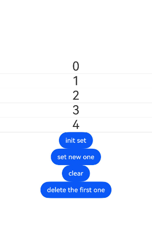
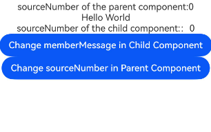
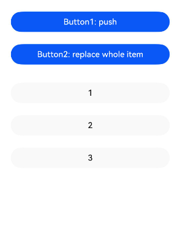
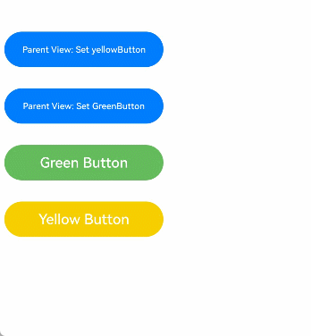

# ArkUI装饰器@Link指南文档示例

### 介绍

本示例通过使用[ArkUI指南文档](https://gitcode.com/openharmony/docs/tree/master/zh-cn/application-dev/ui)中各场景的开发示例，展示在工程中，帮助开发者更好地理解ArkUI提供的组件及组件属性并合理使用。该工程中展示的代码详细描述可查如下链接：

1. [@Link装饰器](https://gitcode.com/openharmony/docs/blob/master/zh-cn/application-dev/ui/state-management/arkts-link.md)。


### 效果预览

| 赋值后加上Proxy代理实现UI刷新        | 装饰Date类型变量         | 装饰Map类型变量            | 装饰Set类型变量
| ------------------------------------ | --------------------------------------------- | --------------------------------------------------- |--------------------------------------------------- |
|  |  |  |  |

| Link基础用法效果        | 通过@Watch在双向同步时更改本地变量         | 数组类型的@Link            | 简单类型和类对象类型的@Link      | 联合类型实例
| ------------------------------------ | --------------------------------------------- | --------------------------------------------------- |--------------------------------------------------- |--------------------------------------------------- |
|  |  |  |  |  |

### 使用说明

1. 在主界面，可以点击对应页面，选择需要参考的组件示例。

2. 在组件目录选择详细的示例参考。

3. 进入示例界面，查看参考示例。

4. 通过自动测试框架可进行测试及维护。

### 工程目录
```
entry/src/main/ets/
├── common
│   └── Resource.ets
├── entryability
│   └── EntryAbility.ets
├── entrybackupability
│   └── EntryBackupAbility.ets
└── pages
    ├── Index.ets
    ├── LinkDecorator
    │   ├── AddProxyToRerendertheUI.ets
    │   ├── DecoratingVariablesDateType.ets
    │   ├── DecoratingVariablesMapType.ets
    │   ├── DecoratingVariablesSetType.ets
    │   ├── LinkUsage.ets
    │   ├── LinkUsage2.ets
    │   ├── UseWatchToChangeLocalVariables.ets
    │   ├── UsingLinkwithArrayTypes.ets
    │   ├── UsingLinkwithPrimitiveandClassTypes.ets
    │   └── UsingUnionTypes.ets
    └── common
        └── Index.ets
entry/src/ohosTest/
├── ets
│   └── test
│       ├── Ability.test.ets
│       ├── Index.test.ets        // 测试用例代码
│       └── List.test.ets
└── module.json5
```

### 具体实现

1. 初始渲染：执行父组件的 build() 函数，创建子组件的新实例。初始化过程如下：指定父组件中的@State变量用于初始化子组件的@Link变量。子组件的@Link变量值与其父组件的数据源变量保持双向数据同步。父组件的@State状态变量包装类通过构造函数传给子组件，子组件的@Link包装类拿到父组件的@State的状态变量后，将当前@Link包装类实例注册给父组件的@State变量。

2. @Link的数据源的更新：即父组件中状态变量更新，引起相关子组件的@Link的更新。处理步骤：通过初始渲染的步骤可知，子组件@Link包装类把当前this指针注册给父组件。父组件@State变量变更后，会遍历更新所有依赖它的系统组件和状态变量（例如：@Link包装类）。通知@Link包装类更新后，子组件中所有依赖@Link状态变量的系统组件都会被通知更新。以此实现父组件对子组件的状态数据同步。

3. @Link的更新：当子组件中@Link更新后，处理步骤如下（以父组件为@State为例）：@Link更新后，调用父组件的@State包装类的set方法，将数值同步回父组件。子组件@Link和父组件@State分别遍历依赖的系统组件，更新对应的UI。从而实现子组件@Link与父组件@State的同步。

### 相关权限

不涉及。

### 依赖

不涉及。

### 约束与限制

1.本示例仅支持标准系统上运行, 支持设备：RK3568。

2.本示例为Stage模型，支持API20版本SDK，版本号：6.0.0.33，镜像版本号：OpenHarmony_6.0.0.33。

3.本示例需要使用DevEco Studio 6.0.0 Release (Build Version: 6.0.0.858， built on September 24, 2025)及以上版本才可编译运行。

### 下载

如需单独下载本工程，执行如下命令：

````
git init
git config core.sparsecheckout true
echo code/DocsSample/ArkUISample/ComponentStateManagement > .git/info/sparse-checkout
git remote add origin https://gitcode.com/openharmony/applications_app_samples.git
git pull origin master
````