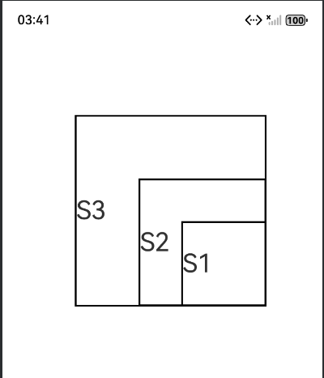

# 自定义组件的自定义布局

### 介绍

本示例展示了在一个Stage模型中，开发基于ArkTS UI的自定义组件的自定义布局。

### 效果预览

|  | 

使用说明

1. 在应用内点击“添加卡片到桌面”按钮，拉起卡片管理页面；

### 工程目录

给出项目中关键的目录结构并描述它们的作用，示例如下：

```
entry/src/main/ets/
|---pages
|   |---Index.ets                          // 主页面

```

### 具体实现

* // 第一步：计算各子组件的大小。通过onMeasureSize：组件每次布局时触发，计算子组件的尺寸，其执行时间先于onPlaceChildren；
* // 第二步：放置各子组件的位置。通过onPlaceChildren：组件每次布局时触发，设置子组件的起始位置；


### 相关权限

不涉及。

### 依赖

不涉及。

### 约束与限制

1.  本示例支持标准系统上运行，支持设备：RK3568；

2. 本示例支持API20版本SDK，版本号：6.0.0.47；

3.  本示例已支持使DevEco Studio 6.0.0 Release (构建版本：6.0.0.858，构建 2024年12月12日)编译运行；

4. 高等级APL特殊签名说明：无；

### 下载

如需单独下载本工程，执行如下命令：

```
git init
git config core.sparsecheckout true
echo code/DocsSample/ArkUISample/ComponentsLayout > .git/info/sparse-checkout
git remote add origin https://gitcode.com/openharmony/applications_app_samples.git
git pull origin master
```