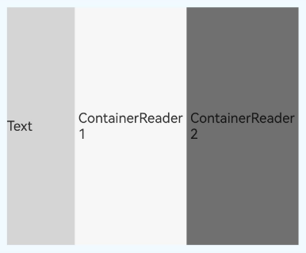
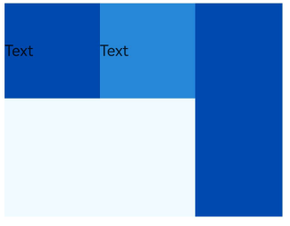
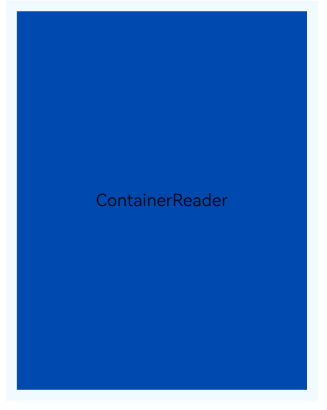
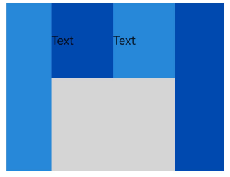
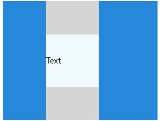
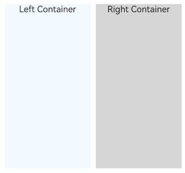

# ContainerReader示例

## 介绍

本示例展示了ArkUI中[ContainerReader组件](https://gitcode.com/openharmony/docs/blob/master/zh-cn/application-dev/reference/apis-arkui/arkui-ts/ts-container-containerreader.md)的开发示例。通过本示例，开发者可以学习如何使用ContainerReader组件感知容器尺寸和断点信息、如何结合Flex/Row/Column等布局组件实现自适应布局、以及如何基于容器断点实现网格组件列数自适应、自定义组件自适应、左右分栏布局等典型开发场景。该工程中展示的代码详细描述可查链接[ContainerReader](https://gitcode.com/openharmony/docs/blob/master/zh-cn/application-dev/ui/arkts-layout-development-container-reader.md)。


## 1. [布局规格示例]
### 效果预览

| 占满空间                                                          |  占满剩余空间                           | 平分剩余空间                              |
|---------------------------------------------------------------|--------------------------------------|--------------------------------------|
|  |  |  |

## 2. [开发步骤示例]
### 效果预览

|  示例
|--------------------------------------|
|     |

## 3. [结合Flex/Row/Column使用示例]
### 效果预览

| layoutWeight分配剩余空间                   |
|------------------------------------|
|  | 

| displayPriority控制显示优先级(低)           |  displayPriority控制显示优先级(高)        |
|------------------------------------|--------------------------------------|
|  |    |

|  flexShrink控制收缩比例               | flexGrow控制扩展比例                       |
|--------------------------------------|--------------------------------------|
|   |    |

## 4. [开发实战示例]
### 效果预览

| 实现独立断点                               |  网格组件自适应列数                         | 自定义组件自适应布局                           |
|------------------------------------|--------------------------------------|------------------------------------|
|  |    |  |

|  左右分栏布局自适应(窄屏)                     | 左右分栏布局自适应(宽屏)                       |
|--------------------------------------|--------------------------------------|
|    |    |


## 使用说明

1. 在主界面，可以点击对应卡片，选择需要参考的示例。

2. 进入布局规格示例，学习ContainerReader组件占满空间、占满剩余空间、平分剩余空间等基本布局方式。

3. 进入开发步骤示例，学习ContainerReader组件的基本用法，包括如何创建ContainerReader、如何获取容器尺寸和断点信息。

4. 进入结合Flex/Row/Column使用示例，学习如何将ContainerReader与layoutWeight、displayPriority、flexShrink、flexGrow等属性结合使用。

5. 进入开发实战示例，学习如何实现独立断点、网格组件自适应列数、自定义组件自适应布局、左右分栏布局自适应等典型场景。

## 工程目录
```
entry/src/main/ets/
|---entryability
|   |---EntryAbility.ets                       // 应用入口Ability
|---entrybackupability
|   |---EntryBackupAbility.ets                 // 备份恢复Ability
|---pages
|   |---MainPage.ets                           // 应用主页面，导航菜单
|   |---developmentSteps                       // 开发步骤示例
|   |       |---DevelopmentSteps.ets            // ContainerReader基本用法
|   |---layoutSpecifications                    // 布局规格示例
|   |       |---LayoutSpecificationsIndex.ets   // 布局规格索引页
|   |       |---FillTheSpace.ets                // 占满空间示例
|   |       |---DivideRemainingSpace.ets        // 占满剩余空间示例
|   |       |---DivideRemainingSpaceEqually.ets // 平分剩余空间示例
|   |---combineWithFlexRowColumn               // 结合Flex/Row/Column使用示例
|   |       |---CombineWithFlexColumnRowIndex.ets  // 结合Flex/Row/Column索引页
|   |       |---CombineWithLayoutWeight.ets     // layoutWeight分配剩余空间
|   |       |---CombineWithLowDisplayPriority.ets   // displayPriority低优先级
|   |       |---CombineWithHighDisplayPriority.ets  // displayPriority高优先级
|   |       |---CombineWithFlexShrink.ets       // flexShrink控制收缩比例
|   |       |---CombineWithFlexGrow.ets         // flexGrow控制扩展比例
|   |---developmentDemo                        // 开发实战示例
|           |---IndependentBreakpoints.ets      // 实现独立断点
|           |---GridComponentAdaptiveColumnSettings.ets  // 网格组件自适应列数
|           |---CustomComponentAdaptiveLayout.ets        // 自定义组件自适应布局
|           |---LeftOrRightSplitLayout.ets               // 左右分栏布局自适应
entry/src/ohosTest/
|---ets
|   |---test
|   |   |---ContainerReader.test.ets           // ContainerReader测试代码
|   |   |---Ability.test.ets                   // Ability测试代码
|   |   |---List.test.ets                      // 列表测试代码
```

## 具体实现

1. 启动app进入主界面，选择布局规格、开发步骤、结合Flex/Row/Column使用或者开发实战示例，然后点击选择详细的示例参考。

2. 布局规格示例展示了ContainerReader组件在不同Flex布局中的空间分配方式，包括占满空间、占满剩余空间（与固定宽度兄弟组件共存）、平分剩余空间（两个ContainerReader通过layoutWeight平分），源码参考[entry/src/main/ets/pages/layoutSpecifications/](./entry/src/main/ets/pages/layoutSpecifications/LayoutSpecificationsIndex.ets)

3. 开发步骤示例展示了ContainerReader组件的基本用法，包括如何创建ContainerReader、如何通过size和widthBreakpoint属性获取容器尺寸和断点信息，源码参考[entry/src/main/ets/pages/developmentSteps/](./entry/src/main/ets/pages/developmentSteps/DevelopmentSteps.ets)

4. 结合Flex/Row/Column使用示例展示了ContainerReader组件与Flex布局属性的配合使用，包括layoutWeight分配剩余空间、displayPriority控制显示优先级（低优先级和高优先级）、flexShrink控制收缩比例、flexGrow控制扩展比例，源码参考[entry/src/main/ets/pages/combineWithFlexRowColumn/](./entry/src/main/ets/pages/combineWithFlexRowColumn/CombineWithFlexColumnRowIndex.ets)

5. 开发实战示例展示了ContainerReader组件的典型应用场景：独立断点（多个ContainerReader各自拥有独立的断点状态）、网格组件根据容器断点动态调整列数、自定义组件根据断点自适应切换纵向/横向布局、左右分栏布局根据容器宽度自适应切换排列方式，源码参考[entry/src/main/ets/pages/developmentDemo/](./entry/src/main/ets/pages/developmentDemo/IndependentBreakpoints.ets)

## 相关权限

不涉及。

## 依赖

不涉及。

## 约束与限制

1. 本示例仅支持标准系统上运行，支持设备：RK3568。

2. 本示例支持API26版本SDK，SDK版本号(API Version 26 Release)。

3. 本示例需要使用DevEco Studio 6.0.2 Release (Build Version: 6.0.2.640, built on January 19, 2026)以上版本才可编译运行。

## 下载

如需单独下载本工程，执行如下命令：

````
git init
git config core.sparsecheckout true
echo code/DocsSample/ArkUISample/ContainerReader > .git/info/sparse-checkout
git remote add origin https://gitCode.com/openharmony/applications_app_samples.git
git pull origin master
````
