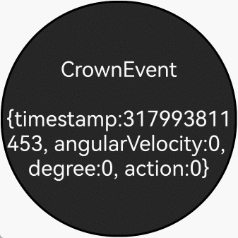

# 支持表冠输入事件

## 介绍

表冠事件是指通过旋转表冠触发的事件，通过硬件采样频率上报旋转角度的变化。当组件需要获取旋转角度等信息时，可以通过onDigitalCrown接收表冠事件来获得上报信息。

本示例为[支持表冠输入事件](https://gitcode.com/openharmony/docs/blob/master/zh-cn/application-dev/ui/arkts-common-events-crown-event.md)的配套示例工程。

本示例展示了表冠事件开发的基本步骤及开发过程中需要注意的事项。

## 效果预览



## 使用说明
1. 在智能穿戴设备上安装编译生成的hap包，并打开应用。
2. 旋转表冠，在屏幕上查看时间戳，旋转角速度，旋转角度和表冠动作的信息。

## 工程目录

```    
entry/src/main/ets/
├──entryability
├──entrybackupability
└──pages
    └── Index.ets                           // 表冠输入案例   
```

## 具体实现

1. 获取并保持焦点：为接收表冠事件的组件开启焦点能力，使用 focusable(true)、focusOnTouch(true) 和 defaultFocus(true) 以确保组件在需要时能够获得焦点并接收事件。
2. 注册表冠事件回调：通过 onDigitalCrown((event: CrownEvent) => { ... }) 注册回调，处理 event 的字段（如 timestamp、angularVelocity、degree、action），并在需要时调用 stopPropagation 以阻止冒泡。
3. 演示示例：在回调中实现自定义逻辑（例如更新文本显示、日志输出等），并在组件中示例化文本组件的样式设置与焦点配置，确保在 BEGIN/UPDATE/END 的焦点状态变化时行为符合预期。

## 相关权限

不涉及

## 依赖

不涉及

## 约束和限制

1. 本示例支持标准系统上运行，支持设备：RK3568;

2. 本示例支持API20版本SDK，版本号：6.0.0.36;

3. 本示例已支持使用DevEco Studio 6.0.0 Release (构建版本：6.0.0.858，构建 2025年9月24日)编译运行

## 下载

如需单独下载本工程，执行如下命令：

```
git init
git config core.sparsecheckout true
echo code/DocsSample/ArkUISample/CrownEventsProject > .git/info/sparse-checkout
git remote add origin https://gitcode.com/openharmony/applications_app_samples.git
git pull origin master
```