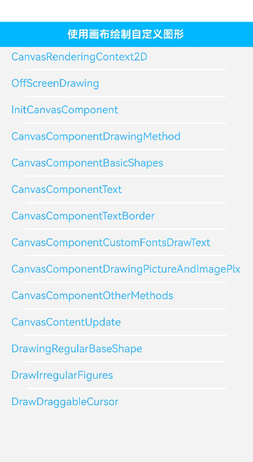

# ArkUI使用画布绘制自定义图形指南文档示例

### 介绍

本示例通过使用[ArkUI指南文档](https://gitcode.com/openharmony/docs/tree/master/zh-cn/application-dev/ui)中各场景的开发示例，展示在工程中，帮助开发者更好地理解ArkUI提供的组件及组件属性并合理使用。该工程中展示的代码详细描述可查如下链接：

1. [使用画布绘制自定义图形 (Canvas)](https://gitcode.com/openharmony/docs/blob/master/zh-cn/application-dev/ui/arkts-drawing-customization-on-canvas.md)

### 效果预览

| 首页                                 | CanvasRenderingContext2D示例                   
|------------------------------------|------------------------------------|
|  |  |

### 使用说明

1. 在主界面，可以点击对应卡片，选择需要参考的组件示例。

2. 在组件目录选择详细的示例参考。

3. 进入示例界面，查看参考示例。

4. 通过自动测试框架可进行测试及维护。

### 工程目录
```
entry/src/main/ets/
|---entryability
|---pages
|   |---canvas                             //画布
|   |       |---CanvasComponentBasicShapes.ets
|   |       |---CanvasComponentCustomFontsDrawText.ets
|   |       |---CanvasComponentDrawingMethod.ets
|   |       |---CanvasComponentDrawingPictureAndImagePixel.ets
|   |       |---CanvasComponentOtherMethods.ets
|   |       |---CanvasComponentText.ets
|   |       |---CanvasComponentTextBorder.ets
|   |       |---CanvasContentUpdate.ets
|   |       |---CanvasRenderingContext2D.ets
|   |       |---DrawDraggableCursor.ets
|   |       |---DrawingRegularBaseShape.ets
|   |       |---DrawIrregularFigures.ets
|   |       |---InitCanvasComponent.ets 
|   |       |---OffScreenDrawing.ets 
|---pages
|   |---Index.ets                       // 应用主页面
entry/src/ohosTest/
|---ets
|   |---Index.test.ets                       // 示例代码测试代码
```
## 具体实现

1. 使用画布绘制自定义图形 (Canvas)
   Canvas提供画布组件，用于自定义绘制图形，开发者使用CanvasRenderingContext2D对象和OffscreenCanvasRenderingContext2D对象在Canvas组件上进行绘制，绘制对象可以是基础形状、文本、图片等。

### 相关权限

不涉及。

### 依赖

不涉及。

### 约束与限制

1.本示例仅支持标准系统上运行, 支持设备：RK3568。

2.本示例为Stage模型，支持API22版本full-SDK，版本号：6.0.2.55，镜像版本号：OpenHarmony_6.0.2 Release。

3.本示例需要使用DevEco Studio 5.0.5 Release (Build Version: 5.0.13.200， built on May 13, 2025)及以上版本才可编译运行。

### 下载

如需单独下载本工程，执行如下命令：

````
git init
git config core.sparsecheckout true
echo code/DocsSample/ArkUISample/CustomCanvas > .git/info/sparse-checkout
git remote add origin https://gitCode.com/openharmony/applications_app_samples.git
git pull origin master
````