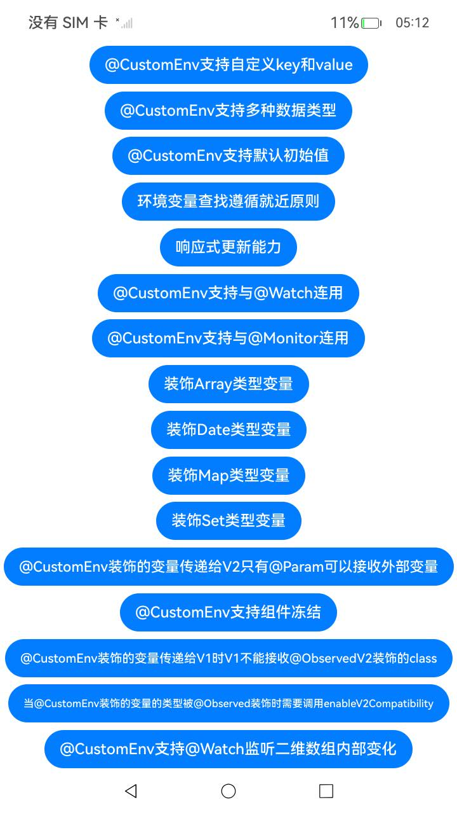

# ArkUI使用组件扩展文档示例

## 介绍

在一些主页的场景中，开发者可以在不入侵自定义组件的情况下，使用CustomEnv配合WithEnv对自定义组件进行再次赋值。本示例主要讲解如何在不入侵自定义组件的情况下，修改自定义组件的初始设定。

## 效果预览

| 效果图                               |
|-----------------------------------|
|  |

## 使用说明

1. 本示例主要讲解如何在不入侵自定义组件的情况下，修改自定义组件的初始设定。

## 工程目录
```
entry/src/
├── main
│   ├── ets
│   │   ├── entryability
│   │   ├── pages
│   │   │   ├── CustomEnvDefaultValPage.ets
│   │   │   ├── CustomEnvMixParamV1ToV2Page.ets
│   │   │   ├── CustomEnvNearPage.ets
│   │   │   ├── CustomEnvObservedMixV2ToV1WithenableV2CompatibilityPage.ets
│   │   │   ├── CustomEnvObservedV2MixV2ToV1Page.ets
│   │   │   ├── CustomEnvSupportArrayPage.ets
│   │   │   ├── CustomEnvSupportComponentFreezePage.ets
│   │   │   ├── CustomEnvSupportDatePage.ets
│   │   │   ├── CustomEnvSupportDeepWatchPage.ets
│   │   │   ├── CustomEnvSupportMapPage.ets
│   │   │   ├── CustomEnvSupportMonitorPage.ets
│   │   │   ├── CustomEnvSupportSetPage.ets
│   │   │   ├── CustomEnvSupportWatchPage.ets
│   │   │   ├── CustomEnvValueClassPage.ets
│   │   │   ├── CustomEnvValUpdatePage.ets
│   │   │   ├── CustomValuePage.ets
│   │   │   ├── Index.ets
│   └── resources
│       ├── ...
├─── ... 

```
## 具体实现

* 本示例主要讲解如何在不入侵自定义组件的情况下，修改自定义组件的初始设定，源码参考：
  [Index.ets](entry/src/main/ets/pages/Index.ets)。

## 相关权限

不涉及。

## 依赖

不涉及。

## 约束与限制

1.本示例仅支持标准系统上运行，支持设备：Phone。

2.本示例为Stage模型，支持API26版本SDK，本示例SDK版本号(API Version 26)。

3.本示例需要使用DevEco Studio 版本号(26.0.0.461)版本才可编译运行。

## 下载

如需单独下载本工程，执行如下命令：

```
git init
git config core.sparsecheckout true
echo code/DocsSample/ArkUISample/CustomEnvSample > .git/info/sparse-checkout
git remote add origin https://gitcode.com/openharmony/applications_app_samples.git
git pull origin master
```