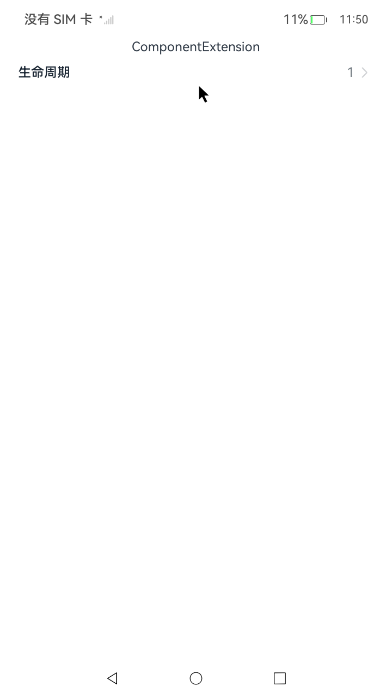
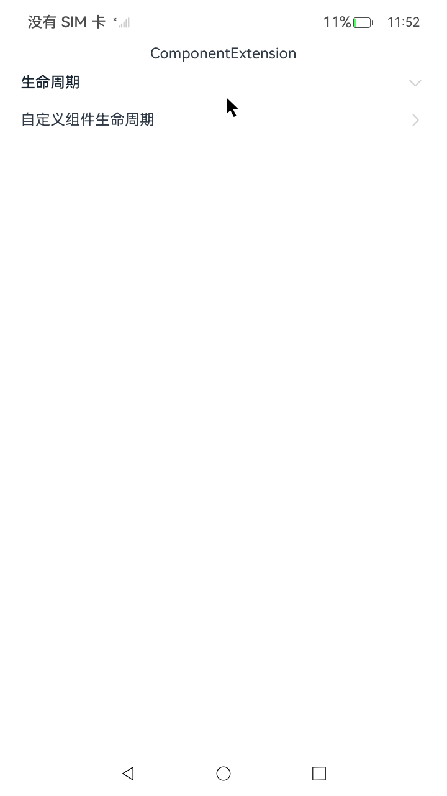

# ArkUI使用支持交互事件指南文档示例

### 介绍

本示例通过使用[ArkUI指南文档](https://gitee.com/openharmony/docs/tree/master/zh-cn/application-dev/ui)
中各场景的开发示例，展示在工程中，帮助开发者更好地理解ArkUI提供的组件及组件属性并合理使用。

### 效果预览

| 首页                                 | 交互类组件目录                            | 生命周期示例                             |
|------------------------------------|------------------------------------|------------------------------------|
|  |  |  |

### 使用说明

1. 在主界面，可以点击对应卡片，选择需要参考的组件示例。

2. 在组件目录选择详细的示例参考。

3. 进入示例界面，查看参考示例。

4. 通过自动测试框架可进行测试及维护。

### 工程目录

```
entry/src/main/ets/
|---entryability
|---pages
|   |---parent                            //生命周期     
|   |       |---Index.ets              
|---pages
|   |---Index.ets                       // 应用主页面
entry/src/ohosTest/
|---ets
|   |---index.test.ets                       // 示例代码测试代码
```

### 具体实现

1、自定义组件的创建：自定义组件的实例由ArkUI框架创建。
2、初始化自定义组件的成员变量：通过本地默认值或者构造方法传递参数来初始化自定
义组件的成员变量，初始化顺序为成员变量的定义顺序。
3、如果开发者定义了aboutToAppear，则执行build方法之前执行该方法。
4、在渲染的时候，执行build方法渲染系统组件，如果子组件为自定义组件，则创建自
定义组件的实例。在渲染的过程中，框架会记录状态变量和组件的映射关系，当状态变量
改变时，驱动其相关的组件刷新。
5、如果开发者定义了onDidBuild，则执行build方法之后执行该方法。

### 相关权限

不涉及。

### 依赖

不涉及。

### 约束与限制

1.本示例仅支持标准系统上运行, 支持设备：RK3568。

2.本示例为Stage模型，支持API14版本SDK，版本号：5.0.2.57，镜像版本号：OpenHarmony_5.0.2.57。

3.本示例需要使用DevEco Studio NEXT Developer Preview2 (Build Version: 5.0.5.306， built on December 12, 2024)及以上版本才可编译运行。

### 下载

如需单独下载本工程，执行如下命令：

````
git init
git config core.sparsecheckout true
echo code/DocsSample/ArkUISample/EventProject > .git/info/sparse-checkout
git remote add origin https://gitee.com/openharmony/applications_app_samples.git
git pull origin master
````