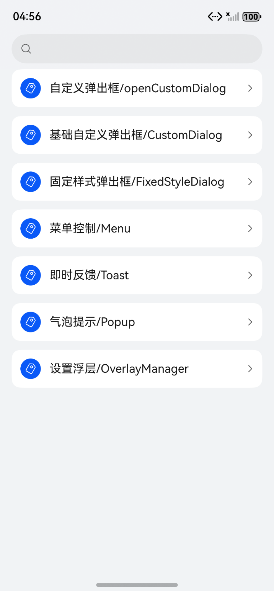

# ArkUI使用弹窗指南文档示例

### 介绍

本示例通过使用[ArkUI指南文档](https://gitcode.com/openharmony/docs/tree/master/zh-cn/application-dev/ui)中各场景的开发示例，展示在工程中，帮助开发者更好地理解ArkUI提供的组件及组件属性并合理使用。该工程中展示的代码详细描述可查如下链接：

1. [不依赖UI组件的全局自定义弹出框 (openCustomDialog)](https://gitcode.com/openharmony/docs/blob/OpenHarmony-5.0.1-Release/zh-cn/application-dev/ui/arkts-uicontext-custom-dialog.md)。
2. [基础自定义弹出框 (CustomDialog)](https://gitcode.com/openharmony/docs/blob/OpenHarmony-5.0.1-Release/zh-cn/application-dev/ui/arkts-common-components-custom-dialog.md)。
3. [固定样式弹出框](https://gitcode.com/openharmony/docs/blob/OpenHarmony-5.0.1-Release/zh-cn/application-dev/ui/arkts-fixes-style-dialog.md)。
4. [菜单控制（Menu)](https://gitcode.com/openharmony/docs/blob/OpenHarmony-5.0.1-Release/zh-cn/application-dev/ui/arkts-popup-and-menu-components-menu.md)
5. [气泡提示 (Popup)](https://gitcode.com/openharmony/docs/blob/OpenHarmony-5.0.1-Release/zh-cn/application-dev/ui/arkts-popup-and-menu-components-popup.md)
6. [即时反馈 (Toast)](https://gitcode.com/openharmony/docs/blob/OpenHarmony-5.0.1-Release/zh-cn/application-dev/ui/arkts-create-toast.md)
7. [设置浮层 (OverlayManager)](https://gitcode.com/openharmony/docs/blob/master/zh-cn/application-dev/ui/arkts-create-overlaymanager.md)
### 效果预览

| 首页                                | 弹窗类组件目录                        | 自定义弹窗示例                       |                                    |                                    |
|------------------------------------|------------------------------------|------------------------------------|------------------------------------|------------------------------------|
|  |  |  |  |  |

### 使用说明

1. 在主界面，可以点击对应卡片，选择需要参考的组件示例。

2. 在组件目录选择详细的示例参考。

3. 进入示例界面，查看参考示例。

4. 通过自动测试框架可进行测试及维护。

### 工程目录
```
entry/src/main/ets/
|---entryability
|---pages
|   |---customdialog                          //自定义弹出框     
|   |       |---CreateCustomDialog.ets
|   |       |---DialogAnimation.ets
|   |       |---DialogInteraction.ets
|   |       |---DialogInteraction1.ets
|   |       |---DialogStyle.ets
|   |       |---Index.ets
|   |       |---NestDialog.ets
|   |---fixedstyledialog                      //固定样式弹出框
|   |       |---ActionSheet.ets
|   |       |---AlertDialog.ets
|   |       |---CalendarPickerDialog.ets
|   |       |---DatePickerDialog.ets
|   |       |---Index.ets
|   |       |---ShowActionMenu.ets
|   |       |---ShowDialog.ets
|   |       |---TextPickerDialog.ets
|   |       |---TimePickerDialog.ets
|   |---Menu                                  //菜单
|   |       |---CreateMenu.ets
|   |       |---Index.ets
|   |---opencustomdialog                      //不依赖UI组件的全局自定义弹出框
|   |       |---Index.ets
|   |       |---openCustomDialog.ets
|   |---OverlayManager                        //设置浮层
|   |       |---Index.ets
|   |       |---OverlayManagerDemo1.ets
|   |       |---OverlayManagerDemo2.ets
|   |       |---OverlayManagerDemo3.ets
|   |---popup                                 //气泡提示
|   |       |---ButtonPopup.ets
|   |       |---CustomPopup.ets
|   |       |---Index.ets
|   |       |---PopupAnimation.ets
|   |       |---PopupStateChange.ets
|   |       |---PopupStyle.ets
|   |       |---TextPrompts.ets
|   |---Toast                                 //即使反馈
|   |       |---CreateToast.ets
|   |       |---DefaultAndTopToast.ets
|   |       |---Index.ets
|   |       |---OpenCloseToast.ets                           
|---pages
|   |---Index.ets                       // 应用主页面
|   |---Index2.ets                       // 弹窗跳转页面
entry/src/ohosTest/
|---ets
|   |---index.test.ets                       // 示例代码测试代码
```
## 具体实现

1. 设置浮层(OverlayManager)：可以通过使用UIContext中的getOverlayManager方法获取当前UI上下文关联的OverlayManager对象，再通过该对象调用对应方法。

    * 在OverlayManager上新增指定节点、删除指定节点、显示所有节点和隐藏所有节点。代码参考[OverlayManagerDemo1.ets](https://gitcode.com/openharmony/applications_app_samples/tree/master/code/DocsSample/ArkUISample/DialogProject/entry/src/main/ets/pages/OverlayManager/OverlayManagerDemo1.ets)

    * 显示一个始终在屏幕左侧的悬浮球，点击可以弹出alertDialog弹窗。代码参考[OverlayManagerDemo2.ets](https://gitcode.com/openharmony/applications_app_samples/tree/master/code/DocsSample/ArkUISample/DialogProject/entry/src/main/ets/pages/OverlayManager/OverlayManagerDemo2.ets)

    * 调用UIContext中getOverlayManager方法获取OverlayManager对象，并利用该对象在指定层级上新增指定节点（addComponentContentWithOrder），层次高的浮层会覆盖在层级低的浮层之上。代码参考[OverlayManagerDemo3.ets](https://gitcode.com/openharmony/applications_app_samples/tree/master/code/DocsSample/ArkUISample/DialogProject/entry/src/main/ets/pages/OverlayManager/OverlayManagerDemo3.ets)

### 相关权限

不涉及。

### 依赖

不涉及。

### 约束与限制

1.本示例仅支持标准系统上运行, 支持设备：RK3568。

2.本示例为Stage模型，支持API18版本SDK，版本号：5.1.0.56，镜像版本号：OpenHarmony_5.1.0.56。

3.本示例需要使用DevEco Studio NEXT Developer Preview2 (Build Version: 5.0.5.306， built on December 12, 2024)及以上版本才可编译运行。

### 下载

如需单独下载本工程，执行如下命令：

````
git init
git config core.sparsecheckout true
echo code/DocsSample/ArkUISample/DialogProject > .git/info/sparse-checkout
git remote add origin https://gitcode.com/openharmony/applications_app_samples.git
git pull origin master
````