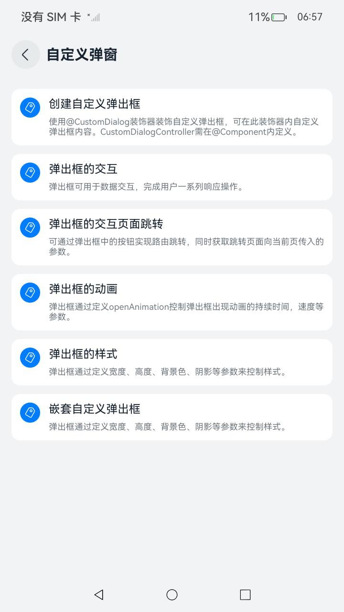

# ArkUI使用弹窗指南文档示例

### 介绍

本示例通过使用[ArkUI指南文档](https://gitCode.com/openharmony/docs/tree/master/zh-cn/application-dev/ui)中各场景的开发示例，展示在工程中，帮助开发者更好地理解ArkUI提供的组件及组件属性并合理使用。该工程中展示的代码详细描述可查如下链接：

1. [不依赖UI组件的全局自定义弹出框 (openCustomDialog)](https://gitcode.com/openharmony/docs/blob/OpenHarmony-5.0.1-Release/zh-cn/application-dev/ui/arkts-uicontext-custom-dialog.md)。
2. [基础自定义弹出框 (CustomDialog)](https://gitcode.com/openharmony/docs/blob/OpenHarmony-5.0.1-Release/zh-cn/application-dev/ui/arkts-common-components-custom-dialog.md)。
3. [固定样式弹出框](https://gitcode.com/openharmony/docs/blob/OpenHarmony-5.0.1-Release/zh-cn/application-dev/ui/arkts-fixes-style-dialog.md)。
4. [菜单控制（Menu)](https://gitcode.com/openharmony/docs/blob/OpenHarmony-5.0.1-Release/zh-cn/application-dev/ui/arkts-popup-and-menu-components-menu.md)
5. [气泡提示 (Popup)](https://gitcode.com/openharmony/docs/blob/OpenHarmony-5.0.1-Release/zh-cn/application-dev/ui/arkts-popup-and-menu-components-popup.md)
6. [即时反馈 (Toast)](https://gitcode.com/openharmony/docs/blob/OpenHarmony-5.0.1-Release/zh-cn/application-dev/ui/arkts-create-toast.md)
7. [设置浮层 (OverlayManager)](https://gitcode.com/openharmony/docs/blob/master/zh-cn/application-dev/ui/arkts-create-overlaymanager.md)
8. [弹出框蒙层控制](https://gitcode.com/openharmony/docs/blob/OpenHarmony-6.0-Release/zh-cn/application-dev/ui/arkts-dialog-mask.md)
### 效果预览

| 首页                                | 弹窗类组件目录                        | 自定义弹窗示例                       |                                    |                                    |
|------------------------------------|------------------------------------|------------------------------------|------------------------------------|------------------------------------|
|  |  |  |  |  |

### 使用说明

1. 在主界面，可以点击对应卡片，选择需要参考的组件示例。

2. 在组件目录选择详细的示例参考。

3. 进入示例界面，查看参考示例。

4. 通过自动测试框架可进行测试及维护。

### 工程目录
```
entry/src/main/ets/
|---entryability
|---pages
|   |---customdialog                          //自定义弹出框     
|   |       |---CreateCustomDialog.ets
|   |       |---CreateCustomDialogNew.ets
|   |       |---DialogAnimation.ets
|   |       |---DialogAnimation1.ets
|   |       |---DialogAvoidSoftKeyboard.ets
|   |       |---DialogInteraction.ets
|   |       |---DialogInteraction1.ets
|   |       |---DialogInteractionUseConstructor.ets
|   |       |---DialogInteractionUseButton.ets
|   |       |---DialogStyle.ets
|   |       |---DialogStyle1.ets
|   |       |---DialogWithPhysicalBack.ets
|   |       |---GetDialogStatus.ets
|   |       |---Index.ets
|   |       |---Index2.ets
|   |       |---NestDialog.ets
|   |       |---NestDialog1.ets
|   |---fixedstyledialog                      //固定样式弹出框
|   |       |---ActionSheet.ets
|   |       |---AlertDialog.ets
|   |       |---CalendarPickerDialog.ets
|   |       |---DatePickerDialog.ets
|   |       |---DatePickerCustomDialog.ets
|   |       |---Index.ets
|   |       |---ShowActionMenu.ets
|   |       |---ShowDialog.ets
|   |       |---TextPickerDialog.ets
|   |       |---TimePickerDialog.ets
|   |---maskdialog                             //弹出框蒙层控制
|   |       |---CustomDialogAnimation.ets
|   |       |---CustomDialogControl.ets
|   |       |---Index.ets
|   |---Menu                                  //菜单
|   |       |---BindComponentMenu.ets         //基于绑定组件指定位置弹出菜单
|   |       |---CreateMenu.ets
|   |       |---EventTransSubWindowMenu.ets   //控制子窗菜单的事件透传
|   |       |---Index.ets
|   |       |---PopVibrateMenu.ets            //菜单弹出时振动效果
|   |       |---SupportAvoidCentralAxisMenu.ets   //菜单支持避让中轴
|   |---opencustomdialog                      //不依赖UI组件的全局自定义弹出框
|   |       |---Index.ets
|   |       |---openCustomDialog.ets
|   |       |---customDialogComponentWithTransition.ets
|   |       |---customDialogWithKeyboardAvoidDistance.ets
|   |       |---OpenDialogAndUpdate.ets
|   |---OverlayManager                        //设置浮层
|   |       |---Index.ets
|   |       |---OverlayManagerAlertDialog.ets
|   |       |---OverlayManagerComponent.ets
|   |       |---OverlayManagerWithOrder.ets
|   |---popup                                 //气泡提示
|   |       |---ButtonPopup.ets
|   |       |---CustomPopup.ets
|   |       |---Index.ets
|   |       |---PopupAnimation.ets
|   |       |---PopupAvoidSoftKeyboard.ets    //气泡避让软键盘示例
|   |       |---PopupPolymorphicEffect.ets    //设置气泡内的多态效果示例
|   |       |---PopupStateChange.ets
|   |       |---PopupStyle.ets
|   |       |---PopupSupportedAvoidAxis.ets   //气泡支持避让中轴示例
|   |       |---TextPrompts.ets
|   |---Toast                                 //即使反馈
|   |       |---CreateToast.ets
|   |       |---DefaultAndTopToast.ets
|   |       |---Index.ets
|   |       |---OpenCloseToast.ets                           
|---pages
|   |---Index.ets                       // 应用主页面
|   |---Index2.ets                       // 弹窗跳转页面
entry/src/ohosTest/
|---ets
|   |---index.test.ets                       // 示例代码测试代码
```
## 具体实现

1. 设置浮层(OverlayManager)：可以通过使用UIContext中的getOverlayManager方法获取当前UI上下文关联的OverlayManager对象，再通过该对象调用对应方法。

   * 在OverlayManager上新增指定节点、删除指定节点、显示所有节点和隐藏所有节点。代码参考[OverlayManagerDemo1.ets](https://gitcode.com/openharmony/applications_app_samples/tree/master/code/DocsSample/ArkUISample/DialogProject/entry/src/main/ets/pages/OverlayManager/OverlayManagerDemo1.ets)

   * 显示一个始终在屏幕左侧的悬浮球，点击可以弹出alertDialog弹窗。代码参考[OverlayManagerDemo2.ets](https://gitcode.com/openharmony/applications_app_samples/tree/master/code/DocsSample/ArkUISample/DialogProject/entry/src/main/ets/pages/OverlayManager/OverlayManagerDemo2.ets)

   * 调用UIContext中getOverlayManager方法获取OverlayManager对象，并利用该对象在指定层级上新增指定节点（addComponentContentWithOrder），层次高的浮层会覆盖在层级低的浮层之上。代码参考[OverlayManagerDemo3.ets](https://gitcode.com/openharmony/applications_app_samples/tree/master/code/DocsSample/ArkUISample/DialogProject/entry/src/main/ets/pages/OverlayManager/OverlayManagerDemo3.ets)

2. 气泡提示（Popup）

   * 气泡分为两种类型，一种是系统提供的气泡PopupOptions，一种是开发者可以自定义的气泡CustomPopupOptions。其中，PopupOptions通过配置primaryButton和secondaryButton来设置带按钮的气泡；CustomPopupOptions通过配置builder来设置自定义的气泡。其中系统提供的气泡PopupOptions，字体的最大放大倍数为2。
   
   * 气泡可以通过配置mask来实现模态和非模态窗口，mask为true或者颜色值的时候，气泡为模态窗口，mask为false时，气泡为非模态窗口。
   
   * 多个气泡同时弹出时，子窗内显示的气泡比主窗内显示的气泡层级高，所处窗口相同时，后面弹出的气泡层级比先弹出的气泡层级高。

3. 菜单控制（Menu）

   * Menu是菜单接口，一般用于鼠标右键弹窗、点击弹窗等。具体用法请参考菜单控制。
   
   * 使用bindContextMenu并设置预览图，菜单弹出时有蒙层，此时为模态。
   
   * 使用bindMenu或bindContextMenu未设置预览图时，菜单弹出无蒙层，此时为非模态。

4. 基础自定义弹出框 (CustomDialog)
   
   * CustomDialog是自定义弹出框，可用于广告、中奖、警告、软件更新等与用户交互响应操作。

   * 开发者可以通过CustomDialogController类显示自定义弹出框。具体用法请参考自定义弹出框。

   * 默认为模态弹窗且有蒙层，不可与蒙层下方控件进行交互（不支持点击和手势等向下透传）。

   * 可以通过配置CustomDialogControllerOptions中的isModal属性来实现模态和非模态弹窗，详细说明可参考弹窗的种类。

5. 不依赖UI组件的全局自定义弹出框 (openCustomDialog)

   * 推荐使用UIContext中获取到的PromptAction对象提供的openCustomDialog接口在相对应用复杂的场景来实现自定义弹出框，相较于CustomDialogController优势点在于页面解耦，支持动态刷新。
   
   * 弹出框（openCustomDialog）默认为模态弹窗且有蒙层，不可与蒙层下方控件进行交互（不支持点击和手势等向下透传）。

   * 可以通过配置promptAction.BaseDialogOptions类型中的isModal属性来实现模态和非模态弹窗，详细说明可参考弹窗的种类。

   * 当isModal为true时，弹出框为模态弹窗，且弹窗周围的蒙层区不支持透传。isModal为false时，弹出框为非模态弹窗，且弹窗周围的蒙层区可以透传。因此如果需要同时允许弹出框的交互和弹出框外页面的交互行为，需要将弹出框设置为非模态。

5. 弹出框蒙层控制（MaskDialog）

   * 开发者对弹出框的定制不仅限于弹出框里的内容，对弹出框蒙层的定制需求也逐渐增加。
   
   * 本文介绍ArkUI弹出框的蒙层控制，包括点击蒙层时是否消失、蒙层区域、蒙层颜色和蒙层动画等特性。

### 相关权限
   不涉及。

### 依赖

不涉及。

### 约束与限制

1.本示例仅支持标准系统上运行, 支持设备：RK3568。

2.本示例为Stage模型，支持API22版本full-SDK，版本号：6.0.0.47，镜像版本号：OpenHarmony_6.0.0 Release。

3.本示例需要使用DevEco Studio 6.0.0 Release (Build Version: 6.0.0.858, built on September 24, 2025)及以上版本才可编译运行。

### 下载

如需单独下载本工程，执行如下命令：

````
git init
git config core.sparsecheckout true
echo code/DocsSample/ArkUISample/DialogProject > .git/info/sparse-checkout
git remote add origin https://gitCode.com/openharmony/applications_app_samples.git
git pull origin master
````