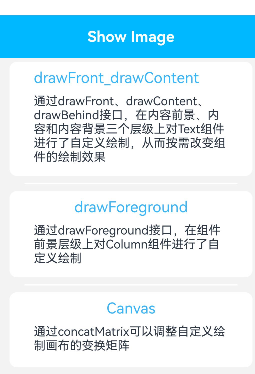
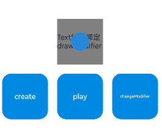

# ArkUI使用自定义绘制修改器指南文档示例

### 介绍

本示例通过使用[ArkUI指南文档](https://gitcode.com/openharmony/docs/tree/master/zh-cn/application-dev/ui)中各场景的开发示例，展示在工程中，帮助开发者更好地理解ArkUI提供的组件及组件属性并合理使用。该工程中展示的代码详细描述可查如下链接：

1. [自定义绘制修改器 (DrawModifier)](https://gitcode.com/openharmony/docs/blob/master/zh-cn/application-dev/ui/arkts-user-defined-extension-drawModifier.md)。
### 效果预览

| 首页                                 | 自定义绘制效果                           |
|------------------------------------|-----------------------------------|
|  |  |

### 使用说明

1. 在主界面，可以点击对应卡片，选择需要参考的组件示例。

3. 进入示例界面，查看参考示例。

4. 通过自动测试框架可进行测试及维护。

### 工程目录
```
entry/src/main/ets/
|---entryability
|---pages
|   |---Canvas_index.ets
|   |---drawForeground_index.ets
|   |---drawFront_drawContent_drawBehind.ets   //应用子页面     
            
|---pages
|   |---Index.ets                      // 应用主页面
entry/src/ohosTest/
|---ets
|   |---index.test.ets                 // 示例代码测试代码
```
### 具体实现

1. 创建继承DrawModifier的自定义类，重写drawBehind/drawContent/drawFront/drawForeground等绘制方法；
2. 在绘制方法中使用Canvas绘图API（如drawRect、drawCircle等）进行自定义绘制；
3. 通过组件的.drawModifier()修饰符绑定自定义DrawModifier实例；
4. 调用invalidate()方法触发重绘更新绘制效果

### 相关权限

不涉及。

### 依赖

不涉及。

### 约束与限制

1.本示例仅支持标准系统上运行, 支持设备：RK3568。

2.本示例为Stage模型，支持API21版本SDK，版本号：6.0.0.55，镜像版本号：OpenHarmony_6.0.0.55。


### 下载

如需单独下载本工程，执行如下命令：

````
git init
git config core.sparsecheckout true
echo code/DocsSample/ArkUIDocSample/drawModifier > .git/info/sparse-checkout
git remote add origin https://gitcode.com/openharmony/applications_app_samples.git
git pull origin master
````