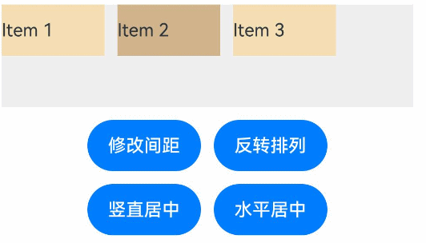
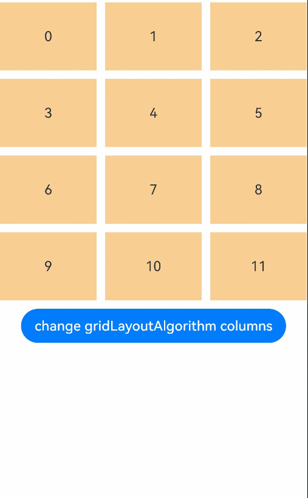
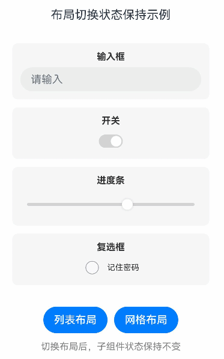

# ArkUI动态布局示例

## 介绍

本示例展示了ArkUI中[ArkUI指南文档](https://gitcode.com/tianlongdevcode/docs_zh/blob/master/zh-cn/application-dev/ui/arkts-layout-development-dynamiclayout.md)的开发示例。通过本示例，开发者可以学习如何使用DynamicLayout组件构建基本布局、如何实现DynamicLayou组件的自定义布局算法、如何动态切换DynamicLayout组件的布局算法。该工程中展示的代码详细描述可查链接[动态布局](https://gitcode.com/openharmony/docs/blob/master/zh-cn/application-dev/reference/apis-arkui/arkui-ts/ts-container-dynamiclayout.md)。
 

## 1. [线性布局算法示例 (Row/Column)]
### 效果预览

| 列表                                 |  示例 
|------------------------------------|--------------------------------------|
|  |    |

## 2. [堆叠布局算法示例 (Stack)]
### 效果预览

| 列表                                    | 示例               
|---------------------------------------|------------------------------------|
|  |  |

## 3. [网格栅格布局算法示例 (Grid)]
### 效果预览

| 列表                                 |  示例              
|------------------------------------|------------------------------------|
|  |  |

## 4. [自定义布局算法示例]
### 效果预览

| 列表                                 | 示例              
|------------------------------------|------------------------------------|
|  |  |

## 5. [布局算法切换示例]
### 效果预览

| 列表                                 | 示例                 
|------------------------------------|------------------------------------|
|  |  |

## 使用说明

1. 在主界面，可以点击对应卡片，选择需要参考的布局示例。

2. 进入线性布局、堆叠布局、网格布局示例，学习如何设置DynamicLayout组件的布局算法。

3. 进入自定义布局算法示例，学习如何实现瀑布流、网格、标签云等自定义布局。

4. 进入算法切换示例，学习如何根据不同条件动态切换DynamicLayout组件的布局算法。

## 工程目录
```
entry/src/main/ets/
|---entryability
|---pages
|   |---MainPage.ets                       // 应用主页面
|   |---basic                              // 基础示例
|   |       |---CreateDynamicLayout.ets     // 创建动态布局示例
|   |---linearlayout                       // 线性布局算法示例
|   |       |---RowLayoutAlgorithm.ets      // 水平线性布局算法
|   |       |---ColumnLayoutAlgorithm.ets   // 垂直线性布局算法
|   |---stacklayout                        // 堆叠布局算法示例
|   |       |---StackLayoutAlgorithm.ets    // 堆叠布局算法
|   |---gridlayout                         // 网格布局算法示例
|   |       |---GridLayoutAlgorithm.ets     // 网格布局算法
|   |---customlayout                       // 自定义布局算法示例
|   |       |---CustomLayoutIndex.ets       // 自定义布局索引页
|   |       |---CustomLayoutBasic.ets       // 自定义布局算法实现指导
|   |       |---WaterFlowLayout.ets        // 自定义瀑布流
|   |       |---GridLayout.ets              // 自定义网格布局
|   |       |---TagCloudLayout.ets          // 自定义标签云布局
|   |---responsivelayout                   // 响应式布局切换示例
|   |       |---ResponsiveLayoutIndex.ets  // 响应式布局索引页
|   |       |---ChangeLayoutAlgorithm.ets   // 通过状态变量切换布局算法
|   |       |---ChangeLayoutWithConditionVariable.ets  // 通过条件运算符切换布局算法
|   |       |---ChangeAlgorithmProperties.ets  // 通过修改算法属性触发重新布局
|   |       |---ChangeLayoutWithMediaQuery.ets  // 响应式布局算法切换
|   |       |---ReserveChildState.ets       // 布局切换保持子组件状态
entry/src/ohosTest/
|---ets
|   |---DynamicLayoutTest.ets              // 动态布局示例测试代码
```

## 具体实现

1. 启动app进入主界面，选择线性布局算法、堆叠布局算法、网格布局算法、自定义布局算法示例或者响应式布局切换示例，然后点击选择详细的示例参考。

2. 线性布局算法示例展示了如何使用DynamicLayout组件和RowLayoutAlgorithm/ColumnLayoutAlgorithm实现水平和垂直方向的线性布局，源码参考示例场景[entry/src/main/ets/pages/linearlayout/](./entry/src/main/ets/pages/linearlayout/RowLayoutAlgorithm.ets)

3. 堆叠布局算法示例展示了如何使用DynamicLayout组件和StackLayoutAlgorithm实现堆叠布局，源码参考示例场景[entry/src/main/ets/pages/stacklayout/](./entry/src/main/ets/pages/stacklayout/StackLayoutAlgorithm.ets)

4. 网格布局算法示例展示了如何使用DynamicLayout组件和GridLayoutAlgorithm实现网格布局，源码参考示例场景[entry/src/main/ets/pages/gridlayout/](./entry/src/main/ets/pages/gridlayout/GridLayoutAlgorithm.ets)

5. 自定义布局算法示例展示了如何实现瀑布流、网格、标签云等自定义布局算法，包括布局算法的基本实现、子组件的测量和定位等，源码参考示例场景[entry/src/main/ets/pages/customlayout/](entry/src/main/ets/pages/customlayout/CustomLayoutIndex.ets)

6. 响应式布局切换示例展示了如何通过状态变量、条件运算符、MediaQuery等方式动态切换布局算法，以及如何在布局切换时保持子组件状态，源码参考示例场景[entry/src/main/ets/pages/responsivelayout/](./entry/src/main/ets/pages/responsivelayout/ResponsiveLayoutIndex.ets)

## 相关权限

不涉及。

## 依赖

- @ohos/lottie: ^2.0.24

## 约束与限制

1. 本示例仅支持标准系统上运行，支持设备：RK3568。

2. 本示例支持API24版本SDK，SDK版本号(API Version 24 Release)。

3. 本示例需要使用DevEco Studio 6.0.2 Release (Build Version: 6.0.2.640, built on January 19, 2026)以上版本才可编译运行。

## 下载

如需单独下载本工程，执行如下命令：

````
git init
git config core.sparsecheckout true
echo code/DocsSample/ArkUISample/DynamicLayout > .git/info/sparse-checkout
git remote add origin https://gitCode.com/openharmony/applications_app_samples.git
git pull origin master
````
