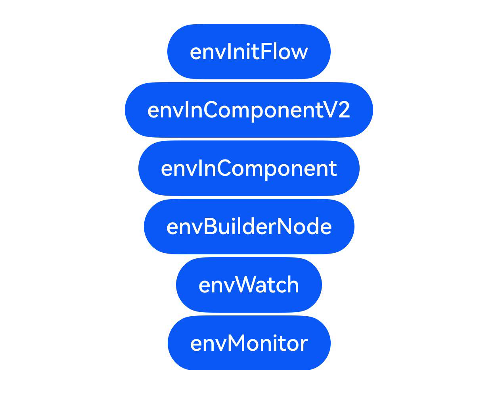

# \@Env：环境变量

## 介绍

本工程帮助开发者更好地理解\@Env环境变量装饰器的使用场景。该工程中展示的代码详细描述可查如下链接：

[\@Env：环境变量](https://gitcode.com/openharmony/docs/blob/master/zh-cn/application-dev/ui/arkts-env-system-property.md)

## 效果预览

|首页                                   |
|----------------------------------------------|
||

## 使用说明

执行测试用例会先打开相应界面，然后点击按钮或图标，演示接口的使用效果。

## 工程目录
```
entry/src/
├── main
│   ├── ets
│   │   ├── entryability
│   │   ├── entrybackupability
│   │   ├── pages
│   │   │   ├── EnvBuilderNode.ets
│   │   │   ├── EnvBuilderNodeLambda.ets
│   │   │   ├── EnvBuilderNodeLambdaSubWindow.ets
│   │   │   ├── EnvBuilderNodeSubWindow.ets
│   │   │   ├── EnvInComponent.ets
│   │   │   ├── EnvInComponentV2.ets
│   │   │   ├── EnvInitFlow.ets
│   │   │   ├── EnvMonitor.ets
│   │   │   ├── EnvWatch.ets
│   │   │   └── Index.ets
│   └── resources
│       ├── ...
├─── ... 
```

## 具体实现

1. \@Env变量在被第一次读值时触发初始化，按“父组件已有实例→当前窗口已有实例→创建新实例”的顺序复用或创建。

2. 在\@ComponentV2中声明\@Env可获取窗口布局断点信息，其返回对象为\@ObservedV2/\@Trace装饰的可观察实例，可通过addMonitor监听其属性变化。

3. 在\@Component中使用\@Env的用法与\@ComponentV2类似。

4. 通过BuilderNode切换\@Component/\@ComponentV2所在窗口实例时，\@Env会依据新窗口重新获取环境变量并刷新关联组件；此时不建议将\@Env传给常规变量，应使用lambda闭包传递以触发刷新。

5. 从API版本26.0.0开始，在\@Component中可通过\@Watch、在\@ComponentV2中可通过\@Monitor监听\@Env装饰变量的变化（仅整体赋值时触发）。

## 相关权限

不涉及。

## 依赖

不涉及。

## 约束与限制

1.本示例已适配API version 22及以上版本SDK，其中\@Watch/\@Monitor监听\@Env相关样例需API version 26.0.0及以上。

## 下载

如需单独下载本工程，执行如下命令：

```
git init
git config core.sparsecheckout true
echo code/DocsSample/ArkUISample/EnvSample/ > .git/info/sparse-checkout
git remote add origin https://gitcode.com/openharmony/applications_app_samples.git
git pull origin master
```
