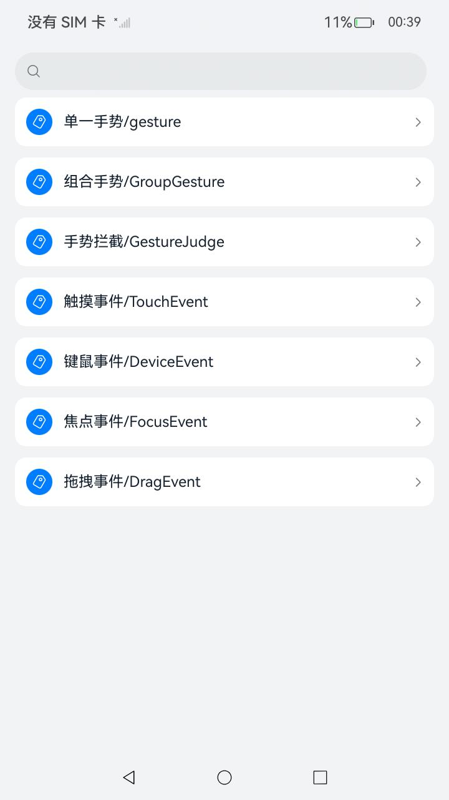
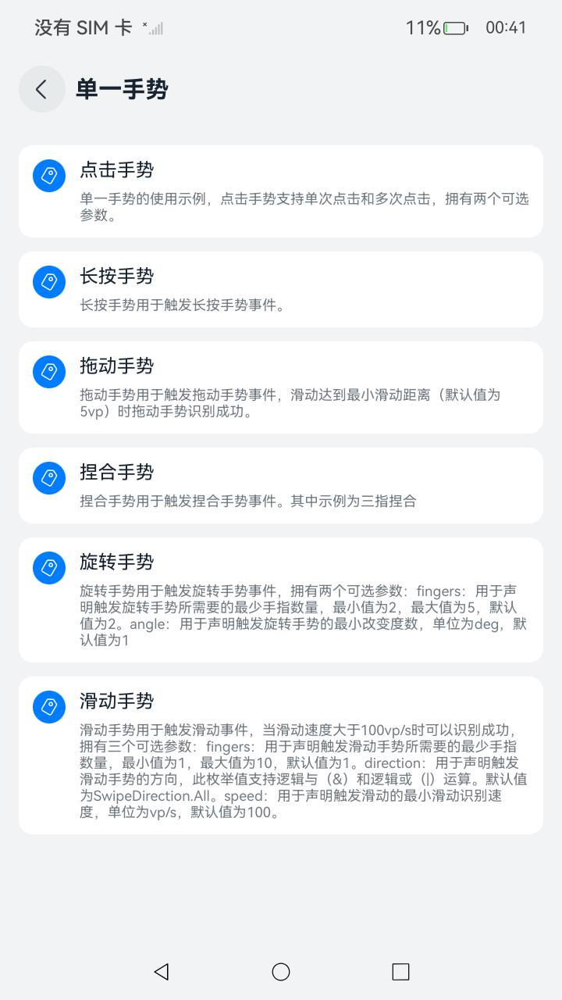
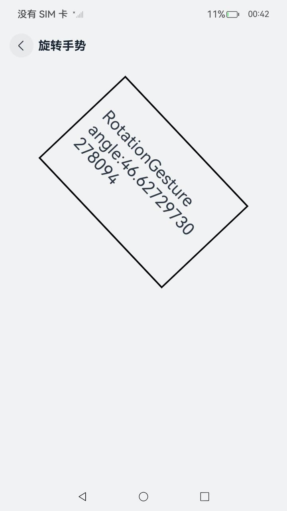

# ArkUI使用支持交互事件指南文档示例

### 介绍

本示例通过使用[ArkUI指南文档](https://gitee.com/openharmony/docs/tree/master/zh-cn/application-dev/ui)中各场景的开发示例，展示在工程中，帮助开发者更好地理解ArkUI提供的组件及组件属性并合理使用。该工程中展示的代码详细描述可查如下链接：

1. [触屏事件](https://gitee.com/openharmony/docs/blob/OpenHarmony-5.0.1-Release/zh-cn/application-dev/ui/arkts-common-events-touch-screen-event.md)。
2. [键鼠事件](https://gitee.com/openharmony/docs/blob/OpenHarmony-5.0.1-Release/zh-cn/application-dev/ui/arkts-common-events-device-input-event.md)。
3. [焦点事件](https://gitee.com/openharmony/docs/blob/OpenHarmony-5.0.1-Release/zh-cn/application-dev/ui/arkts-common-events-focus-event.md)。
4. [拖拽事件](https://gitee.com/openharmony/docs/blob/OpenHarmony-5.0.1-Release/zh-cn/application-dev/ui/arkts-common-events-drag-event.md)
5. [单一手势](https://gitee.com/openharmony/docs/blob/OpenHarmony-5.0.1-Release/zh-cn/application-dev/ui/arkts-gesture-events-single-gesture.md)
6. [组合手势](https://gitee.com/openharmony/docs/blob/OpenHarmony-5.0.1-Release/zh-cn/application-dev/ui/arkts-gesture-events-combined-gestures.md)
7. [手势拦截](https://gitee.com/openharmony/docs/blob/OpenHarmony-5.0.1-Release/zh-cn/application-dev/ui/arkts-gesture-events-gesture-judge.md)
### 效果预览

| 首页                                 | 交互类组件目录                            | 单一手势示例                             |
|------------------------------------|------------------------------------|------------------------------------|
|  |  |  |

### 使用说明

1. 在主界面，可以点击对应卡片，选择需要参考的组件示例。

2. 在组件目录选择详细的示例参考。

3. 进入示例界面，查看参考示例。

4. 通过自动测试框架可进行测试及维护。

### 工程目录
```
entry/src/main/ets/
|---entryability
|---pages
|   |---device                            //键鼠事件     
|   |       |---HoverEffect.ets
|   |       |---OnHover.ets
|   |       |---OnKey.ets
|   |       |---OnKeyPreIme.ets
|   |       |---OnMouse.ets
|   |       |---Index.ets
|   |---focus                              //焦点事件
|   |       |---DefaultFocus.ets
|   |       |---Focusable.ets
|   |       |---FocusAndClick.ets
|   |       |---FocusController.ets
|   |       |---Index.ets
|   |       |---FocusPriority.ets
|   |       |---FocusScopePriority.ets
|   |       |---FocusStyle.ets
|   |       |---onFocusBlur.ets
|   |---drag                                //拖拽事件
|   |       |---DefaultDrag.ets
|   |       |---Index.ets
|   |       |---MoreDrag.ets
|   |---gesturejudge                        //手势拦截
|   |       |---Index.ets  
|   |       |---GestureJudge.ets
|   |---singlegesture                       //单一手势
|   |       |---LongPressGesture.ets
|   |       |---PanGesture.ets
|   |       |---Index.ets
|   |       |---PinchGesture.ets
|   |       |---RotationGesture.ets
|   |       |---SwipeGesture.ets
|   |       |---TapGesture.ets
|   |---Touch                                //触摸事件
|   |       |---ClickEvent.ets
|   |       |---Index.ets
|   |       |---TouchEvent.ets    
|   |---groupgesture                          //组合手势
|   |       |---Exclusive.ets
|   |       |---Index.ets
|   |       |---Parallel.ets
|   |       |---Sequence.ets                    
|---pages
|   |---Index.ets                       // 应用主页面
entry/src/ohosTest/
|---ets
|   |---index.test.ets                       // 示例代码测试代码
```

### 相关权限

不涉及。

### 依赖

不涉及。

### 约束与限制

1.本示例仅支持标准系统上运行, 支持设备：RK3568。

2.本示例为Stage模型，支持API14版本SDK，版本号：5.0.2.57，镜像版本号：OpenHarmony_5.0.2.57。

3.本示例需要使用DevEco Studio NEXT Developer Preview2 (Build Version: 5.0.5.306， built on December 12, 2024)及以上版本才可编译运行。

### 下载

如需单独下载本工程，执行如下命令：

````
git init
git config core.sparsecheckout true
echo code/DocsSample/ArkUIDocSample/EventProject > .git/info/sparse-checkout
git remote add origin https://gitee.com/openharmony/applications_app_samples.git
git pull origin master
````