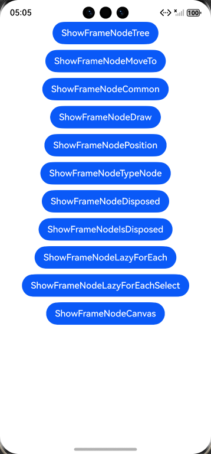
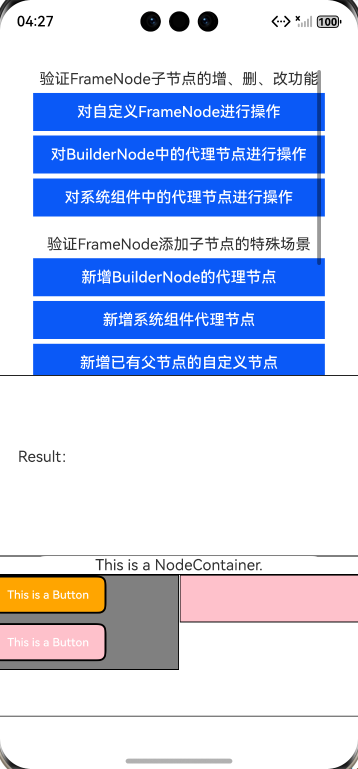
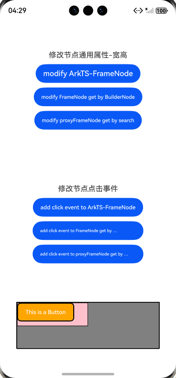
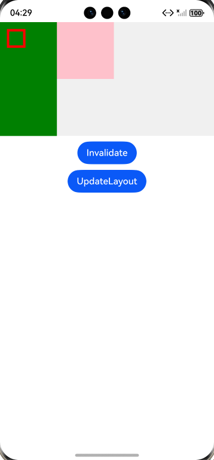
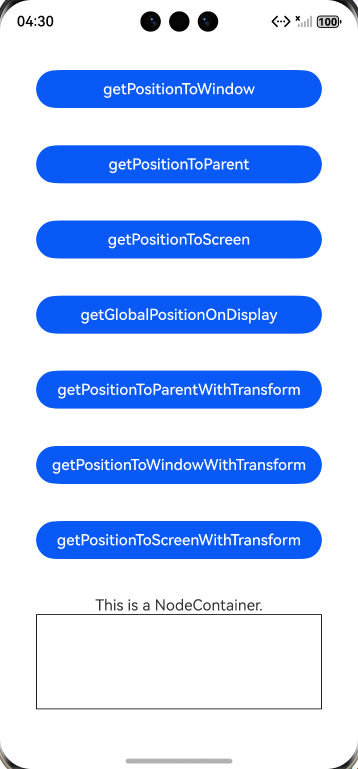
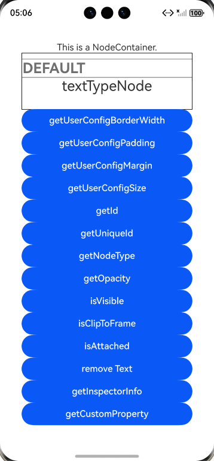
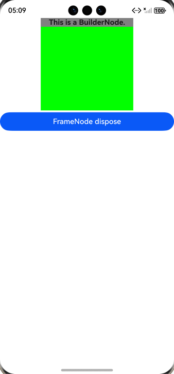
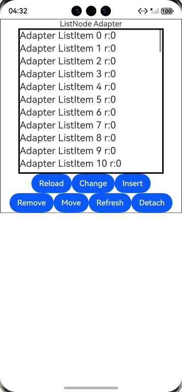
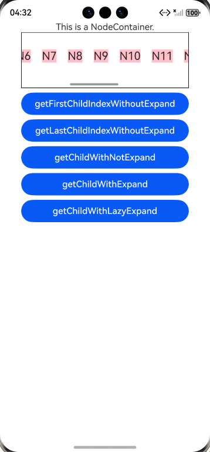

# ArkUI使用Frame Node指南文档示例

### 介绍

本示例通过使用[ArkUI指南文档](https://gitcode.com/openharmony/docs/tree/master/zh-cn/application-dev/ui)中各场景的开发示例，展示在工程中，帮助开发者更好地理解ArkUI提供的组件及组件属性并合理使用。该工程中展示的代码详细描述可查如下链接:

1. [自定义组件节点 (FrameNode)](https://gitcode.com/openharmony/docs/blob/master/zh-cn/application-dev/ui/arkts-user-defined-arktsNode-frameNode.md)

### 效果预览

| 首页                            | 操作节点树                                  | 使用moveTo移动命令式节点                | 设置节点通用属性和事件回调          |
|-------------------------------|----------------------------------------|------------------------------------------|-------------------------------|
|  |  |  |   

| 自定义测量布局与绘制                             | 查找节点及获取基础信息                                | 通过typeNode创建具体类型的FrameNode节点               | 解除当前FrameNode对象对实体FrameNode节点的引用关系                     |
|----------------------------------------|--------------------------------------------|--------------------------------------------|-------------------------------|
|  |  |  |  

| 查询当前FrameNode是否解除引用                          | FrameNode的数据懒加载能力                             | 查询LazyForEach中的FrameNode节点信息                        | 调整自定义绘制Canvas的变换矩阵                     |
|----------------------------------------------|-----------------------------------------------|-----------------------------------------------------|-------------------------------|
|  |  |  |  

### 使用说明

1. 在主界面，通过点击不同的按钮，创建需要的组件。

2. 在自定义组件节点树页面，通过点击不同的按钮，可以看到不同的效果。

3. 在自定义组件节点移动页面，点击move，可以看到组件的移动变化。

4. 在自定义组件通用属性页面，点击修改节点通用属性-宽高文本下面的各个按钮，可以设置节点的通用属性，点击修改节点点击事件下的文本，可以在控制台查看打印信息。

5. 在自定义组件节点测量布局与绘制页面，点击“无效”按钮，可以查看左侧红色方框的变化，点击“更新布局”，可以查看右侧粉色方块的变化。

6. 自定义组件节点位置页面，通过点击不同的按钮，可以在控制台看到FrameMode相对父组件的打印信息。

7. 在自定义组件typeNode创建节点页面，通过点击不同的按钮，可以在控制台看到FrameMode相对父组件的打印信息。

8. 在自定义组件节点解除页面，通过“处理”按钮，可以解除当前FrameNode对象对FrameNode节点的引用关系。

9. 在自定义组件节点查询解除页面，通过点击“处理”和“已处理”按钮，通过文本“FrameNode 已处理为真”是否显示查看当前是否已解除引用页面。

10. 在自定义组件节点懒加载页面，通过点击不同按钮，查看ListNode Adapter列表框中的数据变化。

11. 在自定义组件节点懒加载查询页面，通过点击不同按钮，在控制台查看相应的日志输出。

12. 在自定义组件节点画布页面，可以展示canvas的变换矩阵。

### 工程目录
```

entry/src/main/ets/
|---entryability
|---pages
|   |---index.ets                      // 应用主页面
|   |---framenode
|   |   |---FrameNodeCanvas.ets               // FrameNode画布页
|   |   |---FrameNodeCommon.ets               // FrameNode通用属性页
|   |   |---FrameNodeDisposed.ets               // FrameNode解除引用关系页
|   |   |---FrameNodeDraw.ets               // FrameNodeh绘制页
|   |   |---FrameNodeIsDisposed.ets               // FrameNode是否解除引用页
|   |   |---FrameNodeLazyForEach.ets               // FrameNode懒加载页
|   |   |---FrameNodeLazyForEachSelect.ets               // FrameNode懒加载查询页
|   |   |---FrameNodeMoveTo.ets               // FrameNode移动页
|   |   |---FrameNodePosition.ets               // FrameNode位置页
|   |   |---FrameNodeTree.ets               // FrameNode节点树页         
|   |   |---FrameNodeTypeNode.ets               // 通过TypeNode创建FrameNode页           
entry/src/ohosTest/
|---ets
|   |---ets
|   |---|framenode
|   |   |---|FrameNodeTest.test.ets
|   |---index.test.ets                 // 示例代码测试代码
```

### 具体实现

1. 先定义 MyNodeController 继承 NodeController，在 makeNode 中通过 new FrameNode(uiContext) 创建自定义根节点与子节点，设置宽高、背景色等属性并建立父子关系，还可创建 BuilderNode 挂载系统组件。
2. 页面用 NodeContainer 承载节点，通过按钮触发增删改操作：调用 appendChild 新增节点，removeChild 删除节点，commonAttribute 修改宽高位置；也能调用 isModifiable 判断节点是否可改，通过 getPositionToWindow 等接口获取节点位置，重写 onDraw 实现自定义绘制，满足节点树动态管理需求。

### 相关权限

不涉及。

### 依赖

不涉及。

### 约束与限制

1.本示例支持标准系统上运行, 支持设备：RK3568等。

2.本示例需要使用DevEco Studio 6.0.0 Canary1 (Build Version: 6.0.0.858, built on September 24, 2025)及以上版本才可编译运行。

### 下载

如需单独下载本工程，执行如下命令：

````
git init
git config core.sparsecheckout true
echo code/DocsSample/ArkUISample/FrameNode > .git/info/sparse-checkout
git remote add origin https://gitcode.com/openharmony/applications_app_samples.git
git pull origin master
````