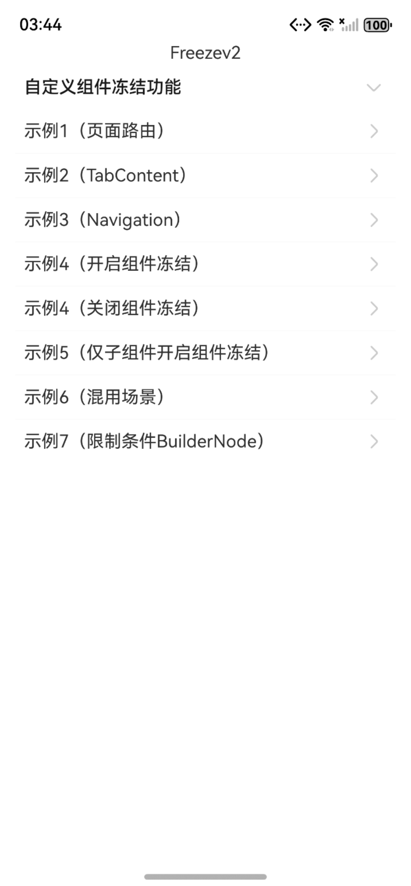

# ArkUI使用动效组件指南文档示例

### 介绍

本示例通过使用[ArkUI指南文档](https://gitcode.com/openharmony/docs/tree/master/zh-cn/application-dev/ui)中各场景的开发示例，展示在工程中，帮助开发者更好地理解ArkUI提供的组件及组件属性并合理使用。该工程中展示的代码详细描述可查如下链接：

1. [自定义组件冻结功能（freeze）](https://gitcode.com/openharmony/docs/blob/master/zh-cn/application-dev/ui/state-management/arkts-custom-components-freezeV2.md)。

### 效果预览


| 首页                               |
| ---------------------------------- |
|  |

### 使用说明

1. 在主界面，可以点击对应卡片，选择需要参考的组件示例。
2. 在组件目录选择详细的示例参考。
3. 进入示例界面，查看参考示例。
4. 通过自动测试框架可进行测试及维护。

### 工程目录

```
entry/src/main/ets/
|---entryability
|---pages
|   |---freeze                       // 组件冻结功能（freeze） 
|   |   |---template1       
|   |   |   |---Page1.ets           // 示例1（页面路由）
|   |   |   |---Page2.ets
|   |   |---template2  
|   |   |   |---TabContentTest.ets                // 示例2（TabContent）
|   |   |---template3                  
|   |   |   |---MyNavigationTestStack.ets            // 示例3（Navigation）
|   |   |---template4       
|   |   |   |---RepeatVirtualScrollFreeze.ets           // 示例4（Repeat,开启组件冻结）
|   |   |   |---PageB.ets                             // 示例4（Repeat,关闭组件冻结）
|   |   |---template5  
|   |   |   |---PageA.ets                // 示例5（仅子组件开启组件冻结）
|   |   |   |---PageB.ets                // 示例5 (Navigation子页面)
|   |   |---template6                  
|   |   |   |---MyNavigationTestStack.ets            // 示例6（混用场景）
|   |   |---template7                  
|   |   |   |---BuilderNode.ets            // 示例7（限制条件BuilderNode）
|---pages
|   |---Index.ets                       // 应用主页面
entry/src/ohosTest/
|---ets
|   |---test
|   |   |---Freeze.test.ets                      // 组件冻结功能（Freeze）示例代码测试代码
```

### 具体实现

1. 自定义组件冻结功能：通过@ComponentV2装饰的自定义组件处于非激活状态时，状态变量将不响应更新，通过freezeWhenInactive属性来决定是否使用冻结功能。源码参考[freeze/template1/Page1.ets](https://gitcode.com/openharmony/applications_app_samples/blob/master/code/DocsSample/ArkUISample/freezev2/entry/src/main/ets/pages/freeze/template1/Page1.ets)
   * 当@ComponentV2装饰的自定义组件处于非激活状态时，状态变量将不响应更新，即@Monitor不会调用，状态变量关联的节点不会刷新。
   * 该冻结机制在复杂UI场景下能显著优化性能，避免非激活组件因状态变量更新进行无效刷新，从而减少资源消耗。通过freezeWhenInactive属性来决定是否使用冻结功能，不传参数时默认不使用。
   * 帧动画在动画过程中即可实时响应，而属性动画按最终状态响应。

### 相关权限

不涉及。

### 依赖

不涉及。

### 约束与限制

1.本示例仅支持标准系统上运行, 支持设备：RK3568。

2.本示例为Stage模型，支持API20版本SDK，版本号：6.0.0.33，镜像版本号：OpenHarmony_6.0.0.33。

3.本示例需要使用DevEco Studio 6.0.0 Canary1 (Build Version: 6.0.0.270， built on May 9, 2025)及以上版本才可编译运行。

### 下载

如需单独下载本工程，执行如下命令：

````
git init
git config core.sparsecheckout true
echo code/DocsSample/ArkUISample/freezev2 > .git/info/sparse-checkout
git remote add origin https://gitcode.com/openharmony/applications_app_samples
git pull origin master
````
