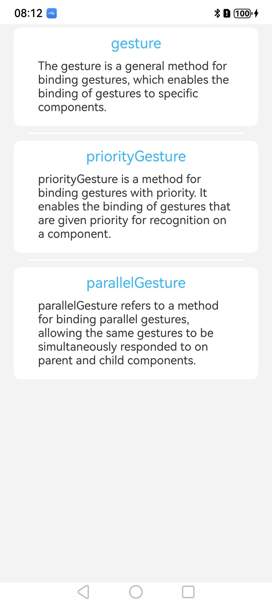
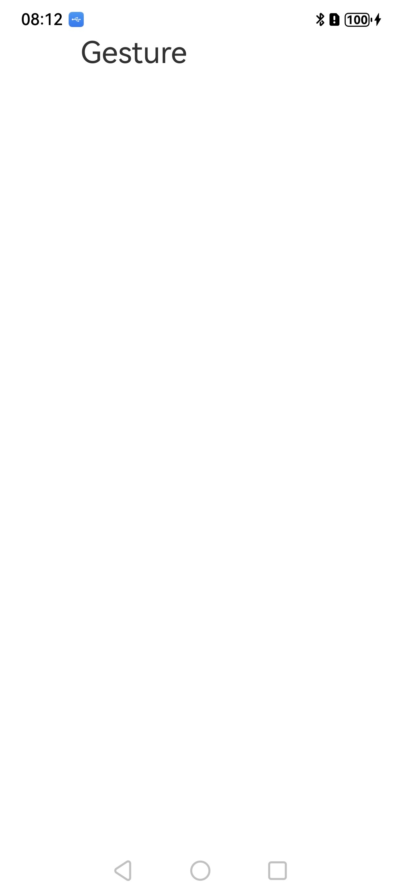

# 绑定手势方法

## 介绍

本示例为[绑定手势方法](https://gitcode.com/openharmony/docs/blob/master/zh-cn/application-dev/ui/arkts-gesture-events-binding.md)的配套示例工程。

本示例展示了适配绑定手势方法的组件及触发方式。

## 效果预览

| 首页                                   | 常规手势绑定方法                             |
|--------------------------------------|--------------------------------------|
|             |          |
| 带优先级的手势绑定方法                          | 并行手势绑定方法                             |
|  |  |


### 使用说明

1. **手势类型与场景匹配**:     
   触发跳转 / 确认：用TapGesture（支持单击 / 双击）。  
   触发上下文菜单 / 拖拽前置：用LongPressGesture（配置合理 duration，建议 300-1000ms）。  
   控制元素移动：用PanGesture（可限制拖动方向，如direction: PanDirection.Horizontal）。  
   控制缩放 / 旋转：用PinchGesture/RotateGesture（通常搭配 Parallel 模式组合使用）。
2. **关键注意事项**：  
   组件状态：确保组件enabled为true、visibility为Visible，禁用 / 隐藏状态下手势不响应。   
   优先级配置：同一区域多手势（如 Tap+LongPress），需给LongPressGesture设更高priority（如priority: 1），避免被 Tap 优先识别。  
   回调边界：过程型手势（如 Pan）的onActionUpdate会高频触发，禁止在回调内执行复杂计算（如大量 DOM 操作），防止卡顿。
3. **特殊场景适配**：  
   手势取消：用GestureGroup包裹时，可通过onActionCancel处理手势中断逻辑（如拖动时手指离开屏幕）。  
   多手指手势：Pinch/Rotate默认支持双指，无需额外配置，只需在回调中通过event参数获取手势数据（如event.scale/event.angle）。

## 工程目录

```
entry/src/main/ets/
└── pages
    └── Index.ets (获取文本界面)
    └── Gesture.ets            //  常规手势绑定方法
    └── ParallelGesture.ets    //  并行手势绑定方法
    └── PriorityGesture.ets    //  带优先级的手势绑定方法
```

### 具体实现

1. **单个手势基础绑定**：通过组件调用.gesture()方法，直接传入手势实例（如 Tap、LongPress），完成单一手势与组件的关联。  
   点击手势（Tap）：支持配置点击次数（count），例：TapGesture({ count: 2 }).onAction(() => { // 双击逻辑 })。  
   长按手势（LongPress）：支持配置触发时长（duration），例：LongPressGesture({ duration: 1000 }).onAction(() => { // 长按1秒触发逻辑 })。  
   捏合手势（Pinch）：用于缩放，通过onActionUpdate获取缩放比例，例：PinchGesture().onActionUpdate((event) => { scaleValue = event.scale })。
2. **手势事件回调处理**：不同手势提供生命周期回调，按需处理触发逻辑，避免冗余代码。  
   单次触发回调（如 Tap/LongPress）：用onAction()处理触发后逻辑（如弹窗提示）。  
   过程型回调（如 Pan/Pinch）：用onActionStart（开始时）、onActionUpdate（过程中）、onActionEnd（结束时）分步处理，例：Pan 手势拖动元素时，在onActionUpdate中更新元素坐标。
3. **手势组合与冲突处理**：基于GestureGroup管理多手势，结合gestureMask控制父子组件手势透传。  
   组合示例：图片缩放 + 旋转（Parallel 模式），例：GestureGroup(GestureMode.Parallel, PinchGesture(), RotateGesture()).onActionUpdate((events) => { // 同步更新缩放和旋转角度 })。  
   冲突解决：父组件用gestureMask: GestureMask.IgnoreInternal，忽略子组件区域的手势触发（如父容器滑动时，不响应子按钮的点击）。


## 相关权限

不涉及

## 依赖

不涉及

## 约束和限制

### 约束与限制
1.本示例仅支持标准系统上运行, 支持设备：RK3568。

2.本示例为Stage模型，支持API20版本SDK，版本号：6.0.0.47，镜像版本号：OpenHarmony_6.0.0.47。

3.本示例需要使用DevEco Studio NEXT Developer Preview2 (Build Version: 6.0.0.47， built on October 21, 2025)及以上版本才可编译运行。

## 下载

如需单独下载本工程，执行如下命令：
```
git init
git config core.sparsecheckout true
echo code/DocsSample/ArkUISample/GestureBinding > .git/info/sparse-checkout
git remote add origin https://gitcode.com/openharmony/applications_app_samples.git
git pull origin master
```
