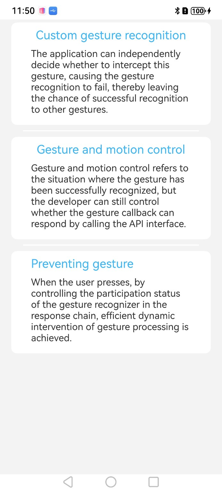
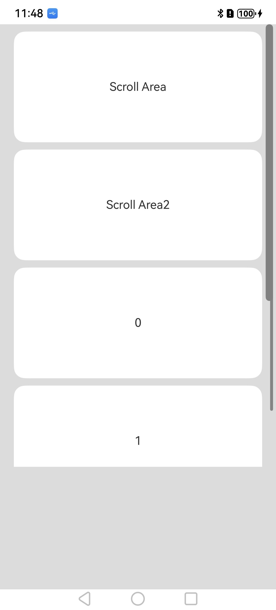

# 手势冲突处理

## 介绍

本示例为[手势冲突处理](https://gitcode.com/openharmony/docs/blob/master/zh-cn/application-dev/ui/arkts-gesture-events-gesture-judge.md)的配套示例工程。

本示例展示了适配手势冲突处理的组件及触发方式。

## 效果预览

| 首页                                    | 自定义手势判定                             |
|---------------------------------------|-------------------------------------|
|        |     |
| 手势并行动态控制                              | 阻止手势参与识别                            |
|    |   |


### 具体实现

1. **基础单个手势识别**：用系统手势类创建实例，绑定回调并关联组件。  
   点击（TapGesture）：设 count（点击次数），onAction 定义逻辑，.gesture () 绑定组件。  
   长按（LongPressGesture）：设 duration（触发时间），onActionStart/End 处理始末逻辑。  
   滑动（PanGesture）：设 direction（方向），onActionUpdate 获取 offsetX/Y 实现跟随滑动。
2. **组合手势识别**：用 GestureGroup 按模式管理多手势。  
   并行（Parallel）：如捏合 + 旋转，可同时触发。  
   顺序（Serial）：如长按后滑动，需先触发前者。  
   互斥（Exclusive）：如点击 / 长按，优先识别高优先级手势。
3. **手势冲突处理**：  
   优先级：通过 priority 属性（值越大优先级越高）设置。  
   父子组件：父组件用 gestureMask 控制子组件手势透传。  
   条件过滤：回调中加判断（如有效滑动偏移）避免误触。


### 使用说明

1. **API 适配场景**：  
   GestureGroup 模式：Parallel 无冲突用，Serial 有先后依赖用，Exclusive 互斥用。  
   属性范围：priority 按需设（建议 1-5 级），PanGesture 不设 direction 默认全方向。

2. **@冲突优先预防**：   
   同一组件少绑手势，拆分交互逻辑。  
   父子组件分层：父绑范围手势（如页面滑动），子绑精准手势（如按钮点击）。

3. **问题排查**：  
   不触发：查组件 enabled、手势绑定、高优先级拦截。  
   触发异常：查 GestureGroup 模式、回调异常逻辑

## 工程目录

```
entry/src/main/ets/
└── pages
    └── Index.ets (获取文本界面)
└── Component/CustomGestures
    └── CustomGestureDetermination.ets   // 自定义手势判定页面
    └── CustomGestures.ets               // 自定义手势判定页面片段
└── Component/GestureAndMotionControl
    └── GestureAndMotionControl.ets      // 手势并行动态控制页面
    └── GestureControl.ets               // 手势并行动态控制页面片段
└── Component/PreventGestureRecognition
    └── PreventGestureRecognition.ets    //  阻止手势参与识别页面
    └── PreventIdentification.ets        //  阻止手势参与识别页面片段
```

## 相关权限

不涉及

## 依赖

不涉及

## 约束和限制

1. 本示例支持标准系统上运行，支持设备：RK3568;

2. 本示例支持API20版本SDK，版本号：6.0.0.36;

3. 本示例已支持使DevEco Studio 5.0.5 Release (构建版本：5.0.13.100，构建 2025年4月25日)编译运行

## 下载

如需单独下载本工程，执行如下命令：

```
git init
git config core.sparsecheckout true
echo code/DocsSample/ArkUISample/GestureConflict > .git/info/sparse-checkout
git remote add origin https://gitcode.com/openharmony/applications_app_samples.git
git pull origin master
```