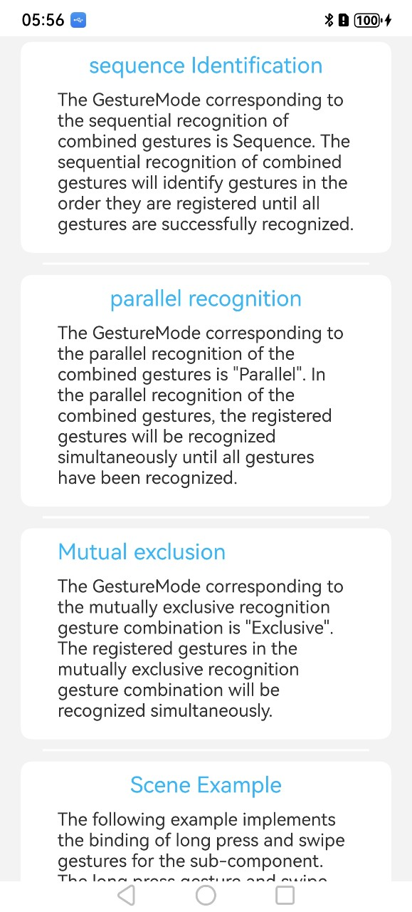
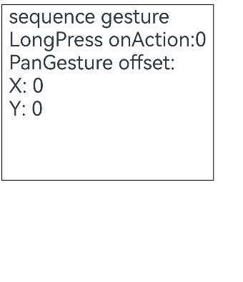
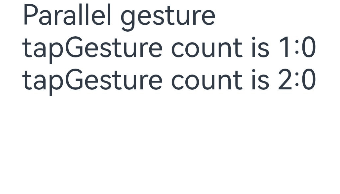
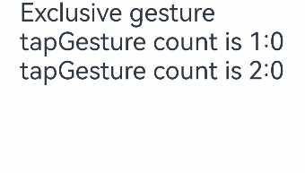

# 组合手势

## 介绍

本示例为[组合手势](https://gitcode.com/openharmony/docs/blob/master/zh-cn/application-dev/ui/arkts-gesture-events-combined-gestures.md)的配套示例工程。

本示例展示了适配组合手势的组件及触发方式。

## 效果预览

| 首页                            | 顺序识别                           |
|-------------------------------|--------------------------------|
|      |   |
| 并行识别                          | 互斥识别                           |
|  |  |


### 具体实现

1. **GestureGroup 基础搭建**：通过GestureGroup(模式)创建容器，包裹多个手势实例，再用组件.gesture()绑定，实现多手势统一管理。
2. **三种组合模式实现**：  
   并行（Parallel）：包裹无冲突手势（如捏合 + 旋转），可同时触发，各自回调独立执行（如捏合改缩放比例、旋转改角度）。  
   顺序（Serial）：包裹有依赖的手势（如长按 + 滑动），需先触发前一个（长按满足 duration），再触发后一个（滑动），前一个未触发则后一个无效。  
   互斥（Exclusive）：包裹互斥手势（如点击 + 长按），系统优先识别高优先级手势，未识别则尝试下一个（如长按优先级高，先判断长按，不满足再判断点击）。
3. **优先级与冲突控制**：  
   手势优先级：给手势设priority（默认 0，值越大优先级越高），如LongPressGesture({priority:1})比TapGesture({priority:0})优先被识别。  
   父子组件冲突：父组件用gestureMask控制透传（如GestureMask.IgnoreInternal，父手势不响应子组件区域操作）。


### 使用说明

1. **模式选择按场景匹配**:   
   需同时触发（如缩放 + 旋转）→ 用 Parallel；  
   需先后触发（如长按后拖动）→ 用 Serial；  
   二选一触发（如点击 / 长按）→ 用 Exclusive，避免模式错用导致手势失效。
2. **优先级配置规则**：  
   priority数值无上限，建议按业务设 1-3 级（避免过度叠加）；  
   同一 GestureGroup 内，优先级高的手势先被判断，优先触发。
3. **使用约束**：  
   禁止在 Serial 模式下包裹无依赖的手势（如点击 + 滑动），会导致后一个手势无法触发；  
   组件需设enabled:true（禁用状态下手势不响应）。

## 工程目录

```
entry/src/main/ets/
└── pages
    └── Index.ets (获取文本界面)
    └── Exclusive.ets          //  互斥识别页面
    └── Parallel.ets           //  并行识别页面
    └── SceneExample.ets       //  场景示例页面
    └── Sequence.ets           //  顺序识别页面
```

## 相关权限

不涉及

## 依赖

不涉及

## 约束和限制

### 约束与限制
1.本示例仅支持标准系统上运行, 支持设备：RK3568。

2.本示例为Stage模型，支持API20版本SDK，版本号：6.0.0.47，镜像版本号：OpenHarmony_6.0.0.47。

3.本示例需要使用DevEco Studio NEXT Developer Preview2 (Build Version: 6.0.0.47， built on October 21, 2025)及以上版本才可编译运行。

## 下载

如需单独下载本工程，执行如下命令：
```
git init
git config core.sparsecheckout true
echo code/DocsSample/ArkUISample/GestureGroup > .git/info/sparse-checkout
git remote add origin https://gitcode.com/openharmony/applications_app_samples.git
git pull origin master
```
