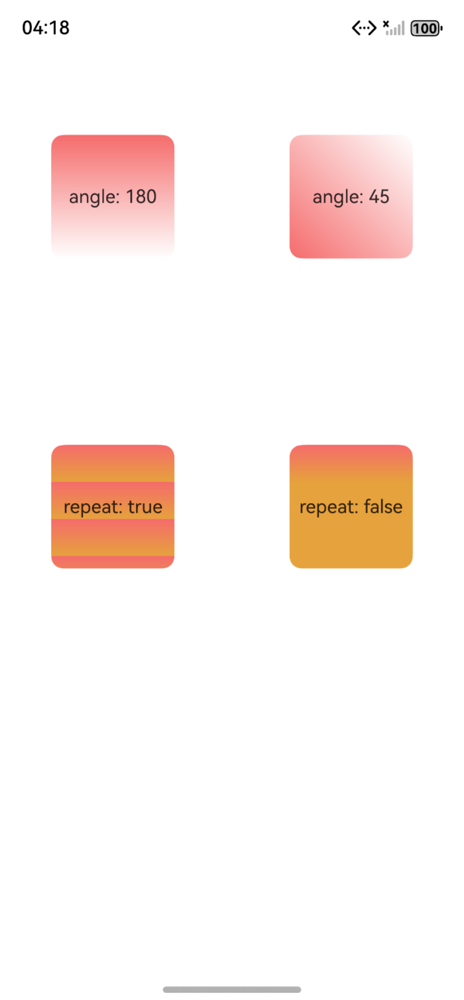
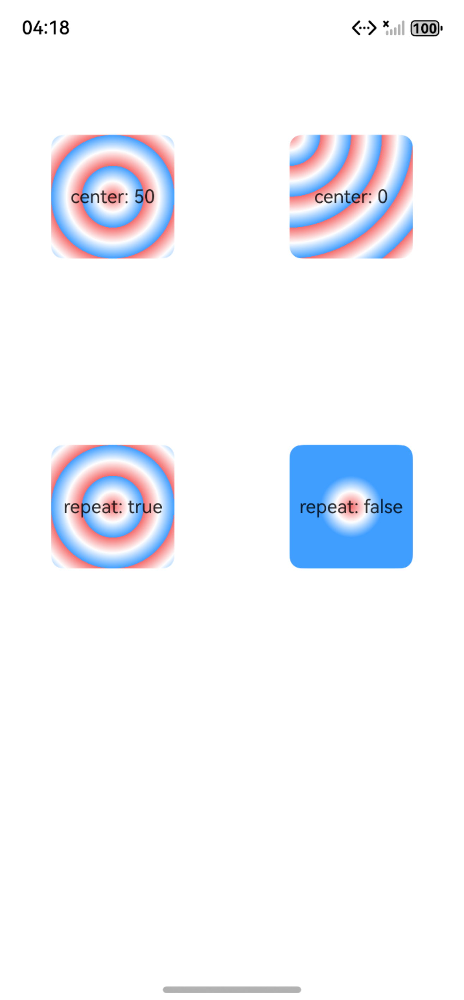

# ArkUI使用滚动类指南文档示例

### 介绍

本示例通过使用[ArkUI指南文档](https://developer.huawei.com/consumer/cn/doc/harmonyos-guides/arkts-color-effect)中各场景的开发示例，展示在工程中，帮助开发者更好地理解ArkUI提供的组件及组件属性并合理使用。该工程中展示的代码详细描述可查如下链接：

### 效果预览

| 首页                                 | 列表类组件目录                            | 列表中显示数据示例                            |
|------------------------------------|------------------------------------|------------------------------------|
|  |  |  |

### 使用说明

1. 在主界面，可以点击对应卡片，选择需要参考的组件示例。

2. 在组件目录选择详细的示例参考。

3. 进入示例界面，查看参考示例。

4. 通过自动测试框架可进行测试及维护。

### 工程目录
```
entry/src/main/ets/
|---entryability
|---homePage
|   |---DirectionGradientEffect.ets     //角度渐变效果  
|   |---LinearGradientEffect.ets       //线性渐变效果
|   |---RadialGradientEffect.ets      //径向渐变效果
|---pages
|   |---Index.ets                       // 应用主页面
entry/src/ohosTest/
|---ets
|   |---index.test.ets                 // 示例代码测试代码
```

### 相关权限

不涉及。

### 依赖

不涉及。

### 下载

如需单独下载本工程，执行如下命令：

````
git init
git config core.sparsecheckout true
echo code/DocsSample/ArkUIDocSample/GradientEffect > .git/info/sparse-checkout
git remote add origin https://gitee.com/openharmony/applications_app_samples.git
git pull origin master
````