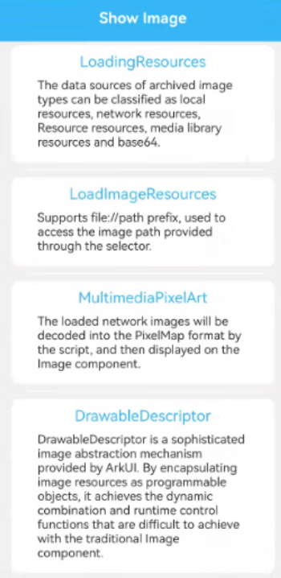
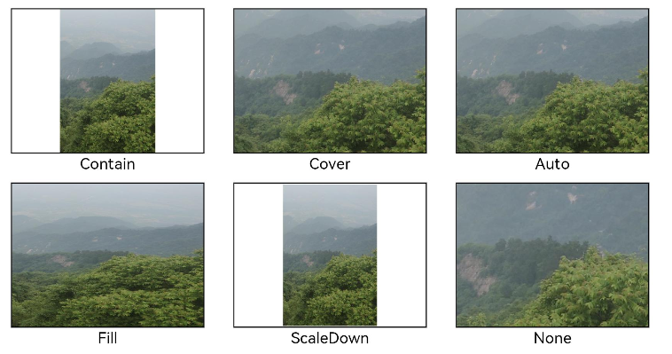
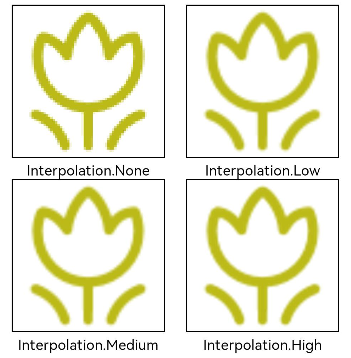
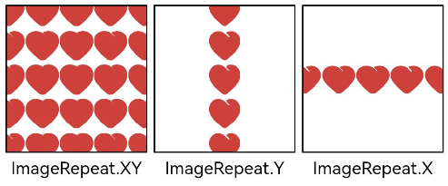
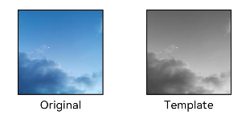
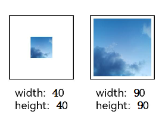

# ArkUI使用文本控件指南文档示例

### 介绍

本示例通过使用[ArkUI指南文档](https://gitcode.com/openharmony/docs/blob/master/zh-cn/application-dev/ui)中各场景的开发示例，展示在工程中，帮助开发者更好地理解ArkUI提供的组件及组件属性并合理使用。该工程中展示的代码详细描述可查如下链接：

1. [显示图片 (Image)](https://gitcode.com/openharmony/docs/blob/master/zh-cn/application-dev/ui/arkts-graphics-display.md)。
### 效果预览

| 首页                                     | 可绘制描述符                                    |
|----------------------------------------|-------------------------------------------|
|      |          |
| 设置图片缩放类型                               | 图片插值                                      |
| ------------------------------------   | ------------------------------------      |
|        |  |
| 设置图片重复样式                               | 设置图片渲染模式                                  |
| ------------------------------------   | ------------------------------------      |
|  |         |
| 设置图片解码尺寸                               | 为图片添加滤镜效果                                 |
| ------------------------------------   | ------------------------------------      |
|        |            |
| 事件调用                                   | 
| ------------------------------------   | 
|       |

### 使用说明

1. **DrawableDescriptor 实现图片动态效果**: 可通过 fromResource、fromPixelMap 等方法创建 DrawableDescriptor 对象，支持多图层叠加（如基础图 + 水印），还能添加旋转、透明度渐变等属性动画，实现更灵活的动态图片展示效果，适合需要自定义视觉交互的场景。
   clipShape 属性裁剪图片形状：Image 组件支持用 clipShape 裁剪图片，可选择系统预设形状（如 Circle 圆形、RoundedRectangle 圆角矩形、Oval 椭圆形），也能通过 Path 自定义不规则形状，裁剪范围仅作用于图片内容，不影响组件本身的布局占位。
2. **clipShape 属性裁剪图片形状**：Image 组件支持用 clipShape 裁剪图片，可选择系统预设形状（如 Circle 圆形、RoundedRectangle 圆角矩形、Oval 椭圆形），也能通过 Path 自定义不规则形状，裁剪范围仅作用于图片内容，不影响组件本身的布局占位。
3. **图片加载优先级与资源调度**：通过 priority 属性设置图片加载优先级（High/Normal/Low），系统会优先加载高优先级图片（如页面主图），低优先级图片（如列表项小图）延后加载，可优化页面初始化速度，减少资源竞争导致的卡顿。
4. **图片像素密度适配处理**：针对不同像素密度（PPI）的设备，可通过 sourceSize 设置不同分辨率的图片（如低 PPI 用 720p，高 PPI 用 1080p），也可将图片放入不同 dpi 目录（如 drawable-xxhdpi），系统会自动匹配对应资源，避免图片模糊或内存浪费。


### 工程目录
```
entry/src/main/ets/
|---entryability
|---pages
|   |---AddFilterEffectsToImages.ets    // 图片添加滤镜效果页面
|   |---DisplayVectorDiagram.ets        // 显示矢量图页面
|   |---DrawableDescriptor.ets          // 可绘制描述符页面
|   |---EventCall.ets                   // 事件调用页面
|   |---ImageInterpolation.ets          // 图片插值页面
|   |---LoadImageResources.ets          // 媒体库文件页面
|   |---LoadingResources.ets            // 存档图类型数据源页面
|   |---MultimediaPixelArt.ets          // 多媒体像素图页面
|   |---SetImageDecodingSize.ets        // 图片解码尺寸页面
|   |---SetImageRenderingMode.ets       // 图片渲染模式页面
|   |---SetImageRepetitionStyle.ets     // 图片重复样式页面
|   |---SetImageZoomType.ets            // 设置图片缩放类型页面     
|   |---Shadow.ets                      // 阴影组件     
            
|---pages
|   |---Index.ets                      // 应用主页面
entry/src/ohosTest/
|---ets
|   |---index2.test.ets                 // 示例代码测试代码
```
### 具体实现

1. **DrawableDescriptor 动态效果**：fromResource 创建对象，addLayer 叠图层，animateTo 加旋转 / 透明度动画，赋值给 source。
2. **媒体库图片加载**：module.json5 配 READ_MEDIA 权限，选图获 URI 转 file 路径，传入 Image 的 src 避免加载失败。
3. **响应式尺寸适配**：宽 100%+ 高 auto 自适应父容器，或用 aspectRatio（如 16:9）固定比例，结合 MediaQuery 调尺寸。
4. **加载控制与监听**：syncLoad=true 防刷新闪烁，onComplete 获图片宽高，onError 打印失败日志排查问题。
4. **图片属性配置**：objectFit（Contain/Cover）控缩放，interpolation 提清晰度，clipShape 裁圆形 / 圆角，colorFilter 加染色滤镜。


### 相关权限

不涉及。

### 依赖

不涉及。

### 约束与限制

1.本示例仅支持标准系统上运行, 支持设备：RK3568。

2.本示例为Stage模型，支持API20版本SDK，版本号：6.0.0.47，镜像版本号：OpenHarmony_6.0.0.47。

3.本示例需要使用DevEco Studio 6.0.0 Release (Build Version: 6.0.0.858， built on September 24, 2025)及以上版本才可编译运行。
### 下载

如需单独下载本工程，执行如下命令：

````
git init
git config core.sparsecheckout true
echo code/DocsSample/ArkUISample/ImageComponent > .git/info/sparse-checkout
git remote add origin https://gitcode.com/openharmony/applications_app_samples.git
git pull origin master
````