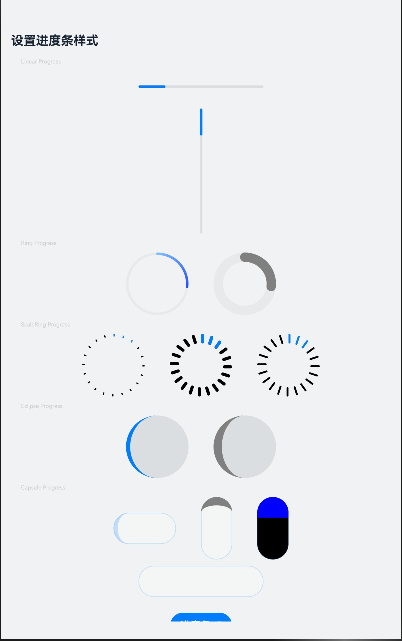
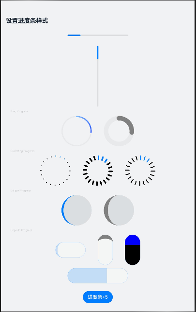

# ArkUI使用文本控件指南文档示例

### 介绍

本示例通过使用[ArkUI指南文档](https://gitee.com/openharmony/docs/tree/master/zh-cn/application-dev/ui)中各场景的开发示例，展示在工程中，帮助开发者更好地理解ArkUI提供的组件及组件属性并合理使用。该工程中展示的代码详细描述可查如下链接：

1. [进度条 (Progress)](https://gitee.com/openharmony/docs/blob/OpenHarmony-5.0.0-Release/zh-cn/application-dev/ui/arkts-common-components-progress-indicator.md)。
### 效果预览

| 初始效果                               | 进度条+5                 | 进度条-5           |
|------------------------------------|------------------------------------|------------------------------------|
|  |  |  |

### 使用说明

1. 在主界面，点击进度条+5/进度条-5的按钮，查看不同样式进度条的变化。

4. 通过自动测试框架可进行测试及维护。

### 工程目录
```
entry/src/main/ets/
|---entryability          
|---pages
|   |---Index.ets                      // 应用主页面
entry/src/ohosTest/
|---ets
|   |---index.test.ets                 // 示例代码测试代码
```

### 相关权限

不涉及。

### 依赖

不涉及。

### 约束与限制

1.本示例仅支持标准系统上运行, 支持设备：RK3568。

2.本示例为Stage模型，支持API14版本SDK，版本号：5.0.2.57，镜像版本号：OpenHarmony_5.0.2.57。

3.本示例需要使用DevEco Studio NEXT Developer Preview2 (Build Version: 5.0.5.306， built on December 12, 2024)及以上版本才可编译运行。

### 下载

如需单独下载本工程，执行如下命令：

````
git init
git config core.sparsecheckout true
echo code/DocsSample/ArkUIDocSample/InfoComponent/ProgressProject > .git/info/sparse-checkout
git remote add origin https://gitee.com/openharmony/applications_app_samples.git
git pull origin master
````