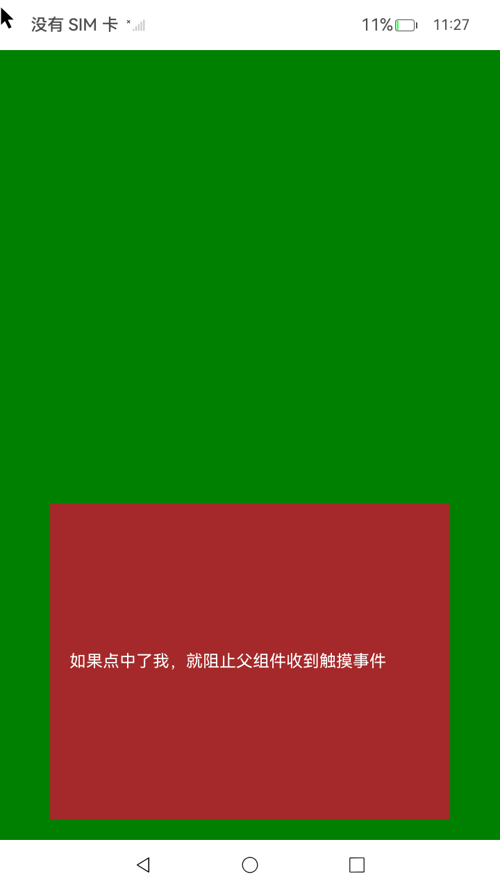
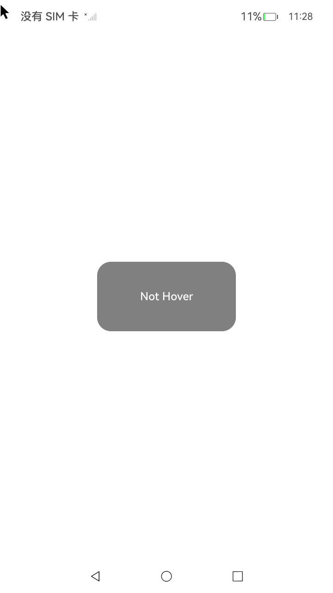
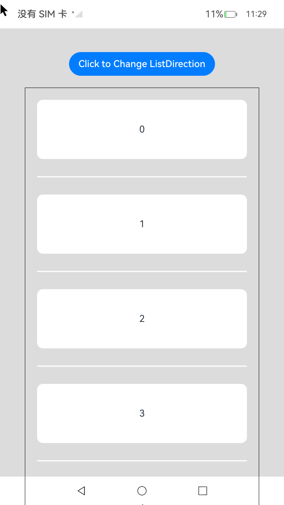

# ArkUI使用支持交互事件指南文档示例

### 介绍

本示例通过使用[ArkUI指南文档](https://gitCode.com/openharmony/docs/tree/master/zh-cn/application-dev/ui)
中各场景的开发示例，展示在工程中，帮助开发者更好地理解ArkUI提供的组件及组件属性并合理使用。

### 示例文档
[交互基础机制说明](https://gitcode.com/openharmony/docs/blob/master/zh-cn/application-dev/ui/arkts-interaction-basic-principles.md)
[支持鼠标输入事件](https://gitcode.com/openharmony/docs/blob/master/zh-cn/application-dev/ui/arkts-interaction-development-guide-mouse.md)
[支持触屏输入事件](https://gitcode.com/openharmony/docs/blob/master/zh-cn/application-dev/ui/arkts-interaction-development-guide-touch-screen.md)

### 效果预览

| 首页                                 | 交互类组件目录                            | 单一手势示例                             |
|------------------------------------|------------------------------------|------------------------------------|
|  |  |  |

### 使用说明

1. 在主界面，可以点击对应目录，选择需要参考的组件示例。

2. 在组件目录选择详细的示例参考。

3. 进入示例界面，查看参考示例。

4. 通过自动测试框架可进行测试及维护。

### 工程目录

```
entry/src/main/ets/
|---entryability
|---pages
|   |---FocusOnclickExample                            //热区事件     
|   |       |---FocusOnclickExample.ets
|   |---MouseButton                              //鼠标按键事件
|   |       |---MouseButton.ets
|   |---mouseMove                                //鼠标移动事件
|   |       |---mouseMove.ets
|   |---MouseWheel                        //鼠标滚轮事件
|   |       |---ListDataSource.ets  
|   |       |---MouseWheel.ets
|   |---MultipleFingerInformation                       //多指信息
|   |       |---MultipleFingerInformation.ets
|   |---onHover                                //鼠标移入移出事件
|   |       |---OnHover.ets 
|   |---PreventBubbling                          //阻止冒泡事件
|   |       |---PreventBubbling.ets      
|   |---sampling                          //采样和历史点
|   |       |---Sampling.ets        
|   |---stopPropagation                          //阻止鼠标冒泡事件
|   |       |---StopPropagation.ets                    
|   |---gamepad                          //游戏手柄操作
|   |       |---CommonKey.ets                    
|   |       |---DirectionKey.ets                    
|   |       |---GamepadSample.ets                    
|   |       |---Joystick.ets                    
|   |       |---NewJoystick.ets                    
|---pages
|   |---Index.ets                       // 应用主页面
entry/src/ohosTest/
|---ets
|   |---index.test.ets                       // 示例代码测试代码
```

### 具体实现

1. 默认情况下，组件的响应热区即为组件自身的位置和大小，这与用户看到的范围相
一致，从而最大程度地保证用户操作的手眼一致性。在极少数情况下，应用需调整热区
大小以限制或扩大组件响应的操作范围，这一功能通过组件的responseRegion接口实现。
响应热区影响指向性事件的派发，通过与组件自身区域的相对关系进行指定，可以指定一
个或多个区域，将组件的响应热区分割为多个部分；
2. 鼠标事件回调。每当鼠标指针在绑定该API的组件内产生行为（MouseAction）时，触
发事件回调，参数为MouseEvent对象，表示触发此次的鼠标事件。该事件支持自定义冒泡
设置，默认父子冒泡；
3. 重采样会合并同一个触点在同一帧内多次上报的move事件，并通过算法尽可能计算出一
个合适的坐标上报给应用；
4. 在支持多指触控的触屏设备上，上报的事件中同时包含了窗口所有按压手指的信息，可
以通过touches获取；
5. 当使用游戏手柄与应用进行交互时，通过按键事件回调处理按键逻辑，通过焦点轴事件回调处理操纵杆逻辑。

### 相关权限

不涉及。

### 依赖

不涉及。

### 约束与限制

1.本示例仅支持标准系统上运行, 支持设备：RK3568。

2.本示例为Stage模型，支持API14版本SDK，版本号：5.0.2.57，镜像版本号：OpenHarmony_5.0.2.57。

3.本示例需要使用DevEco Studio NEXT Developer Preview2 (Build Version: 5.0.5.306， built on December 12, 2024)及以上版本才可编译运行。

### 下载

如需单独下载本工程，执行如下命令：

````
git init
git config core.sparsecheckout true
echo code/DocsSample/ArkUISample/InterAction > .git/info/sparse-checkout
git remote add origin https://gitcode.com/openharmony/applications_app_samples.git
git pull origin master
````