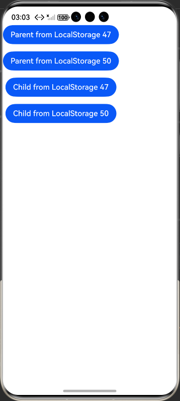
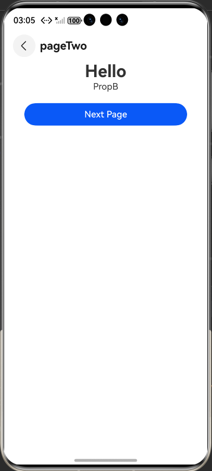
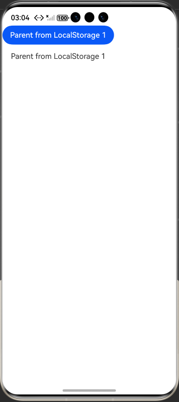

# arkts-localstorage

## 介绍

LocalStorage是ArkTS为构建页面级别状态变量提供存储的内存内的“数据库”。

应用程序可以创建多个LocalStorage实例，LocalStorage实例可以在页面内共享，也可以通过getSharedLocalStorage接口，实现跨页面、跨UIAbility实例共享。

组件树的根节点，即被@Entry装饰的@Component，可以被分配一个LocalStorage实例，此组件的所有子组件实例将自动获得对该LocalStorage实例的访问权限。

@Component装饰的组件既可以自动继承来自父组件的LocalStorage实例，也可以传入指定的LocalStorage的实例，详见：自定义组件接收LocalStorage实例。

LocalStorage中的所有属性都是可变的。

应用程序决定LocalStorage对象的生命周期。当应用释放最后一个指向LocalStorage的引用时，比如销毁最后一个自定义组件，LocalStorage将被JS Engine垃圾回收。

LocalStorage根据与@Component装饰的组件的同步类型不同，提供了两个装饰器：

@LocalStorageProp：@LocalStorageProp装饰的变量与LocalStorage中给定属性建立单向同步关系。

@LocalStorageLink：@LocalStorageLink装饰的变量与LocalStorage中给定属性建立双向同步关系。

[LocalStorage：页面级UI状态存储](https://gitcode.com/openharmony/docs/blob/master/zh-cn/application-dev/ui/state-management/arkts-localstorage.md)。

## 效果预览

| 首页                                                 | CustomDialogController_CAPI页面                       | OpenCustomDialog_CAPI页面                            |
|----------------------------------------------------|-----------------------------------------------------|----------------------------------------------------|
|  |  |  |

## 使用说明

1. 安装编译生成的hap包，并打开应用；
2. 首页面会出现页面列表，点击此列表项进入对应页面示例界面；

## 工程目录

```
PersistentStorage
entry
└── src
    ├── main
    │   ├── ets
    │   │   ├── entryability
    │   │   │   └── EntryAbility.ets
    │   │   ├── entrybackupability
    │   │   │   └── EntryBackupAbility.ets
    │   │   └── pages
    │   │       ├── ChangeLocalSetSample.ets
    │   │       ├── Index.ets
    │   │       ├── LocalDateSample.ets //装饰Date类型变量
    │   │       ├── LocalMapSample.ets  //装饰Map类型变量
    │   │       ├── LocalSetSample.ets  //装饰Set类型变量
    │   │       ├── PageFiveShare.ets //自定义组件接收LocalStorage实例
    │   │       ├── PageFiveShare2.ets //Navigation组件和LocalStorage联合使用
    │   │       ├── PageFourStateVariableSYN.ets //兄弟组件之间同步状态变量
    │   │       ├── PageLocalStorageLink.ets //LocalStorage支持联合类型
    │   │       ├── PageMyNavigation.ets  //Navigation组件和LocalStorage联合使用
    │   │       ├── PageOneDoubleSYN.ets // 从UI内部使用LocalStorage
    │   │       ├── PageSixLocalStorage.ets //将LocalStorage实例从UIAbility共享到一个或多个页面
    │   │       ├── PageSixLocalStorageA.ets //将LocalStorage实例从UIAbility共享到一个或多个页面
    │   │       ├── PageSixLocalStorageB.ets //将LocalStorage实例从UIAbility共享到一个或多个页面
    │   │       ├── PageTowSigleSYN.ets  //@LocalStorageProp和LocalStorage单向同步的简单场景
    │   │       └── PageTwoWaySYN.ets //@LocalStorageLink和LocalStorage双向同步的简单场景
    │   ├── module.json5
    │   └── resources
    │       ├── base
    │       │   ├── element
    │       │   │   ├── color.json
    │       │   │   ├── float.json
    │       │   │   └── string.json
    │       │   ├── media
    │       │   │   ├── background.png
    │       │   │   ├── foreground.png
    │       │   │   ├── layered_image.json
    │       │   │   └── startIcon.png
    │       │   └── profile
    │       │       ├── backup_config.json
    │       │       ├── main_pages.json
    │       │       └── route_map.json
    │       ├── dark
    │       │   └── element
    │       │       └── color.json
    │       └── rawfile
    ├── mock
    │   └── mock-config.json5
    ├── ohosTest
    │   ├── ets
    │   │   └── test
    │   │       ├── Ability.test.ets
    │   │       ├── Index.test.ets
    │   │       └── List.test.ets
    │   ├── module.json5
    │   └── ohosTest.md
    └── test
        ├── List.test.ets
        └── LocalUnit.test.ets

        
```
## 具体实现

1. 创建 LocalStorage 实例并初始化：通过new LocalStorage(初始键值对)创建实例，如const storage = new LocalStorage({ 'PropA': 47 })，直接设置初始状态，支持后续增删改查。
2. 页面根组件关联实例：在@Entry装饰器中传入实例，如@Entry(storage)，使根组件及所有子组件自动获取该实例访问权限，实现页面内状态共享。
3. @LocalStorageProp 单向同步实现：组件内用@LocalStorageProp('PropA') prop: number = 1关联存储，存储中PropA变化时组件值同步更新，组件本地修改不回写存储。
4. @LocalStorageLink 双向同步实现：通过@LocalStorageLink('PropA') link: number = 1绑定，组件修改值会回写存储，存储值变化也会同步到所有关联组件。
5. UIAbility 向页面传递实例：在 Ability 的onWindowStageCreate中，用windowStage.loadContent('页面路径', this.storage)传递实例，页面通过LocalStorage.GetShared()获取。
6. 组件外 API 修改存储状态：调用storage.setOrCreate('PropA', 48)直接修改存储值，触发所有关联@LocalStorageProp/@LocalStorageLink的组件同步刷新。
7. Date 类型状态同步（API12+）：用@LocalStorageLink('date') date: Date = new Date('2021-08-08')绑定，调用date.setFullYear(2024)等方法，UI 自动更新状态。
8. Map 类型状态操作（API12+）：定义@LocalStorageLink('map') map: Map<number, string> = new Map([[0, 'a']])，通过map.set(1, 'b')/map.delete(0)修改，UI 实时渲染变化。
9. Set 类型状态管理（API12+）：以@LocalStorageLink('set') set: Set<number> = new Set([1,2])绑定，执行set.add(3)/set.clear()，组件同步展示最新集合。
10. 兄弟组件状态同步：所有兄弟组件通过@LocalStorageLink('PropA')关联同一键值，当任一组更新此键值时，其余兄弟组件与存储将自动同步更新，无需手动传递值。

## 相关权限

不涉及

## 依赖

不涉及

## 约束和限制

1. 本示例支持标准系统上运行，支持设备：RK3568等;

2. 本示例支持API22版本SDK，版本号：6.0.0.36;

3. 本示例已支持使DevEco Studio 6.0.0.848 (构建版本：6.0.0.848，构建 2025年10月17日)编译运行

## 下载

如需单独下载本工程，执行如下命令：

```
git init
git config core.sparsecheckout true
echo code/DocsSample/ArkUISample/LocalStorage > .git/info/sparse-checkout
git remote add origin https://gitcode.com/openharmony/applications_app_samples.git
git pull origin master
```
