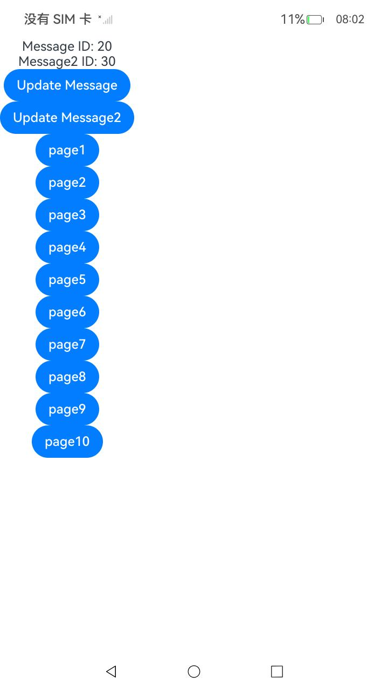
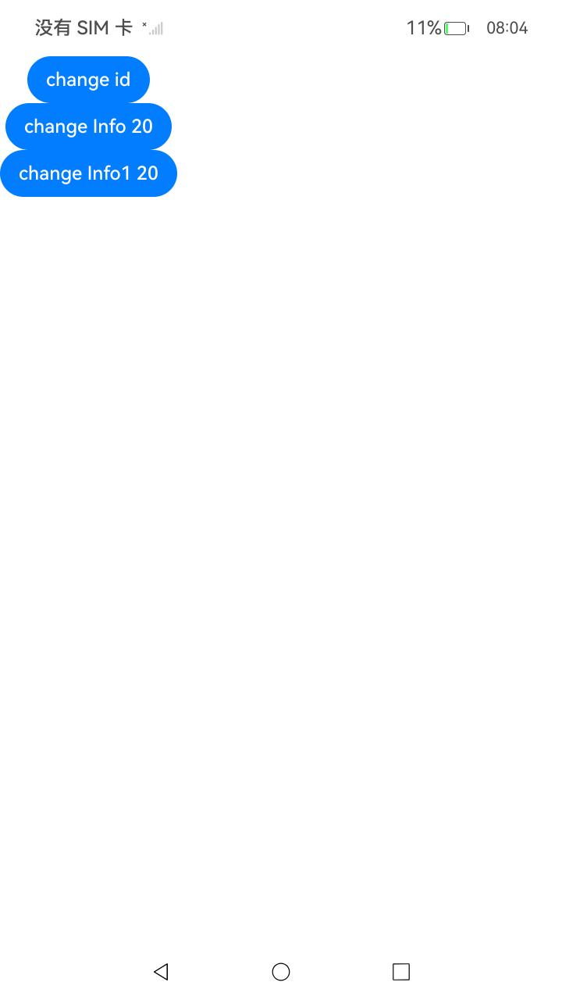
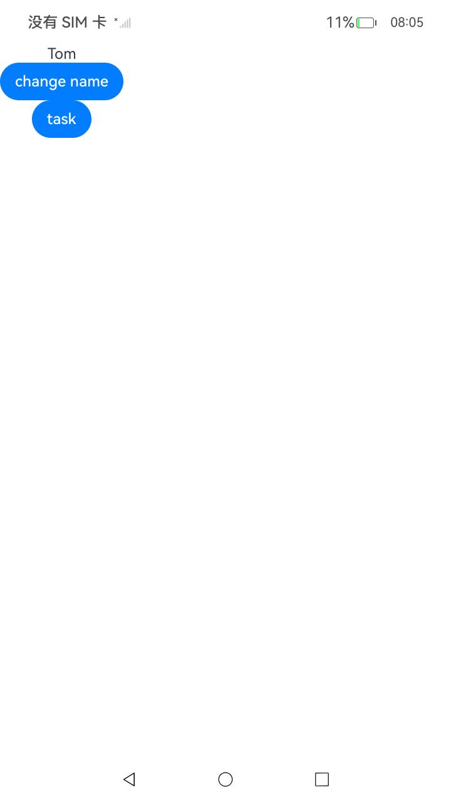
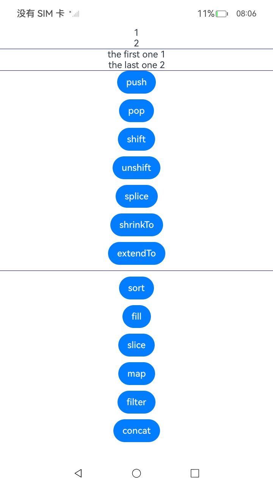
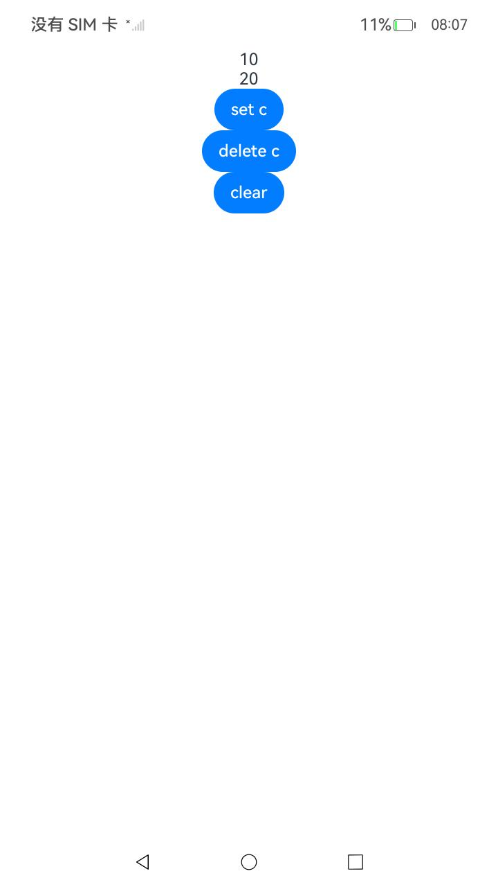
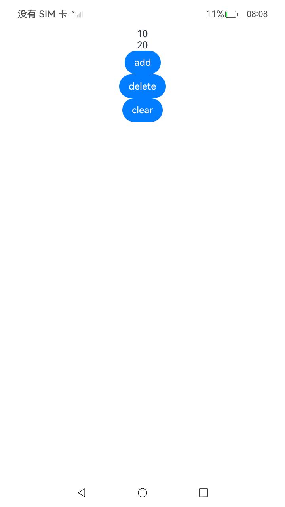
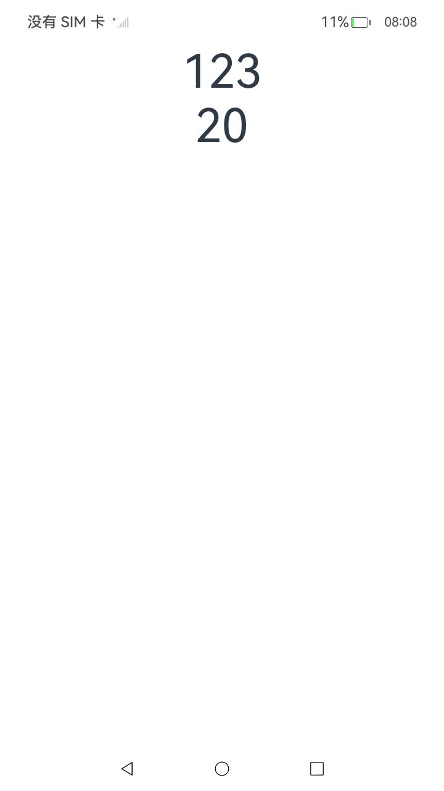
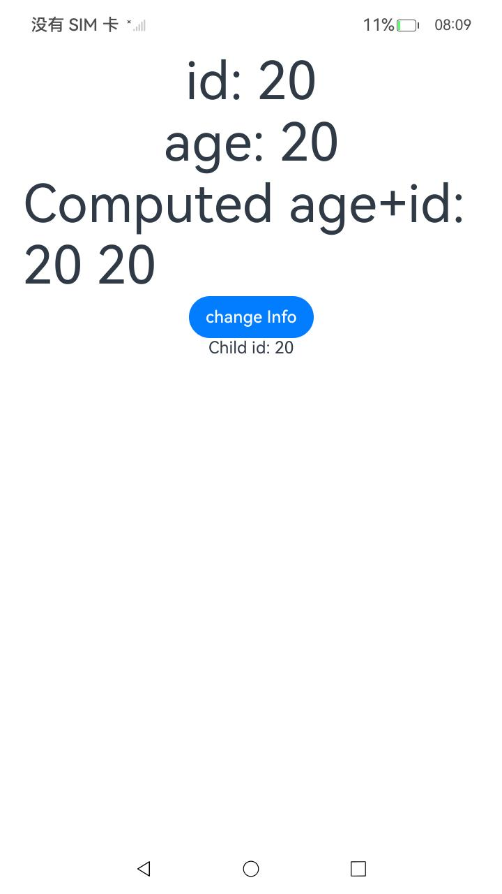
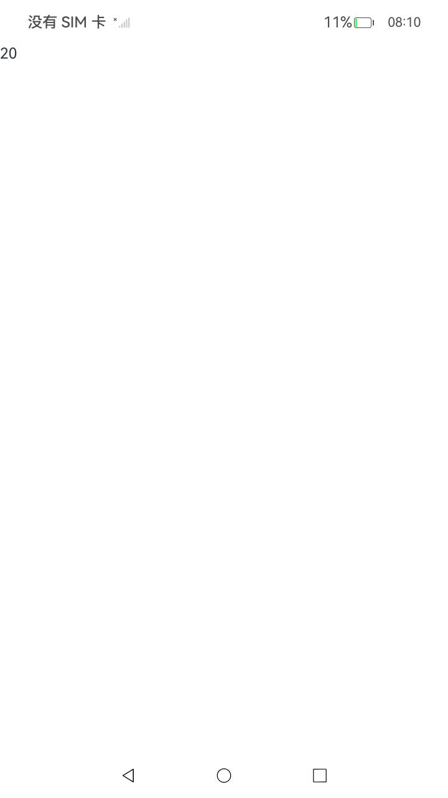
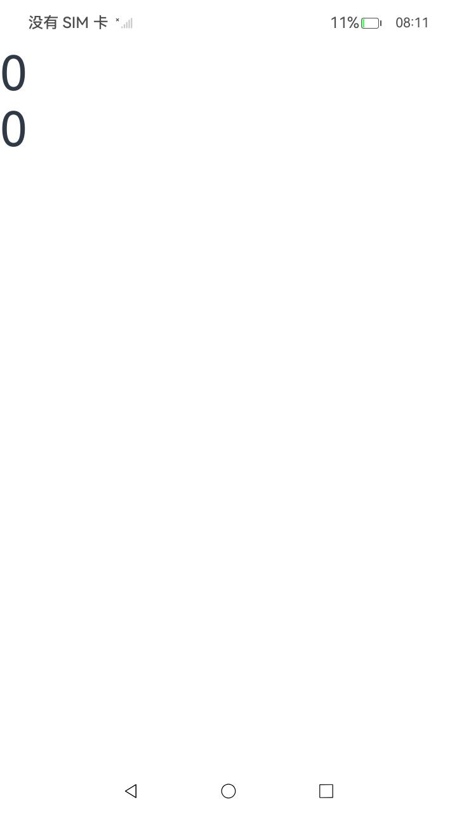

# ArkUI使用makeObserved接口：将非观察数据变为可观察数据指南文档示例

### 介绍

本示例通过使用[ArkUI指南文档](https://gitcode.com/openharmony/docs/tree/master/zh-cn/application-dev/ui)中各场景的开发示例，展示在工程中，帮助开发者更好地理解ArkUI提供的组件及组件属性并合理使用。该工程中展示的代码详细描述可查如下链接：

1. [线性容器(Column)](https://docs.openharmony.cn/pages/v6.0/zh-cn/application-dev/reference/apis-arkui/arkui-ts/ts-container-column.md)

2. [文本显示器(Text)](https://docs.openharmony.cn/pages/v6.0/en/application-dev/reference/apis-arkui/arkui-ts/ts-basic-components-text.md)

3. [Button](https://docs.openharmony.cn/pages/v6.0/zh-cn/application-dev/reference/apis-arkui/arkui-ts/ts-basic-components-button.md)

4. [makeObserved接口：将非观察数据变为可观察数据](https://gitcode.com/openharmony/docs/blob/master/zh-cn/application-dev/ui/state-management/arkts-new-makeObserved.md)

## 预览效果
|首页|页面一|页面二|页面三|
|---|---|---|---|
|||||
|页面四|页面五|页面六|页面七|
|||||
|页面八|页面九|页面十||
|||||

## 使用说明
### 1.在进入主页面后，点击页面按钮进行查看

## 工程目录结构
```
MakeObserved
├─ AppScope
│  ├─ app.json5
│  └─ resources
│     └─ base
│        ├─ element
│        │  └─ string.json
│        └─ media
│           ├─ background.png
│           ├─ foreground.png
│           └─ layered_image.json
├─ code-linter.json5
├─ entry
│  ├─ hvigorfile.ts
│  ├─ obfuscation-rules.txt
│  ├─ oh-package.json5
│  └─ src
│     ├─ main
│     │  ├─ ets
│     │  │  ├─ common
│     │  │  │  └─ MyComponent.ets
│     │  │  ├─ entryability
│     │  │  │  └─ EntryAbility.ets
│     │  │  ├─ entrybackupability
│     │  │  │  └─ EntryBackupAbility.ets
│     │  │  ├─ Model
│     │  │  │  └─ modelView.ets
│     │  │  ├─ pages
│     │  │  │  └─ Index.ets
│     │  │  └─ View
│     │  │     ├─ Page1.ets
│     │  │     ├─ Page10.ets
│     │  │     ├─ Page2.ets
│     │  │     ├─ Page3.ets
│     │  │     ├─ Page4.ets
│     │  │     ├─ Page5.ets
│     │  │     ├─ Page6.ets
│     │  │     ├─ Page7.ets
│     │  │     ├─ Page8.ets
│     │  │     └─ Page9.ets
│     │  ├─ module.json5
│     │  └─ resources
│     │     ├─ base
│     │     │  ├─ element
│     │     │  │  ├─ color.json
│     │     │  │  ├─ float.json
│     │     │  │  └─ string.json
│     │     │  ├─ media
│     │     │  │  ├─ background.png
│     │     │  │  ├─ foreground.png
│     │     │  │  ├─ layered_image.json
│     │     │  │  └─ startIcon.png
│     │     │  └─ profile
│     │     │     ├─ backup_config.json
│     │     │     └─ main_pages.json
│     │     ├─ dark
│     │     │  └─ element
│     │     │     └─ color.json
│     │     └─ rawfile
│     ├─ mock
│     │  └─ mock-config.json5
│     ├─ ohosTest
│     │  ├─ ets
│     │  │  └─ test
│     │  │     ├─ Ability.test.ets
│     │  │     ├─ index.test.ets
│     │  │     └─ List.test.ets
│     │  └─ module.json5
│     └─ test
│        ├─ List.test.ets
│        └─ LocalUnit.test.ets
├─ hvigor
│  └─ hvigor-config.json5
├─ hvigorfile.ts
├─ index.test.ets
├─ oh-package-lock.json5
├─ oh-package.json5
├─ ohoTest.md
└─ README_zh.md

```
## 具体实现
1. 导入UIUtils模块并使用makeObserved接口
2. 处理不同类型数据的可观察转换
3. 与状态管理装饰器(@Local等)配合使用
4. 支持集合类型(collections.Array/Map/Set)的可观察转换
5. 为了将普通不可观察数据变为可观察数据，开发者可以使用makeObserved接口，makeObserved可以在@Trace无法标记的情况下使用。

亮点功能：
- 与@Sendable装饰类配合使用，支持跨线程数据传递后的可观察转换
- 处理JSON.parse返回的匿名对象的可观察转换

### 相关权限
不涉及。

### 依赖
不涉及。

### 约束与限制
.本示例仅支持标准系统上运行, 支持设备：RK3568。

2.本示例为Stage模型，支持API22版本SDK，版本号：6.0.0.33，镜像版本号：OpenHarmony_6.0.0.33。

3.本示例需要使用DevEco Studio 6.0.0 Canary1 (Build Version: 6.0.0.270， built on May 9, 2025)及以上版本才可编译运行。

### 下载
如需单独下载本工程，执行如下命令：

`````
git init
git config core.sparsecheckout true
echo code/DocsSample/ArkUISample/MakeObserved > .git/info/sparse-checkout
git remote add origin https://gitcode.com/openharmony/applications_app_samples.git
git pull origin master
`````