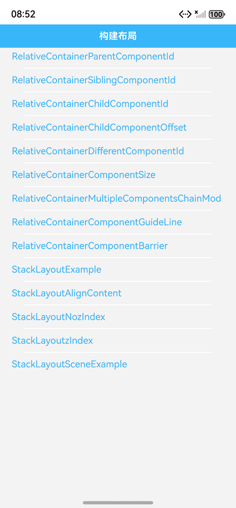
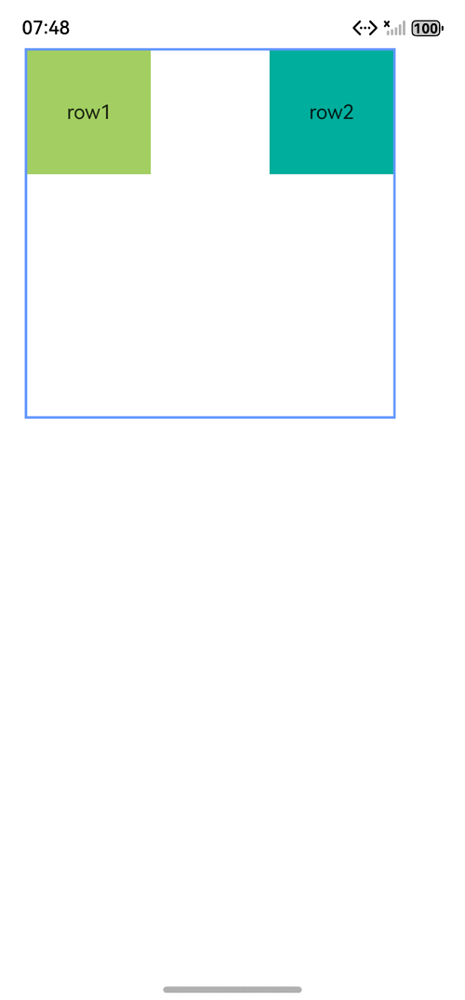
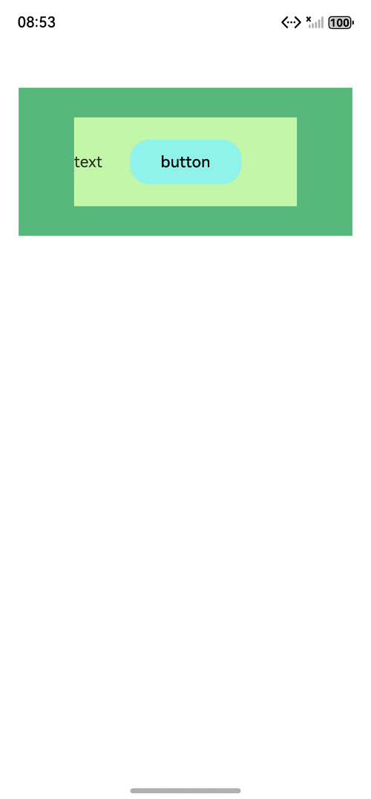
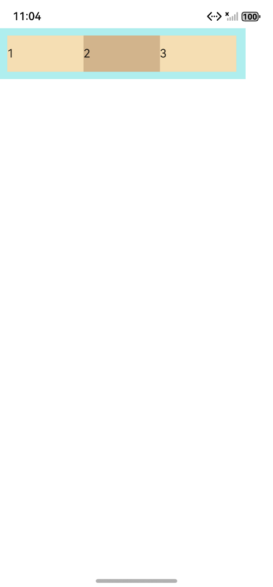

# ArkUI多种布局组件指南文档示例

### 介绍

本示例通过使用[ArkUI指南文档](https://gitcode.com/openharmony/docs/tree/master/zh-cn/application-dev/ui)中各场景的开发示例，展示在工程中，帮助开发者更好地理解ArkUI提供的组件及组件属性并合理使用。该工程中展示的代码详细描述可查如下链接：

1. [相对布局](https://gitcode.com/tianlongdevcode/docs_zh/blob/master/zh-cn/application-dev/ui/arkts-layout-development-relative-layout.md)。
2. [层叠布局](https://gitcode.com/tianlongdevcode/docs_zh/blob/master/zh-cn/application-dev/ui/arkts-layout-development-stack-layout.md)。
3. [线性布局](https://gitcode.com/tianlongdevcode/docs_zh/blob/master/zh-cn/application-dev/ui/arkts-layout-development-linear.md)。
4. [弹性布局](https://gitcode.com/tianlongdevcode/docs_zh/blob/master/zh-cn/application-dev/ui/arkts-layout-development-flex-layout.md)。
5. [栅格布局](https://gitcode.com/tianlongdevcode/docs_zh/blob/master/zh-cn/application-dev/ui/arkts-layout-development-grid-layout.md)。

### 1. [相对布局 (RelativeContainer)]
### 效果预览

| 列表                                 |  示例 
|------------------------------------|--------------------------------------|
|  |    |

### 2. [层叠布局 (Stack)]
### 效果预览

| 列表                                    | 示例               
|---------------------------------------|------------------------------------|
|  |  |

### 3. [线性布局 (Row/Column)]
### 效果预览

| 列表                                 |  示例              
|------------------------------------|------------------------------------|
|  |  |

### 4. [弹性布局 (Flex)]
### 效果预览

| 列表                                 | 示例              
|------------------------------------|------------------------------------|
|  |  |

### 5. [栅格布局 (GridRow/GridCol)]
### 效果预览

| 列表                                 | 示例                 
|------------------------------------|------------------------------------|
|  |  |

### 使用说明

1. 在主界面，可以点击对应卡片，选择需要参考的组件示例。

2. 在组件目录选择详细的示例参考。

3. 进入示例界面，查看参考示例。

4. 通过自动测试框架可进行测试及维护。

### 工程目录
```
entry/src/main/ets/
|---entryability
|---pages
|   |---relativecontainerlayout                  //相对布局 (RelativeContainer
|   |       |---RelativeContainerParentComponentId.ets
|   |       |---RelativeContainerSiblingComponentId.ets
|   |       |---RelativeContainerChildComponentId.ets
|   |       |---RelativeContainerChildComponentOffset.ets
|   |       |---RelativeContainerDifferentComponentId.ets
|   |       |---RelativeContainerComponentSize.ets
|   |       |---RelativeContainerMultipleComponentsChainMode.ets
|   |       |---RelativeContainerComponentGuideLine.ets
|   |       |---RelativeContainerComponentBarrier.ets
|   |---stacklayout                             //层叠布局 (Stack)
|   |       |---StackLayoutExample.ets
|   |       |---StackLayoutAlignContent.ets
|   |       |---StackLayoutNozIndex.ets
|   |       |---StackLayoutzIndex.ets
|   |       |---StackLayoutSceneExample.ets
|   |---linearlayout                             //线性布局 (Row/Column)
|   |       |---ColumnLayoutExample.ets
|   |       |---RowLayoutExample.ets
|   |       |---ColumnLayoutJustifyContentStart.ets
|   |       |---ColumnLayoutJustifyContentCenter.ets
|   |       |---ColumnLayoutJustifyContentEnd.ets
|   |       |---ColumnLayoutJustifyContentSpaceBetween.ets
|   |       |---ColumnLayoutJustifyContentSpaceAround.ets
|   |       |---ColumnLayoutJustifyContentSpaceEvenly.ets
|   |       |---RowLayoutJustifyContentStart.ets
|   |       |---RowLayoutJustifyContentCenter.ets
|   |       |---RowLayoutJustifyContentEnd.ets
|   |       |---RowLayoutJustifyContentSpaceBetween.ets
|   |       |---RowLayoutJustifyContentSpaceAround.ets
|   |       |---RowLayoutJustifyContentSpaceEvenly.ets
|   |       |---RowLayoutHorizontalAlignStart.ets
|   |       |---RowLayoutHorizontalAlignCenter.ets
|   |       |---RowLayoutHorizontalAlignEnd.ets
|   |       |---RowLayoutVerticalAlignTop.ets
|   |       |---RowLayoutVerticalAlignCenter.ets
|   |       |---RowLayoutVerticalAlignBottom.ets
|   |       |---BlankExample.ets
|   |       |---LayoutWeightExample.ets
|   |       |---WidthExample.ets
|   |       |---ScrollVerticalExample.ets
|   |       |---ScrollHorizontalExample.ets
|   |---flexlayout                             //弹性布局 (Flex)
|   |       |---FlexDirectionRow.ets
|   |       |---FlexDirectionRowReverse.ets
|   |       |---FlexDirectionColumn.ets
|   |       |---FlexDirectionColumnReverse.ets
|   |       |---FlexWrapNoWrap.ets
|   |       |---FlexWrapWrap.ets
|   |       |---FlexWrapWrapReverse.ets
|   |       |---FlexAlignStart.ets
|   |       |---FlexAlignCenter.ets
|   |       |---FlexAlignEnd.ets
|   |       |---FlexAlignSpaceBetween.ets
|   |       |---FlexAlignSpaceAround.ets
|   |       |---FlexAlignSpaceEvenly.ets
|   |       |---FlexItemAlignAuto.ets
|   |       |---FlexItemAlignStart.ets
|   |       |---FlexItemAlignCenter.ets
|   |       |---FlexItemAlignEnd.ets
|   |       |---FlexItemAlignStretch.ets
|   |       |---FlexItemAlignBaseline.ets
|   |       |---FlexAlignSelf.ets
|   |       |---FlexAlignCenterFlexAlignStart.ets
|   |       |---FlexAlignCenterFlexAlignCenter.ets
|   |       |---FlexAlignCenterFlexAlignEnd.ets
|   |       |---FlexAlignCenterFlexAlignSpaceBetween.ets
|   |       |---FlexAlignCenterFlexAlignSpaceAround.ets
|   |       |---FlexAlignCenterFlexAlignSpaceEvenly.ets
|   |       |---FlexBasis.ets
|   |       |---FlexGrow.ets
|   |       |---FlexShrink.ets
|   |       |---FlexExample.ets
|   |---gridlayout                             //栅格布局 (GridRow/GridCol)
|   |       |---GridLayoutReference.ets
|   |       |---GridLayoutColumns.ets
|   |       |---GridLayoutColumnsToFour.ets
|   |       |---GridLayoutColumnsToEight.ets
|   |       |---GridLayoutColumnOption.ets
|   |       |---GridLayoutDirectionRow.ets
|   |       |---GridLayoutDirectionRowReverse.ets
|   |       |---GridLayoutGutterToNumber.ets
|   |       |---GridLayoutGutterOption.ets
|   |       |---GridColSpan.ets
|   |       |---GridColOffset.ets
|   |       |---GridColOrder.ets
|   |       |---GridColSpanToNumber.ets
|   |       |---GridColSpanToOption.ets
|   |       |---GridColOffsetToNumber.ets
|   |       |---GridColOffsetToOption.ets
|   |       |---GridColOrderToNumber.ets
|   |       |---GridColOrderToOption.ets
|   |       |---GridRowExample.ets
|---pages
|   |---Index.ets                       // 应用主页面
entry/src/ohosTest/
|---ets
|   |---RelativeContainerLayout.test.ets           // 相对布局示例代码测试代码
|   |---StackLayout.test.ets                       // 层叠布局示例代码测试代码
|   |---LinearLayout.test.ets                      // 线性布局示例代码测试代码
|   |---FlexLayout.test.ets                        // 弹性布局示例代码测试代码
|   |---GridLayout.test.ets                        // 栅格布局示例代码测试代码
```

### 相关权限

不涉及。

### 依赖

不涉及。

### 约束与限制

1.本示例仅支持标准系统上运行, 支持设备：RK3568。

2.本示例为Stage模型，支持API18版本full-SDK，版本号：5.1.0.107，镜像版本号：OpenHarmony_5.1.0 Release。

3.本示例需要使用DevEco Studio 5.0.5 Release (Build Version: 5.0.13.200， built on May 13, 2025)及以上版本才可编译运行。

### 下载

如需单独下载本工程，执行如下命令：

````
git init
git config core.sparsecheckout true
echo code/DocsSample/ArkUISample/MultipleLayoutProject > .git/info/sparse-checkout
git remote add origin https://gitCode.com/openharmony/applications_app_samples.git
git pull origin master
````