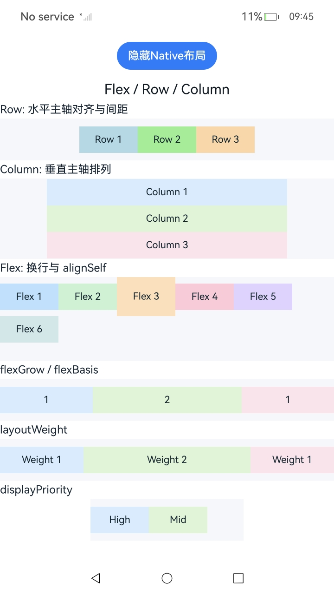

# 使用Flex布局

### 介绍

本工程以 `ArkUI (C-API)` 的方式实现使用Flex布局，演示 `Row`、`Column`、`Flex` 原生节点的创建与弹性布局属性配置。

### 效果预览

1. 首页展示“显示Native布局”按钮。

2. 点击按钮后展示 Native 侧构建的 `Flex / Row / Column` 示例页面，包含 `Row`、`Column`、`Flex` 换行、`flexGrow / flexBasis`、`layoutWeight` 和 `displayPriority` 等示例。

<table>
  <tr>
    <th>首页</th>
    <th>Flex / Row / Column</th>
  </tr>
  <tr>
    <td></td>
    <td></td>
  </tr>
</table>

### 使用说明

1. 启动应用后，在首页点击“显示Native布局”。

2. 查看 `Row`、`Column`、`Flex` 相关布局示例。

3. 点击“隐藏Native布局”可销毁当前 Native 布局树。

4. 可结合自动测试框架进行测试及维护。

### 工程目录

``` text
entry/src/main
+--- cpp
|   ├── ArkUIBaseNode.h
|   ├── ArkUIColumnNode.h
|   ├── ArkUIFlexNode.h
|   ├── ArkUINode.h
|   ├── ArkUIRowNode.h
|   ├── ArkUITextNode.h
|   ├── CMakeLists.txt
|   ├── FlexLayoutExample.h
|   ├── NativeEntry.cpp
|   ├── NativeEntry.h
|   ├── NativeModule.h
|   ├── NormalFlexExample.h
|   ├── napi_init.cpp
|   └── types
|       └── libentry
|           ├── Index.d.ts
|           └── oh-package.json5
└── ets
    ├── entryability
    │   └── EntryAbility.ets
    ├── entrybackupability
    │   └── EntryBackupAbility.ets
    └── pages
        └── Index.ets
```

### 具体实现

* 页面入口与 Native 节点挂载参考 [Index.ets](entry/src/main/ets/pages/Index.ets)、[napi_init.cpp](entry/src/main/cpp/napi_init.cpp) 和 [NativeEntry.cpp](entry/src/main/cpp/NativeEntry.cpp)。
  * ETS 页面通过 `Button` 切换 `showNative` 状态。
  * `NodeContent` 作为 Native 布局挂载槽位。
  * Native 模块导出 `createNativeRoot` 和 `destroyNativeRoot` 两个接口，用于创建和销毁根节点。

* `Row`、`Column`、`Flex` 基础节点封装参考 [ArkUIRowNode.h](entry/src/main/cpp/ArkUIRowNode.h)、[ArkUIColumnNode.h](entry/src/main/cpp/ArkUIColumnNode.h)、[ArkUIFlexNode.h](entry/src/main/cpp/ArkUIFlexNode.h) 和 [ArkUITextNode.h](entry/src/main/cpp/ArkUITextNode.h)。
  * 通过 `createNode` 创建对应的原生节点。
  * 通过封装方法设置主轴对齐、交叉轴对齐、文本内容和尺寸等属性。

* Flex 布局示例拼装参考 [FlexLayoutExample.h](entry/src/main/cpp/FlexLayoutExample.h)。
  * `CreateRowExample` 演示 `Row` 水平主轴对齐与间距。
  * `CreateColumnExample` 演示 `Column` 垂直主轴排列。
  * `CreateFlexWrapExample` 演示 `Flex` 换行与 `alignSelf`。
  * `CreateFlexGrowExample`、`CreateLayoutWeightExample` 和 `CreateDisplayPriorityExample` 分别演示 `flexGrow / flexBasis`、`layoutWeight` 和 `displayPriority`。

### 相关权限

不涉及。

### 依赖

不涉及。

### 约束与限制

1. 本示例仅支持标准系统上运行，支持设备：RK3568。

2. 本示例为 Stage 模型，支持 API22 版本 full-SDK，版本号：6.0.0.47，镜像版本号：OpenHarmony_6.0.0 Release。

3. 本示例需要使用 DevEco Studio 6.0.0 Release (Build Version: 6.0.0.858, built on September 24, 2025) 及以上版本才可编译运行。

### 下载

如需单独下载本工程，执行如下命令：

```bash
git init
git config core.sparsecheckout true
echo code/DocsSample/ArkUISample/NDKFlexSample > .git/info/sparse-checkout
git remote add origin https://gitcode.com/openharmony/applications_app_samples.git
git pull origin master
```
