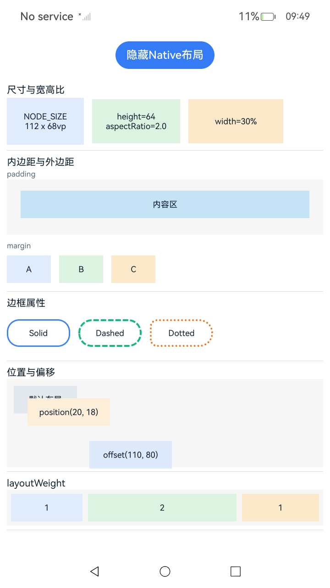

# 使用布局属性

### 介绍

本工程以 `ArkUI (C-API)` 的方式实现布局属性示例，演示组件尺寸、内外边距、边框、位置偏移、`layoutWeight` 与安全区扩展等常见布局属性在 Native 节点中的配置方式。

### 效果预览

1. 首页展示“显示Native布局”按钮。

2. 点击按钮后展示 Native 侧构建的布局属性示例页面，包含“尺寸与宽高比”“内边距与外边距”“边框属性”“位置与偏移”“layoutWeight”等多个分区。

<table>
  <tr>
    <th>首页</th>
    <th>Layout</th>
  </tr>
  <tr>
    <td></td>
    <td></td>
  </tr>
</table>

### 使用说明

1. 启动应用后，在首页点击“显示Native布局”。

2. 查看布局属性相关的 Native 示例内容。

3. 点击“隐藏Native布局”可销毁当前 Native 布局树。

4. 可结合自动测试框架进行测试及维护。

### 工程目录

``` text
entry/src/main
+--- cpp
|   ├── ArkUIBaseNode.h
|   ├── ArkUIColumnNode.h
|   ├── ArkUIFlexNode.h
|   ├── ArkUINode.h
|   ├── ArkUIRowNode.h
|   ├── ArkUIScrollNode.h
|   ├── ArkUIStackNode.h
|   ├── ArkUITextNode.h
|   ├── CMakeLists.txt
|   ├── LayoutAttributeExample.h
|   ├── NativeEntry.cpp
|   ├── NativeEntry.h
|   ├── NativeModule.h
|   ├── napi_init.cpp
|   └── types
|       └── libentry
|           ├── Index.d.ts
|           └── oh-package.json5
└── ets
    ├── entryability
    │   └── EntryAbility.ets
    ├── entrybackupability
    │   └── EntryBackupAbility.ets
    └── pages
        └── Index.ets
```

### 具体实现

* 页面入口与 Native 节点挂载参考 [Index.ets](entry/src/main/ets/pages/Index.ets)、[napi_init.cpp](entry/src/main/cpp/napi_init.cpp) 和 [NativeEntry.cpp](entry/src/main/cpp/NativeEntry.cpp)。
  * ETS 页面通过 `Button` 控制 Native 布局树的创建与销毁。
  * `NodeContent` 作为 Native 侧布局内容的挂载容器。
  * Native 模块对外暴露 `createNativeRoot` 和 `destroyNativeRoot` 接口。

* 基础布局节点封装参考 [ArkUIColumnNode.h](entry/src/main/cpp/ArkUIColumnNode.h)、[ArkUIRowNode.h](entry/src/main/cpp/ArkUIRowNode.h)、[ArkUIStackNode.h](entry/src/main/cpp/ArkUIStackNode.h) 和 [ArkUITextNode.h](entry/src/main/cpp/ArkUITextNode.h)。
  * 通过封装好的接口设置节点尺寸、背景色、边框、内外边距、对齐方式和文本内容等属性。

* 布局属性示例内容参考 [LayoutAttributeExample.h](entry/src/main/cpp/LayoutAttributeExample.h)。
  * `CreateSizeSection` 演示固定尺寸、宽高比和百分比宽度。
  * `CreateSpacingSection` 演示 `padding` 和 `margin`。
  * `CreateBorderSection` 演示边框宽度、颜色、样式和圆角。
  * `CreatePositionSection` 演示 `position` 与 `offset`。
  * `CreateWeightSection` 演示 `layoutWeight`。
  * `CreatePageRoot` 演示安全区扩展能力。

### 相关权限

不涉及。

### 依赖

不涉及。

### 约束与限制

1. 本示例仅支持标准系统上运行，支持设备：RK3568。

2. 本示例为 Stage 模型，支持 API22 版本 full-SDK，版本号：6.0.0.47，镜像版本号：OpenHarmony_6.0.0 Release。

3. 本示例需要使用 DevEco Studio 6.0.0 Release (Build Version: 6.0.0.858, built on September 24, 2025) 及以上版本才可编译运行。

### 下载

如需单独下载本工程，执行如下命令：

```bash
git init
git config core.sparsecheckout true
echo code/DocsSample/ArkUISample/NDKLayoutSample > .git/info/sparse-checkout
git remote add origin https://gitcode.com/openharmony/applications_app_samples.git
git pull origin master
```
