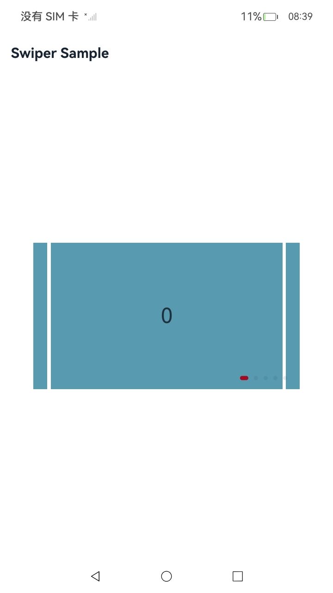

# 使用网格

### 介绍

本工程以`ArkUI (C-API)`的方式实现[使用滑块视图容器](https://gitcode.com/openharmony/docs/blob/master/zh-cn/application-dev/ui/ndk-swiper.md)，演示滑块视图容器组件原生节点的创建、显示效果属性设置、页面切换事件监听与ETS侧对接。

### 效果预览



### 使用说明

1. 在主界面可以显示参考的组件示例。

### 工程目录

``` text
entry/src/main
+--- cpp
|   ├── CMakeLists.txt
|   ├── napi_init.cpp
|   ├── NativeEntry.cpp
|   ├── NativeEntry.h
|   └── types
|       └── libentry
|           ├── Index.d.ts
|           └── oh-package.json5
├── ets
|   ├── entryability
|   |   └── EntryAbility.ets
|   ├── entrybackupability
|   |   └── EntryBackupAbility.ets
|   └── pages
|       └── Index.ets  
```

### 具体实现

* 滑块视图容器组件的创建、属性设置和时间监听等，源码参考：[NativeEntry.cpp](entry/src/main/cpp/NativeEntry.cpp)
    * 通过`createNode(ARKUI_NODE_SWIPER)`创建滑块视图容器节点
    * 通过`NODE_SWIPER_PREV_MARGIN`等属性修改显示效果
    * 通过`OH_ArkUI_SwiperIndicator_Create(ARKUI_SWIPER_INDICATOR_TYPE_DOT)`创建圆点导航指示器，并修改显示效果
    * 通过`registerNodeEvent`监听`NODE_SWIPER_EVENT_ON_CHANGE`等页面切换事件

### 相关权限

不涉及。

### 依赖

不涉及。

### 约束与限制

1.本示例仅支持标准系统上运行, 支持设备：RK3568。

2.本示例为Stage模型，支持API23版本full-SDK，版本号：6.1.0.36，镜像版本号：OpenHarmony_6.0.0 Release。

3.本示例需要使用DevEco Studio 6.0.2 Release (Build Version: 6.0.2.642, built on March 5, 2026)及以上版本才可编译运行。

### 下载

如需单独下载本工程，执行如下命令：

```
git init
git config core.sparsecheckout true
echo code/DocsSample/ArkUISample/NdkSwiperSample > .git/info/sparse-checkout
git remote add origin https://gitcode.com/openharmony/applications_app_samples.git
git pull origin master
```