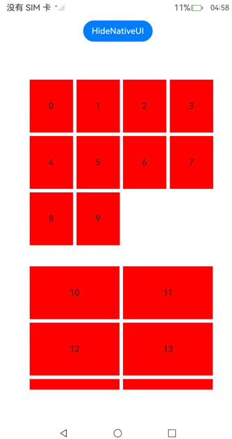

# ArkUI 滚动类 示例

### 介绍

本工程以 `ArkUI` (C-API)` 的方式实现瀑布流容器组件示例，演示原生节点的创建、复用、懒加载与 ETS 侧对接。该工程中展示的代码详细描述可查如下链接：

1. [使用瀑布流](https://gitcode.com/openharmony/docs/blob/master/zh-cn/application-dev/ui/ndk-waterflow.md)。

### 效果预览

<table>
  <tr>
    <th>首页</th>
    <th>WaterFlow</th>
  </tr>
  <tr>
    <td></td>
    <td></td>
  </tr>
</table>

### 使用说明

1. 在主界面，可以点击对应卡片，选择需要参考的组件示例。

2. 在组件目录选择详细的示例参考。

3. 进入示例界面，查看参考示例。

4. 通过自动测试框架可进行测试及维护。

### 工程目录
```
entry/src/main
+--- cpp
|   |-- ArkUIBaseNode.h
|   |-- ArkUINode.h
|   |-- CMakeLists.txt
|   |-- CreateWaterflowExample.h
|   |-- FlowItemAdapter.h
|   |-- NativeEntry.cpp
|   |-- NativeEntry.h
|   |-- NativeModule.h
|   |-- WaterflowSection.h
|   |-- napi_init.cpp
|   |-- types
|   |   `-- libentry
|   |       |-- Index.d.ts
|   |       `-- oh-package.json5
|   `-- waterflow.h
|-- ets
|   |-- entryability
|   |   `-- EntryAbility.ets
|   |-- entrybackupability
|   |   `-- EntryBackupAbility.ets
|   `-- pages
|       `-- Index.ets         
```
具体实现：
1. 基础瀑布流组件搭建（含 ArkTS 页面挂载）
该实现聚焦 “从 0 到 1” 创建可显示的瀑布流容器，包含 Native 侧组件构建与 ArkTS 侧挂载衔接。
+ 参考CreateWaterflowExample.h，创建ArkUIWaterflowNode实例，调用SetWidth(400)和SetHeight(600)设置容器尺寸。
+ 在 ArkTS 页面创建NativeNode占位组件，按 “接入 ArkTS 页面” 要求实现 Native 模块接口，将 Native 侧创建的瀑布流节点挂载到占位组件上。
+ 无需设置分组和懒加载，直接运行代码，验证瀑布流容器是否在 ArkTS 页面正常渲染（可先添加 1-2 个固定FlowItem测试）。
2. 瀑布流懒加载与节点复用实现
基于FlowItemAdapter.h，实现大量数据的按需加载和组件复用，避免内存占用过高。
+ 初始化FlowItemAdapter，在构造函数中通过OH_ArkUI_NodeAdapter_Create()创建NodeAdapter，并调用OH_ArkUI_NodeAdapter_SetTotalNodeCount设置总数据量（如示例中的 100 条）。
+ 实现OnCreateNewChild方法：当需要新节点时，先检查cachedItems_缓存栈，有缓存则复用并更新文本数据，无缓存则创建新ARKUI_NODE_FLOW_ITEM和ARKUI_NODE_TEXT节点。
+ 实现OnDisposeChild方法：当节点不可见时，将其存入cachedItems_缓存栈，而非直接销毁，供后续复用。
+ 在ArkUIWaterflowNode中通过SetLazyAdapter绑定适配器，运行后滑动瀑布流，验证数据是否按需加载、节点是否复用。
3. 瀑布流分组（分段）配置实现
基于WaterflowSection.h，实现多分组瀑布流，支持不同分组的列数、间距、边距差异化配置。
+ 创建WaterflowSection实例，定义多个SectionOption配置（如示例中MARGIN_GAP_SECTION_1列数 2、MARGIN_GAP_SECTION_2列数 4），设置每个分组的itemsCount（数据量）、columnsGap（列间距）、rowsGap（行间距）和margin（边距）。
+ 调用sections->SetSection方法，循环为每个分组（如示例中的 10 个分组）绑定配置，奇数分组用MARGIN_GAP_SECTION_1，偶数分组用MARGIN_GAP_SECTION_2。
+ 在ArkUIWaterflowNode中通过SetSection绑定分组配置，运行后查看瀑布流是否按分组展示，不同分组的列数、间距是否符合预期。
4. 瀑布流数据动态操作（增删改移）实现
基于FlowItemAdapter.h中的RemoveItem、InsertItem等方法，实现瀑布流数据的实时更新与 UI 同步。
+ 调用InsertItem(int32_t index, const std::string &value)：在指定索引插入数据，内部先更新data_数组，再调用OH_ArkUI_NodeAdapter_InsertItem通知适配器，UI 会自动添加对应节点。
+ 调用RemoveItem(int32_t index)：删除指定索引数据，更新data_数组后调用OH_ArkUI_NodeAdapter_RemoveItem，UI 会移除对应节点并重新排列。
+ 调用MoveItem(int32_t oldIndex, int32_t newIndex)：移动数据位置，更新data_数组后调用OH_ArkUI_NodeAdapter_MoveItem，UI 会同步调整节点位置。
+ 调用ReloadItem(int32_t index, const std::string &value)：更新指定索引数据，调用OH_ArkUI_NodeAdapter_ReloadItem，UI 会重新渲染对应节点的内容。
+ 在代码中添加按钮或定时器触发上述方法，验证瀑布流数据更新后，UI 是否实时、正确响应。

### 相关权限

不涉及。

### 依赖

不涉及。

### 约束与限制

1.本示例仅支持标准系统上运行, 支持设备：RK3568。

2.本示例为Stage模型，支持API22版本full-SDK，版本号：6.0.0.47，镜像版本号：OpenHarmony_6.0.0 Release。

3.本示例需要使用DevEco Studio 6.0.0 Release (Build Version: 6.0.0.858, built on September 24, 2025)及以上版本才可编译运行。

### 下载

如需单独下载本工程，执行如下命令：

````
git init
git config core.sparsecheckout true
echo code/DocsSample/ArkUISample/NdkWorkflowSample > .git/info/sparse-checkout
git remote add origin https://gitcode.com/openharmony/applications_app_samples.git
git pull origin master
````