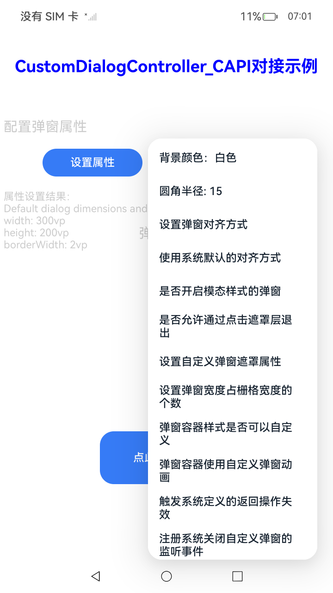
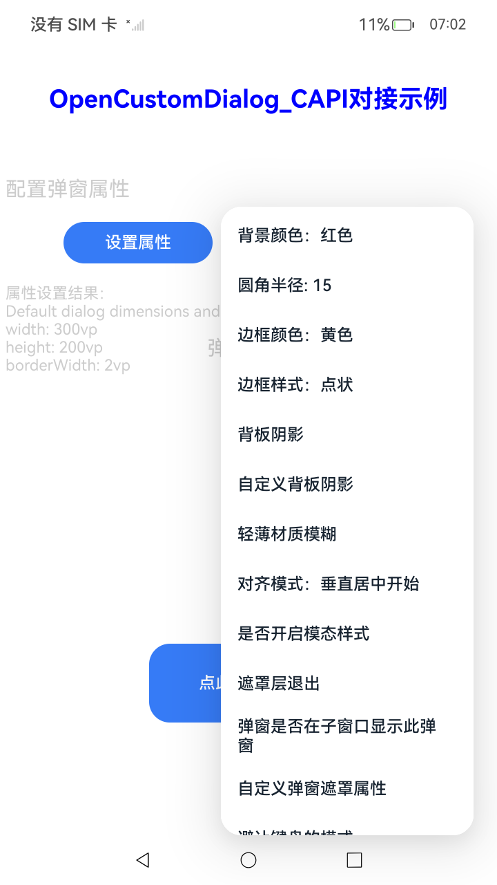

# NativeDialogSample

## 介绍

本示例展示了如何创建自定义弹窗，设置自定义弹窗的背景颜色、圆角半径、对齐方式、边框颜色、边框样式等功能。该工程中展示的接口详细描述可查如下链接：

[native_dialog.h](https://gitcode.com/openharmony/docs/blob/master/zh-cn/application-dev/reference/apis-arkui/capi-native-dialog-h.md)
[构建弹窗](https://gitcode.com/openharmony/docs/blob/master/zh-cn/application-dev/ui/ndk-build-pop-up-window.md)

## 效果预览

| 首页                                              | CustomDialogController_CAPI页面                                  |OpenCustomDialog_CAPI页面                                              |dialog demo页面                                              |
| ----------------------------------------------------- |--------------------------------------------------------------| ------------------------------------------------------- |------------------------------------------------------- |
|  |  |  |  |

## 使用说明

1. 安装编译生成的hap包，并打开应用；
2. 首页面会出现CustomDialogController_CAPI对接示例按钮，点击此按钮进入CustomDialogController_CAPI对接示例界面；
3. 首页面会出现OpenCustomDialog_CAPI对接示例按钮，点击此按钮进入OpenCustomDialog_CAPI对接示例界面；
4. 首页面会出现关闭应用按钮，点击此按钮关闭应用；

## 工程目录

```
native_type_sample
entry/src/main/ets/
└───pages
│   ├── DialogDemo.ets (dialog demo界面)
│   ├── Index.ets (获取导航页面)
│   ├── IndexController.ets (CustomDialogController_CAPI对接示例界面)
│   └── IndexCustomDialog.ets (OpenCustomDialog_CAPI对接示例界面)
└───common
       └── resource.ets (资源字串处理工具类)
entry/src/main/
├── cpp
│   ├── types
│   │   └── libentry
│   │       └── Index.d.ts (函数对应的js映射)
│   ├── common
│   │    └── common.h
│   ├── CMakeLists.txt (CMake脚本)
│   └── napi_init.cpp
└───customdialog
│   ├── customdialogexample.cpp 
│   ├── customdialogexample.h
│   ├── nativedialogdemo.cpp
│   ├── nativedialogdemo.h
│   └── utils.h
└── resources
    ├── base
    │   ├── element
    │   │   ├── color.json
    │   │   ├── float.json
    │   │   └── string.json
    │   └── media
```
## 具体实现

1. dialog demo页面：通过dialog demo按钮进入页面后，通过按钮触发c++相关代码，实现显示弹窗、关闭弹窗、弹窗生命周期演示示例。源码参考[nativedialogdemo.cpp](https://gitcode.com/openharmony/applications_app_samples/blob/master/code/DocsSample/ArkUISample/NativeDialogSample/entry/src/main/cpp/customdialog/nativedialogdemo.cpp)

    * 定义一个组件，该组件在页面中占位，通过napi接口传递handle给c++侧。

    * c++代码中使用napi的接口和方法实现一个按钮和一个弹窗，通过按钮控制弹窗的显示和关闭。

## 相关权限

不涉及

## 依赖

不涉及

## 约束和限制

1. 本示例支持标准系统上运行，支持设备：RK3568等;

2. 本示例支持API20版本SDK，版本号：6.0.0.36;

3. 本示例已支持使DevEco Studio 5.1.1 Release (构建版本：5.1.1.840，构建 2025年9月20日)编译运行

## 下载

如需单独下载本工程，执行如下命令：

```
git init
git config core.sparsecheckout true
echo code/DocsSample/ArkUISample/NativeDialogSample > .git/info/sparse-checkout
git remote add origin https://gitcode.com/openharmony/applications_app_samples.git
git pull origin master
```
