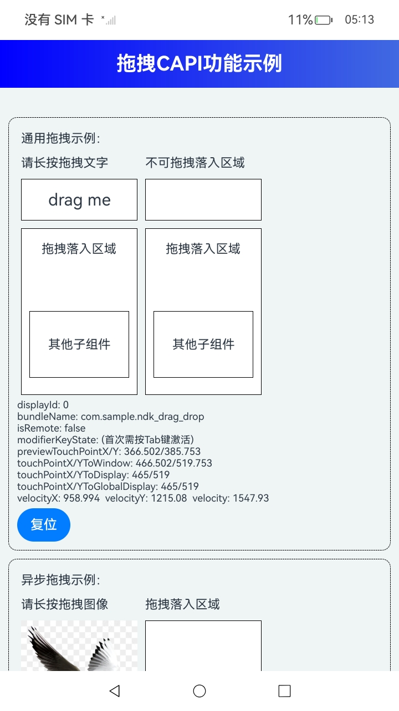

# 拖拽事件

### 介绍

ArkUI开发框架针对拖拽事件提供了[NODE_ON_PRE_DRAG](https://gitcode.com/openharmony/docs/blob/master/zh-cn/application-dev/reference/apis-arkui/capi-native-node-h.md)，[NODE_ON_DRAG_START](https://gitcode.com/openharmony/docs/blob/master/zh-cn/application-dev/reference/apis-arkui/capi-native-node-h.md)，[NODE_ON_DROP](https://gitcode.com/openharmony/docs/blob/master/zh-cn/application-dev/reference/apis-arkui/capi-native-node-h.md)，[NODE_ON_DRAG_ENTER](https://gitcode.com/openharmony/docs/blob/master/zh-cn/application-dev/reference/apis-arkui/capi-native-node-h.md)，[NODE_ON_DRAG_MOVE](https://gitcode.com/openharmony/docs/blob/master/zh-cn/application-dev/reference/apis-arkui/capi-native-node-h.md)，[NODE_ON_DRAG_LEAVE](https://gitcode.com/openharmony/docs/blob/master/zh-cn/application-dev/reference/apis-arkui/capi-native-node-h.md)，[NODE_ON_DRAG_END](https://gitcode.com/openharmony/docs/blob/master/zh-cn/application-dev/reference/apis-arkui/capi-native-node-h.md)等组件事件，当拖拽在不同的阶段时会触发对应的组件事件，完成对应的数据处理操作，实现期望的拖拽交互能力。

### 效果预览

| 首页                                 |
|------------------------------------|
|  |

### 使用说明

1. 在首页可以查看多种拖拽C-API的使用示例，包括通用拖拽、通用异步拖拽、延迟拖拽、主动发起拖拽、主动发起拖拽（异步加载）的示例。

2. 通过自动测试框架可进行测试及维护。

### 工程目录
```
entry/src/main/ets/
|---cpp
|     |---types
|     |---CMakeLists.txt
|     |---common.h
|     |---container.cpp
|     |---container.h
|     |---fifthmodule.h                    // 主动发起拖拽（异步加载）示例代码
|     |---firstmodule.h                    // 通用拖拽示例代码
|     |---forthmodule.h                    // 主动发起拖拽示例代码
|     |---init.cpp
|     |---manager.cpp                       // 各模块示例入口
|     |---manager.h                         // manager头文件
|     |---napi_init.cpp
|     |---secondmodule.h                    // 异步拖拽示例代码
|     |---thirdmodule.h                    // 延迟处理拖拽示例代码
|---ets
|   |---pages
|   |   |---Index.ets                       // 应用主页面
```

### 相关权限

不涉及。

### 依赖

不涉及。

### 约束与限制

1.本示例仅支持标准系统上运行, 支持设备：RK3568。

2.本示例为Stage模型，支持API20版本SDK，版本号：6.0.0.41，镜像版本号：OpenHarmony_6.0.0.41。

3.本示例需要使用DevEco Studio 5.0.5 Release (Build Version: 5.0.13.200, built on May 13, 2025)及以上版本才可编译运行。

### 下载

如需单独下载本工程，执行如下命令：

````
git init
git config core.sparsecheckout true
echo code/DocsSample/ArkUISample/NativeDragDrop > .git/info/sparse-checkout
git remote add origin https://gitcode.com/openharmony/applications_app_samples.git
git pull origin master
````