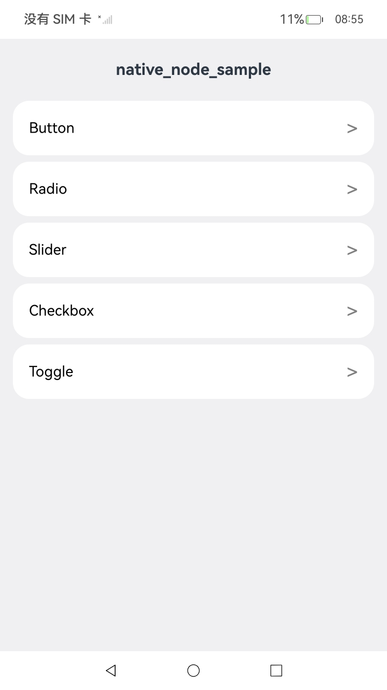
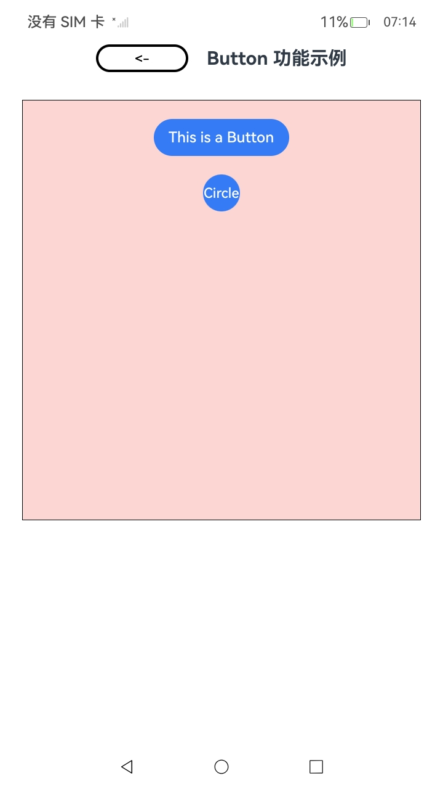
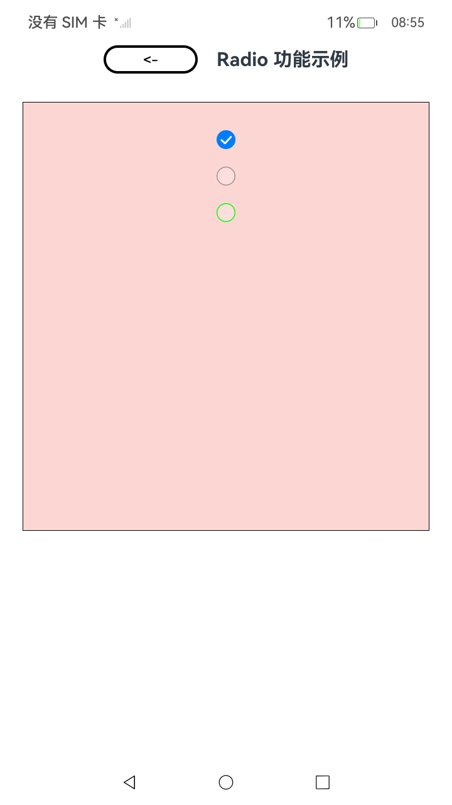
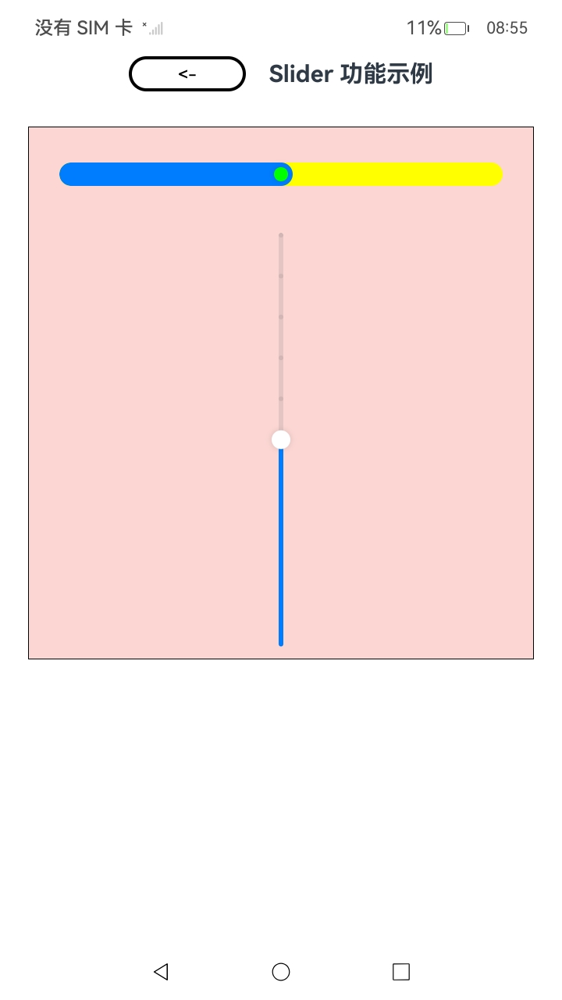
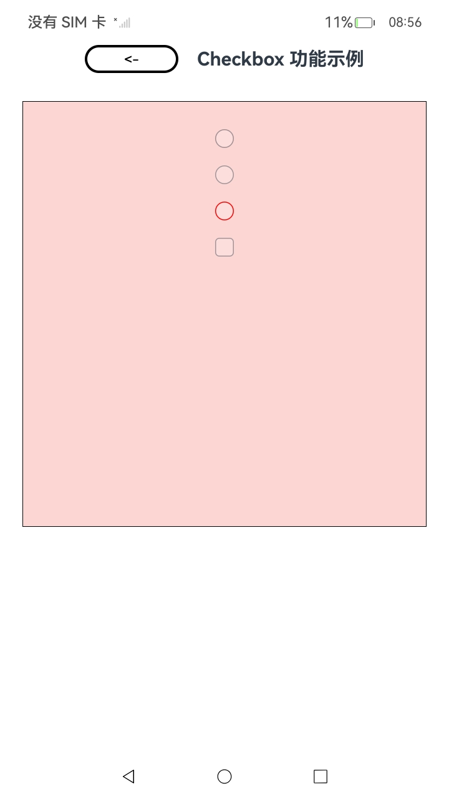
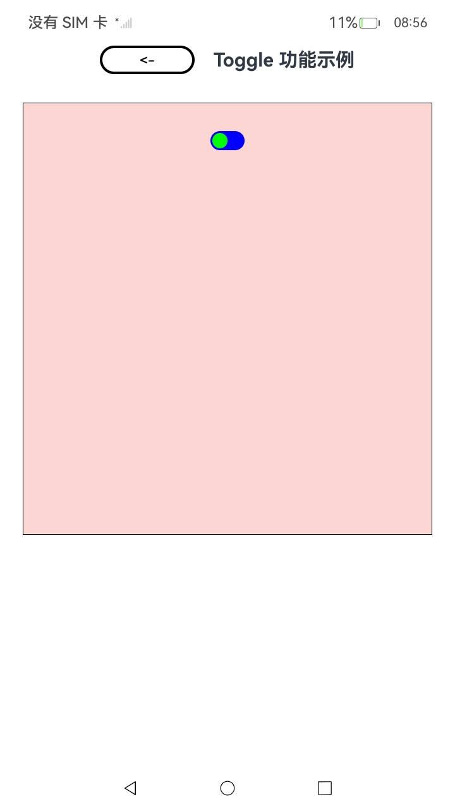

# Native_node_Sample

## 介绍

本示例展示了如何创建Button\Checkbox\CheckboxGroup\Slider\Toggle\Radio等表单类组件，配置其样式、属性等功能，构建基础展示页面。该工程中展示的接口详细描述可查如下链接：

[native_node.h](https://gitcode.com/openharmony/docs/blob/master/zh-cn/application-dev/reference/apis-arkui/capi-native-node-h.md)

## 效果预览
<table>
  <tr>
    <th>首页</th>
    <th>Button</th>
    <th>Radio</th>
    <th>Slider</th>
    <th>Checkbox</th>
    <th>Toggle</th>
  </tr>
  <tr>
    <td></td>
    <td></td>
    <td></td>
    <td></td>
    <td></td>
    <td></td>
  </tr>
</table>

## 使用说明
1. 安装编译生成的hap包，并打开应用；
2. 进入首页，可选择不同模块页面。
3. 点击Button选择框进入Button组件的CAPI接口展示界面；
4. 点击Radio选择框进入Radio组件的CAPI接口展示界面；
5. 点击Slider选择框进入Slider组件的CAPI接口展示界面；
6. 点击Checkbox选择框进入Checkbox组件和CheckboxGroup的CAPI接口展示界面；
7. 点击Toggle选择框进入Toggle组件的CAPI接口展示界面；
```
"BIND_EVENT success"
```

## 工程目录

```
NativeFormExample
├── AppScope
│   ├── app.json5                           # 应用全局配置
│   └── resources
│       └── base
│           ├── element
│           │   └── string.json             # 字符串资源
│           └── media
│               ├── background.png          # 背景图片
│               ├── foreground.png          # 前景图片
│               └── layered_image.json      # 分层图片配置
├── entry
│   ├── build-profile.json5                 # 模块构建配置
│   ├── obfuscation-rules.txt               # 混淆规则
│   ├── oh-package.json5                    # 模块依赖配置
│   ├── oh-package-lock.json5               # 依赖锁定文件
│   ├── src
│   │   ├── main
│   │   │   ├── cpp                         # Native C++代码
│   │   │   │   ├── CMakeLists.txt          # CMake构建配置
│   │   │   │   ├── common                  # 公共头文件
│   │   │   │   │   ├── ArkUIBaseNode.h     # 基础节点封装
│   │   │   │   │   ├── ArkUIButtonNode.h   # Button节点封装
│   │   │   │   │   ├── ArkUICheckboxNode.h # Checkbox节点封装
│   │   │   │   │   ├── ArkUIColumnNode.h   # Column节点封装
│   │   │   │   │   ├── ArkUINode.h         # 节点基类
│   │   │   │   │   ├── ArkUIRadioNode.h    # Radio节点封装
│   │   │   │   │   ├── ArkUISliderNode.h   # Slider节点封装
│   │   │   │   │   ├── ArkUITextNode.h     # Text节点封装
│   │   │   │   │   ├── ArkUIToggleNode.h   # Toggle节点封装
│   │   │   │   │   ├── common.h            # 公共定义
│   │   │   │   │   └── NativeModule.h      # Native模块定义
│   │   │   │   ├── demo                    # 示例代码
│   │   │   │   │   ├── formTest.cpp        # 表单测试实现
│   │   │   │   │   └── formTest.h          # 表单测试头文件
│   │   │   │   ├── napi_init.cpp           # NAPI初始化
│   │   │   │   └── types
│   │   │   │       └── libentry
│   │   │   │           ├── Index.d.ts      # 类型声明
│   │   │   │           └── oh-package.json5
│   │   │   ├── ets                         # ArkTS代码
│   │   │   │   ├── entryability
│   │   │   │   │   └── EntryAbility.ets    # 应用入口
│   │   │   │   ├── entrybackupability
│   │   │   │   │   └── EntryBackupAbility.ets
│   │   │   │   └── pages
│   │   │   │       ├── Index.ets           # 首页
│   │   │   │       ├── page_button.ets     # Button示例页面
│   │   │   │       ├── page_checkbox.ets   # Checkbox示例页面
│   │   │   │       ├── page_radio.ets      # Radio示例页面
│   │   │   │       ├── page_slider.ets     # Slider示例页面
│   │   │   │       └── page_toggle.ets     # Toggle示例页面
│   │   │   ├── module.json5                # 模块配置
│   │   │   └── resources                   # 资源文件
│   │   │       ├── base
│   │   │       │   ├── element
│   │   │       │   │   ├── color.json      # 颜色资源
│   │   │       │   │   ├── float.json      # 尺寸资源
│   │   │       │   │   └── string.json     # 字符串资源
│   │   │       │   ├── media               # 图片资源
│   │   │       │   └── profile
│   │   │       │       ├── backup_config.json
│   │   │       │       └── main_pages.json # 页面路由配置
│   │   │       ├── dark                    # 深色模式资源
│   │   │       └── rawfile                 # 原始文件
│   │   ├── ohosTest                        # 测试代码
│   │   │   ├── ets
│   │   │   │   └── test
│   │   │   │       ├── Ability.test.ets    # Ability测试
│   │   │   │       ├── List.test.ets       # List测试
│   │   │   │       └── Public.test.ets     # 公共测试
│   │   │   └── module.json5
│   │   └── test
│   │       ├── List.test.ets
│   │       └── LocalUnit.test.ets
│   └── syscap.json                         # 系统能力配置
├── hvigor                                  # 构建脚本
├── build-profile.json5                     # 工程构建配置
├── code-linter.json5                       # 代码检查配置
├── hvigorfile.ts                           # Hvigor构建脚本
├── local.properties                        # 本地配置
├── oh-package.json5                        # 工程依赖配置
├── ohosTest.md                             # 测试说明文档
├── README.md                               # 工程说明文档
└── screenshot                              # 截图目录
```

## 相关权限

不涉及

## 依赖

不涉及

## 约束和限制

1. 本示例支持标准系统上运行，支持设备：RK3568;

2. 本示例支持API23版本SDK，版本号：6.1.0.19;

3. 本示例已支持使DevEco Studio 5.1.1 Release (构建版本：5.1.1.840，构建 2025年9月20日)编译运行

## 下载

如需单独下载本工程，执行如下命令：

```
git init
git config core.sparsecheckout true
echo code/DocsSample/ArkUISample/NativeFormExample > .git/info/sparse-checkout
git remote add origin https://gitcode.com/openharmony/applications_app_samples.git
git pull origin master
```