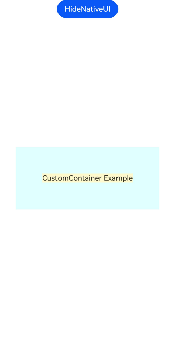

# 自定义布局容器

## 介绍

ArkUI开发框架在NDK接口提供了自定义UI组件的能力，开发者通过注册相关自定义回调事件接入ArkUI开发框架的布局渲染流程。本示例展示了如何创建自定义布局容器。示例创建了一个自定义容器，该容器将子组件最大值加上额外边距作为自身大小，同时对子组件进行居中排布。

本示例为 [构建自定义组件-自定义布局容器](https://gitcode.com/openharmony/docs/blob/master/zh-cn/application-dev/ui/ndk-build-custom-components.md#自定义布局容器) 的配套示例工程。

## 效果预览

| 预览                                      | 
| -------------------------------------------- | 

## 使用说明
1. 安装编译生成的hap包，并打开应用；
2. 进入首页，可点击按钮。
3. 可以查看到效果，稍微等待可以看到文字的背景颜色发生变化。


## 工程目录

```
entry/src/main/ets/
└── pages
    └── Index.ets (获取导航页面)

entry/src/main/cpp/
├── types
│   └── libentry
│       └── Index.d.ts (函数对应的js映射)
├── ArkUIBaseNode.h
├── ArkUICustomContainerNode.h
├── ArkUINode.h
├── ArkUITextNode.h
├── CMakeLists.txt
├── napi_init.cpp
├── NativeEntry.cpp
├── NativeEntry.h
├── NativeModule.h
└── UITimer.h
```

## 具体实现

1. 按照[接入ArkTS页面](https://gitcode.com/openharmony/docs/blob/master/zh-cn/application-dev/ui/ndk-access-the-arkts-page.md)创建前置工程。
2. 创建自定义容器组件封装对象。
3. 使用自定义容器创建带文本的示例界面。
4. 修改CMakeList.txt，添加链接库。

## 相关权限

不涉及

## 依赖

不涉及

## 约束和限制

1. 本示例支持标准系统上运行，支持设备：RK3568;

2. 本示例支持API22版本SDK，版本号：6.0.2.54;

3. 本示例已支持使DevEco Studio 5.1.1 Release (构建版本：5.1.1.840，构建 2025年10月18日)编译运行

## 下载

如需单独下载本工程，执行如下命令：

```bash
git init
git config core.sparsecheckout true
echo code/DocsSample/ArkUISample/NativeType/CustomContainerSample > .git/info/sparse-checkout
git remote add origin https://gitcode.com/openharmony/applications_app_samples.git
git pull origin master
```