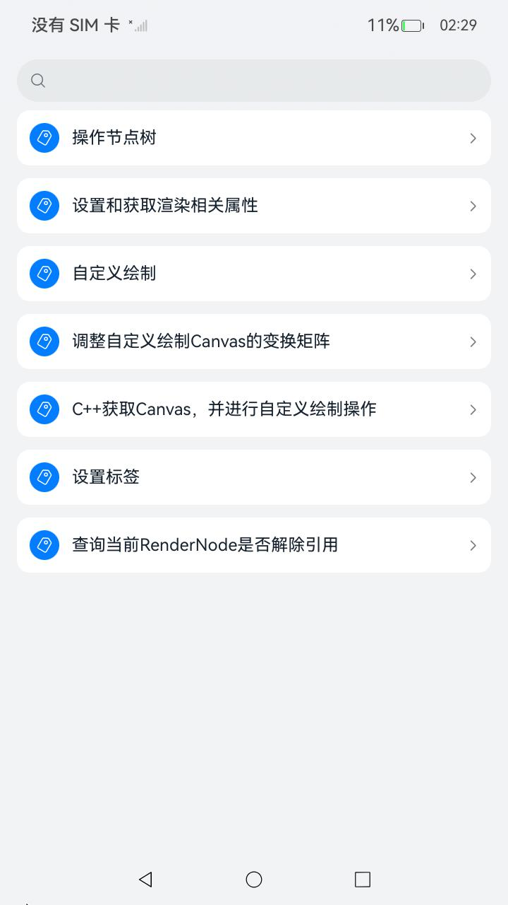
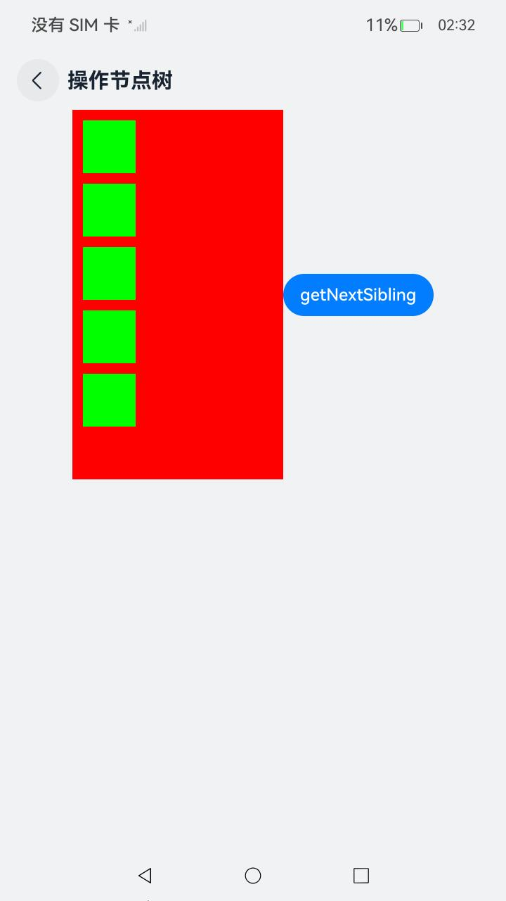
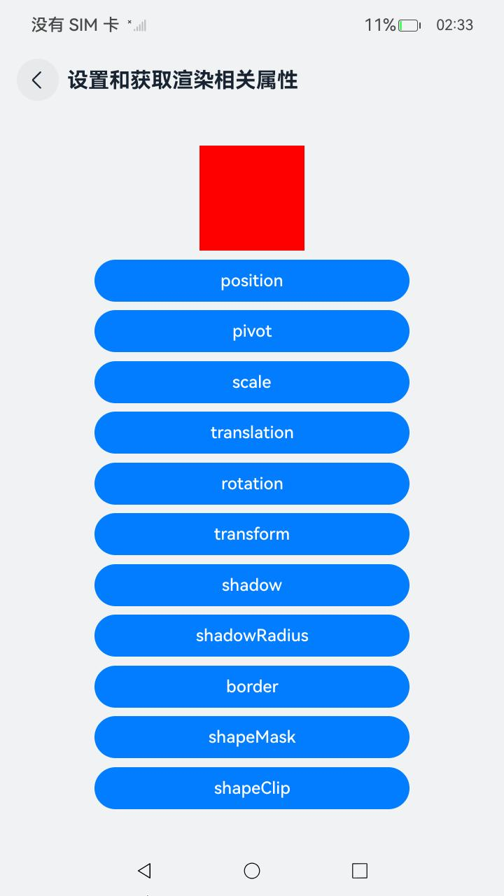
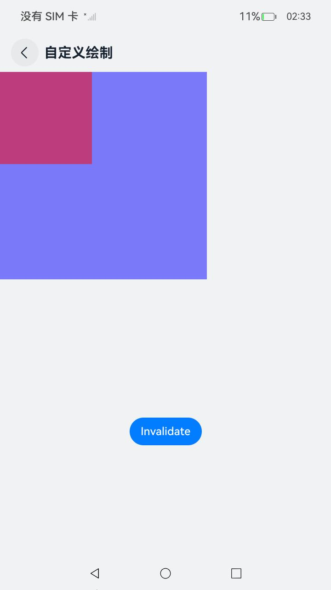
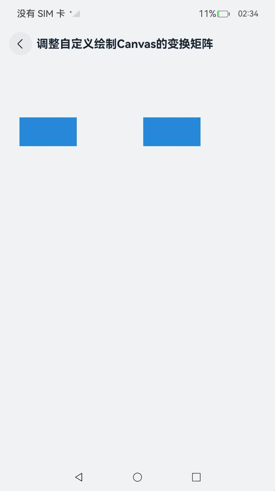
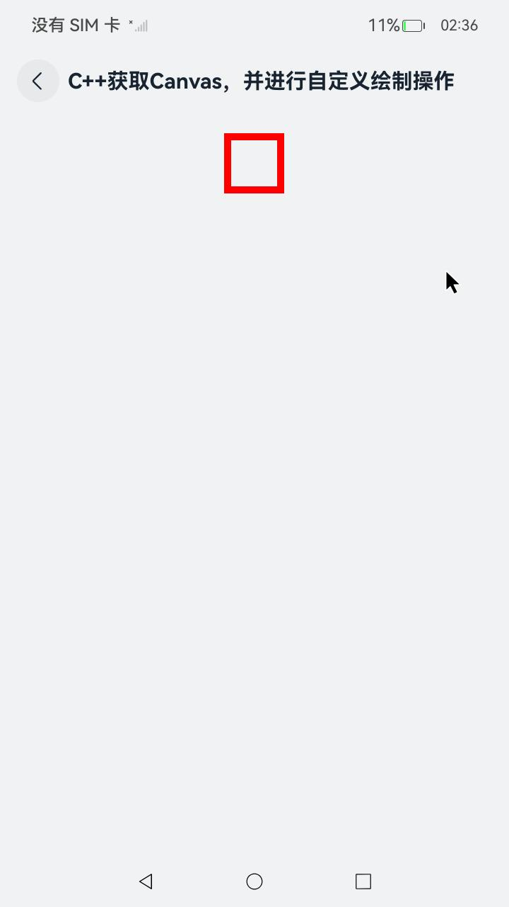
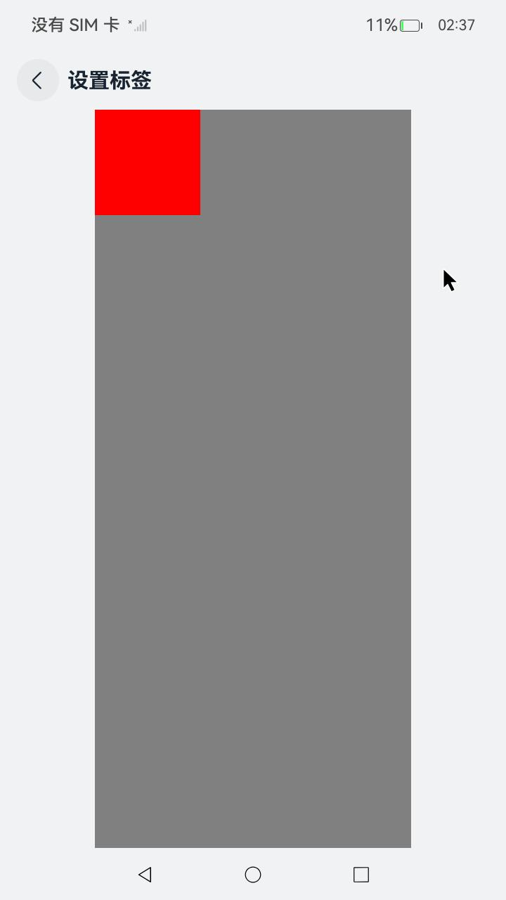
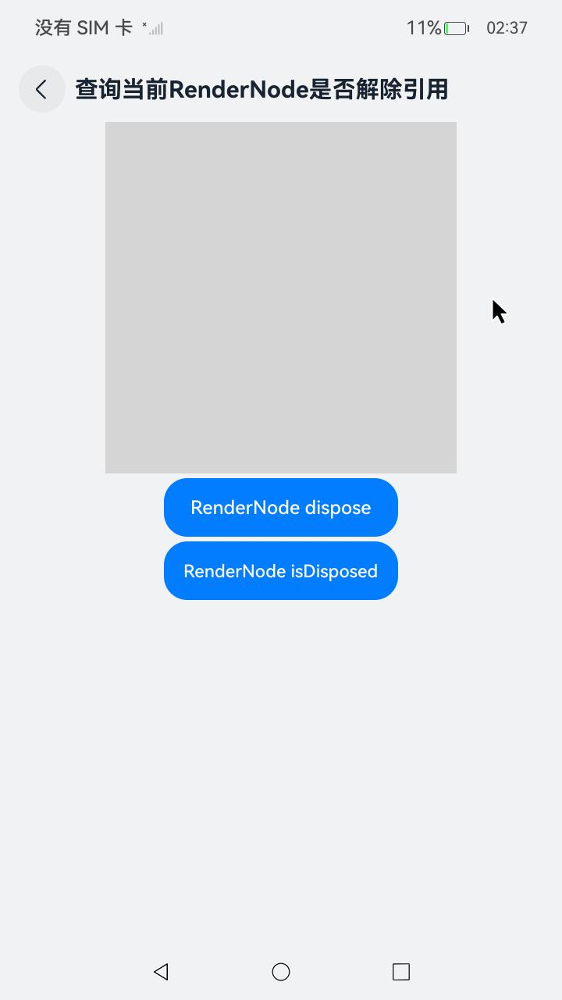

# 自定义渲染节点 (RenderNode)

## 介绍

对于不具备自己的渲染环境的三方框架，尽管已实现前端解析、布局及事件处理等功能，但仍需依赖系统的基础渲染和动画能力。[FrameNode](https://gitcode.com/openharmony/docs/blob/master/zh-cn/application-dev/ui/arkts-user-defined-arktsNode-frameNode.md)上的通用属性与通用事件对这类框架而言是冗余的，会导致多次不必要的操作，涵盖布局、事件处理等逻辑。

自定义渲染节点 (RenderNode)是更加轻量的渲染节点，仅具备与渲染相关的功能它提供了设置基础渲染属性的能力，以及节点的动态添加、删除和自定义绘制的能力。

本示例为 [自定义渲染节点 (RenderNode)](https://gitcode.com/openharmony/docs/blob/master/zh-cn/application-dev/ui/arkts-user-defined-arktsNode-renderNode.md) 的配套示例工程。

## 效果预览

| 首页 | 操作节点树 | 设置和获取渲染相关属性 | 自定义绘制 |
|-----|-----|-----|-----|
|  |  |  |  |
| 调整自定义绘制Canvas的变换矩阵 | C++获取Canvas，并进行自定义绘制操作 | 设置标签 | 查询当前RenderNode是否解除引用 |
|  |  |  |  |

## 使用说明
1. 在主界面，可以点击对应卡片，选择需要参考的示例。
2. 进入示例界面，查看参考示例。
3. 通过自动测试框架可进行测试及维护。


## 工程目录

```
entry/src/main/
├── cpp
│   ├── CMakeLists.txt
│   ├── native_bridge.cpp
│   └── types
│       └── libentry
│           └── Index.d.ts
└── ets
    ├── common
    │   ├── Card.ets
    │   ├── Route.ets
    │   └── resource.ets
    └── pages
        ├── CheckRanderNodeDisposed.ets
        ├── CustomDraw.ets
        ├── CustomDrawCanvas.ets
        ├── CustomDrawCanvasNative.ets
        ├── Index.ets
        ├── OperationNodeTree.ets
        ├── RenderingProperties.ets
        └── SetLabel.ets
```

## 具体实现

1. 创建和删除节点。
2. 操作节点树。
3. 设置和获取渲染相关属性。
4. 自定义绘制。
5. 调整自定义绘制Canvas的变换矩阵。

## 相关权限

不涉及

## 依赖

不涉及

## 约束和限制

1. 本示例支持标准系统上运行，支持设备：RK3568;

2. 本示例支持API22版本SDK，版本号：6.0.2.54;

3. 本示例已支持使DevEco Studio 5.1.1 Release (构建版本：5.1.1.840，构建 2025年10月20日)编译运行

## 下载

如需单独下载本工程，执行如下命令：

```bash
git init
git config core.sparsecheckout true
echo code/DocsSample/ArkUISample/NativeType/CustomRenderNode > .git/info/sparse-checkout
git remote add origin https://gitcode.com/openharmony/applications_app_samples.git
git pull origin master
```