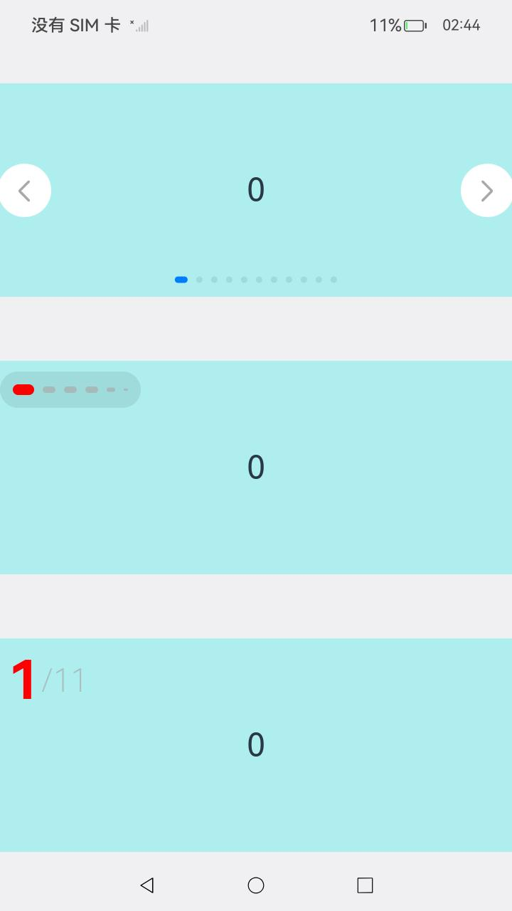

# Native_type_Sample

## 介绍

本示例展示了如何创建文本、输入框、文本域、滑动容器、视效、动效等组件，以及展示如何通过该头文件提供的各种函数来配置其特殊样式类、属性与事件设置等功能。

## 效果预览

| 首页 | Text页面                                              | Swiper页面                                              |
| ---- | ----------------------------------------------------- | ------------------------------------------------------- |
|      |  |  |

## 使用说明
1. 安装编译生成的hap包，并打开应用；
2. 进入首页，可选择不同模块页面。
3. 点击Text选择框进入Text组件的CAPI接口展示界面；
4. 点击Swiper选择框进入Swiper组件的CAPI接口展示界面；


## 工程目录

```
native_type_sample
entry/src/main/ets/
└── pages
    ├── Index.ets (获取导航页面)
    ├── page_accessibility.ets (无障碍界面)
    ├── page_embedded_component.ets (嵌入式组件界面)
    ├── page_swiper.ets (滑动容器页面)
    ├── page_animation.ets (动效界面)
    ├── page_visual_effects.ets (视效界面)
    └── page_text.ets (文本界面)

entry/src/main/
├── cpp
│   ├── types
│   │   └── libentry
│   │       └── Index.d.ts (函数对应的js映射)
│   ├── ArkUIAnimationNode.h
│   ├── ArkUIBaseNode.h
│   ├── ArkUIButtonNode.h
│   ├── ArkUIColumnNode.h
│   ├── ArkUINode.h
│   ├── ArkUINumber.h
│   ├── ArkUITextNode.h
│   ├── ArkUIVisualEffectsNode.h
│   ├── NativeModule.h
│   ├── CMakeLists.txt (CMake脚本)
|   ├── manager.cpp 
|   ├── manager.h
│   ├── napi_init.cpp
|   ├── .......
|   ├── baseUtils.cpp
|   ├── baseUtils.h
|   ├── SwiperMaker.cpp
|   ├── SwiperMaker.h
|   ├── TextMaker.cpp
│   ├── TextMaker.h
|   ├── AccessibilityMaker.cpp
│   ├── AccessibilityMaker.h
|   ├── EmbeddedComponentMaker.cpp
│   └── EmbeddedComponentMaker.h
└── resources
    ├── base
    │   ├── element
    │   │   ├── color.json
    │   │   ├── float.json
    │   │   └── string.json
    │   └── media
```

## 相关权限

不涉及

## 依赖

不涉及

## 约束和限制

1. 本示例支持标准系统上运行，支持设备：RK3568;

2. 本示例支持API20版本SDK，版本号：6.0.0.36;

3. 本示例已支持使DevEco Studio 5.1.1 Release (构建版本：5.1.1.840，构建 2025年9月20日)编译运行

## 下载

如需单独下载本工程，执行如下命令：

```bash
git init
git config core.sparsecheckout true
echo code/DocsSample/ArkUISample/NativeType/native_type_sample > .git/info/sparse-checkout
git remote add origin https://gitcode.com/openharmony/applications_app_samples.git
git pull origin master
```