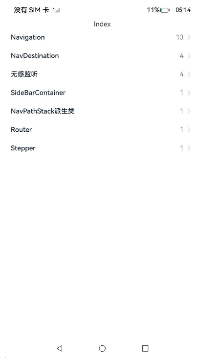

# ArkUI使用导航组件指南文档示例

### 介绍

本示例通过使用[ArkUI指南文档](https://gitee.com/openharmony/docs/tree/master/zh-cn/application-dev/ui)中各场景的开发示例，展示在工程中，帮助开发者更好地理解ArkUI提供的组件及组件属性并合理使用。该工程中展示的代码详细描述可查如下链接：

1. [Navigation](https://gitee.com/openharmony/docs/blob/master/zh-cn/application-dev/reference/apis-arkui/arkui-ts/ts-basic-components-navigation.md)。
2. [NavDestination](https://gitee.com/openharmony/docs/blob/master/zh-cn/application-dev/reference/apis-arkui/arkui-ts/ts-basic-components-navdestination.md)。
3. [无感监听](https://gitee.com/openharmony/docs/blob/master/zh-cn/application-dev/reference/apis-arkui/js-apis-arkui-observer.md)。
4. [SideBarContainer](https://gitee.com/openharmony/docs/blob/master/zh-cn/application-dev/reference/apis-arkui/arkui-ts/ts-container-sidebarcontainer.md)
5. [NavPathStack派生类](https://gitee.com/openharmony/docs/blob/master/zh-cn/application-dev/reference/apis-arkui/arkui-ts/ts-custom-component-api.md)
6. [Router](https://gitee.com/openharmony/docs/blob/master/zh-cn/application-dev/reference/apis-arkui/js-apis-router.md)
7. [Stepper](https://gitee.com/openharmony/docs/blob/master/zh-cn/application-dev/reference/apis-arkui/arkui-ts/ts-basic-components-stepper.md)

### 效果预览

| 首页                                 |
|------------------------------------|
|  |

### 使用说明

1. 在主界面，可以点击对应卡片，选择需要参考的组件示例。

2. 在组件目录选择详细的示例参考。

3. 进入示例界面，查看参考示例。

4. 通过自动测试框架可进行测试及维护。

### 工程目录
```
entry/src/main/ets/
|---entryability
|---pages
|   |---navDestination                       //NavDestination 
|   |   |---template1
|   |   |   |---Index.ets
|   |   |---template2
|   |   |   |---Index.ets
|   |   |---template3
|   |   |   |---Index.ets
|   |   |---template4
|   |   |   |---Index.ets
|   |---navigation                      //Navigation
|   |   |---template1
|   |   |   |---Index.ets
|   |   |---template2
|   |   |   |---Index.ets    
|   |   |---template3
|   |   |   |---Index.ets    
|   |   |---template4
|   |   |   |---Index.ets    
|   |   |---template5
|   |   |   |---Index.ets    
|   |   |---template6
|   |   |   |---Index.ets    
|   |   |---template7
|   |   |   |---Index.ets    
|   |   |---template8
|   |   |   |---Index.ets    
|   |   |---template9
|   |   |   |---Index.ets    
|   |   |---template10
|   |   |   |---Index.ets      
|   |   |---template11
|   |   |   |---Index.ets    
|   |   |---template12
|   |   |   |---Index.ets    
|   |   |---template13
|   |   |   |---Index.ets      
|   |---navPathStackExtend                             //NavPathStack派生类
|   |   |---template1
|   |   |   |---Index.ets
|   |---observer              //无感监听
|   |   |---template1
|   |   |   |---Index.ets
|   |   |---template2
|   |   |   |---Index.ets
|   |   |---template3
|   |   |   |---Index.ets
|   |   |---template4
|   |   |   |---Index.ets
|   |---router                  //Router
|   |   |---template1
|   |   |   |---Index.ets
|   |---sideBarContainer                 //SideBarContainer
|   |   |---template1
|   |   |   |---Index.ets   
|   |---stepper                      //Stepper
|   |   |---template1
|   |   |   |---Index.ets      
|---pages
|   |---Index.ets                       // 应用主页面
entry/src/ohosTest/
|---ets
|   |---test
|   |   |---NavDestination.test.ets                      // NavDestination示例代码测试代码
|   |   |---Navigation.test.ets                         // Navigation示例代码测试代码
|   |   |---QueryNavDestinationInfo.test.ets                         // NavPathStack派生类示例代码测试代码
|   |   |---Router.test.ets                       // Router示例代码测试代码
|   |   |---SideBarContainer.test.ets                       // SideBarContainer示例代码测试代码
|   |   |---Stepper.test.ets                       // Stepper示例代码测试代码
|   |   |---UiObserver.test.ets                    // 无感监听示例代码测试代码
```

### 相关权限

不涉及。
[README_zh.md](..%2FDialogProject%2FREADME_zh.md)
### 依赖

不涉及。

### 约束与限制

1.本示例仅支持标准系统上运行, 支持设备：RK3568。

2.本示例为Stage模型，支持API18版本SDK，版本[README_zh.md](..%2FVisionEffect%2FREADME_zh.md)号：5.1.0.56，镜像版本号：OpenHarmony_5.1.0.56。

### 下载

如需单独下载本工程，执行如下命令：

````
git init
git config core.sparsecheckout true
echo code/DocsSample/ArkUIDocSample/VisionEffect > .git/info/sparse-checkout
git remote add origin https://gitee.com/openharmony/applications_app_samples.git
git pull origin master
````