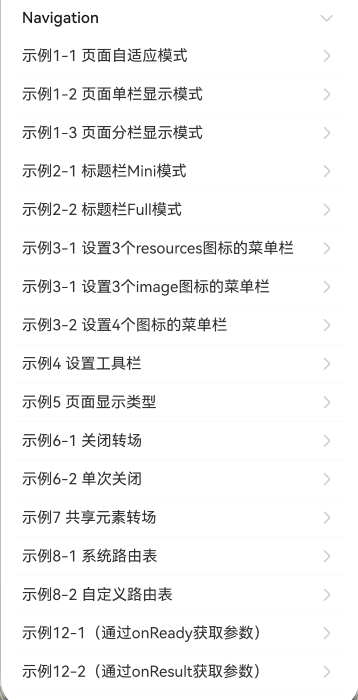

# 组件导航(Navigation) (推荐)指南文档示例

### 介绍

本示例展示了在一个Stage模型中，开发基于ArkTS UI的Navigation的应用

### 效果预览

| 首页                            |
|-------------------------------|
|  |

### 使用说明

1. 在主界面，可以点击对应卡片，选择需要参考的组件示例。

2. 在组件目录选择详细的示例参考。

3. 进入示例界面，查看参考示例。

4. 通过自动测试框架可进行测试及维护。

### 工程目录
```
entry/src/main/ets/
|---entryability
|---pages
|   |---navigation                      // Navigation
|   |   |---template1
|   |   |   |---image
|   |   |   |---CustomRoutingTable.ets
|   |   |   |---GeometryTransition.ets
|   |   |   |---MenusFour.ets
|   |   |   |---MenusThreeImage.ets
|   |   |   |---MenusThreeResource.ets
|   |   |   |---NavigationExample.ets
|   |   |   |---NavigationExampleOne.ets
|   |   |   |---NavigationExampleTwo.ets
|   |   |   |---PageDisplayModeAuto.ets
|   |   |   |---PageDisplayModeSplit.ets
|   |   |   |---PageDisplayModeStack.ets
|   |   |   |---PageDisplayType.ets
|   |   |   |---PageOnceClose.ets
|   |   |   |---PageOne.ets
|   |   |   |---TitleModeFull.ets
|   |   |   |---TitleModeMini.ets
|   |   |   |---ToolBar.ets
|   |   |---template2
|   |   |   |---Index.ets    
|   |   |   |---PageOne.ets    
|   |   |   |---PageTwo.ets      
|   |   |---template4
|   |   |   |---Index.ets    
|   |   |   |---PageOne.ets    
|   |   |   |---PageTwo.ets      
|   |   |---template7
|   |   |   |---PageOne.ets    
|   |   |   |---PageTwo.ets      
|   |---observer              // 监听
|   |   |---template1
|   |   |   |---Index.ets
|   |   |---template2
|   |   |   |---Index.ets
|   |   |---template3
|   |   |   |---Index.ets
|---pages
|   |---Index.ets                       // 应用主页面
entry/src/ohosTest/
|---ets
|   |---test
|   |   |---Navigation.test.ets                         // Navigation示例代码测试代码
|   |   |---UiObserver.test.ets                    // 无感监听示例代码测试代码
```

### 相关权限

不涉及。

### 依赖

不涉及。

### 约束与限制

1.  本示例支持标准系统上运行，支持设备：RK3568；

2. 本示例支持API20版本SDK，版本号：6.0.0.47；

3.  本示例已支持使DevEco Studio 6.0.0 Release (构建版本：6.0.0.858，构建 2025年10月24日)编译运行；

4. 高等级APL特殊签名说明：无；
### 下载

如需单独下载本工程，执行如下命令：

````
git init
git config core.sparsecheckout true
echo code/DocsSample/ArkUISample/NavigationSample > .git/info/sparse-checkout
git remote add origin https://gitcode.com/openharmony/applications_app_samples.git
git pull origin master
````