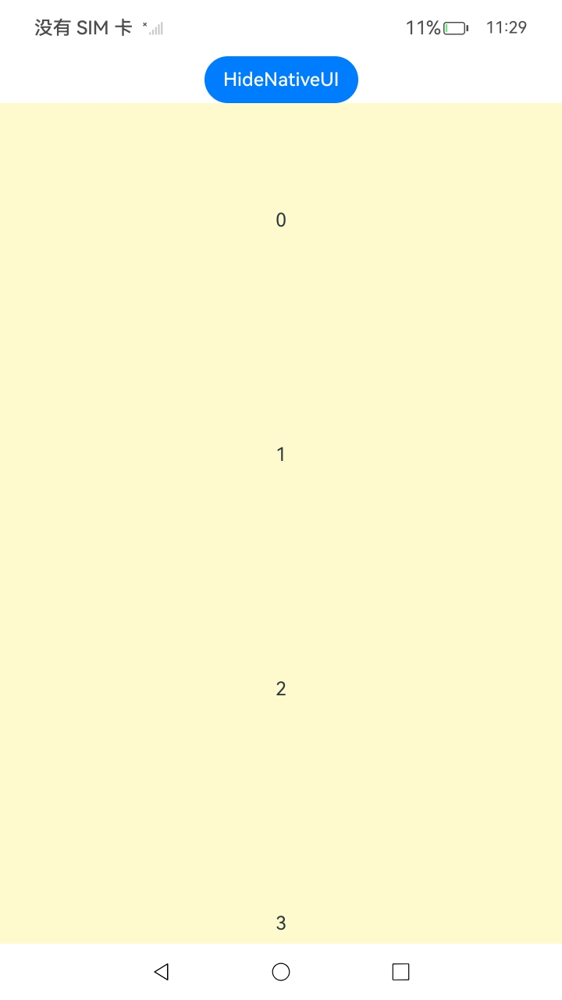
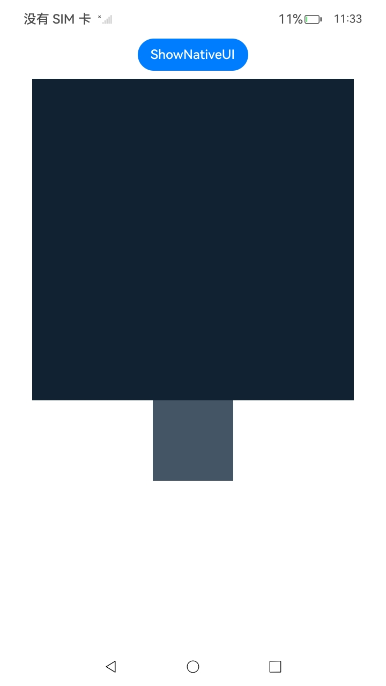
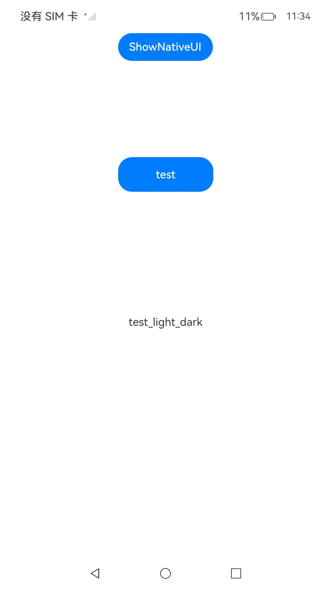
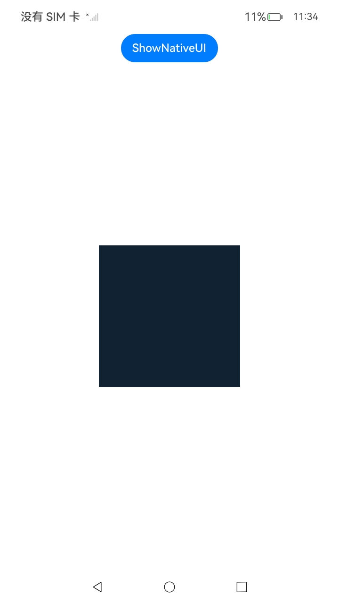

# ArkUI指南文档示例

### 介绍

ArkUI开发框架对UI组件的事件，提供了监听函数的方式。首先，可使用addNodeEventReceiver函数添加组件事件的监听器，该监听器会监听该组件上发生的所有事件，例如：点击事件、焦点事件。然后，可使用registerNodeEvent函数声明组件的哪些事件需要监听。

ArkUI开发框架主要提供点击手势、滑动手势、快滑手势、长按手势、捏合手势和旋转手势，通过给指定的组件绑定不同的手势并设置相应的回调，实现期望的手势交互能力。

该工程中展示的代码详细描述可查如下链接：

1. [监听组件事件](https://gitcode.com/openharmony/docs/blob/master/zh-cn/application-dev/ui/ndk-listen-to-component-events.md)。

2. [绑定手势事件](https://gitcode.com/openharmony/docs/blob/master/zh-cn/application-dev/ui/ndk-bind-gesture-events.md)。


### 效果预览

| 给点击添加相关事件         |
|--------------------------------------------------|
|  |

|自定义手势判定回调  |
|--------------------------------------------------------|
|            |

| 按钮点击监听事件 |
|---------------------------------------------------------------------------|
|                                 |

| 顺序识别长按和滑动手势|
|--------------------------------------------------------|
| |

| 并行识别长按和快滑手势                            |
|------------------------------------------|
|  |

| 互斥识别滑动手势和捏合手势                        |
|---------------------------------------------------|
|  |


### 使用说明

1. 在首页选择对应的测试界面。

2. 在对应的测试界面点击或滑动，观察日志。

### 工程目录
```
entry/
└── src
    ├── main
    │   ├── cpp
    │   │   ├── ArkUIBaseNode.h              
    │   │   ├── ArkUIListItemNode.h
    │   │   ├── ArkUIListNode.h
    │   │   ├── ArkUINode.h
    │   │   ├── ArkUITextNode.h
    │   │   ├── CMakeLists.txt
    │   │   ├── Common.h
    │   │   ├── Function.h
    │   │   ├── LongPressAndFlickGesture.h
    │   │   ├── LongPressAndSwipeGesture.h
    │   │   ├── NativeEntry.cpp
    │   │   ├── NativeEntry.h
    │   │   ├── NativeModule.h
    │   │   ├── NormalTextListExample.h             
    │   │   ├── SwipeAndPinchExclusiveGesture.h   
    │   │   ├── napi_init.cpp
    │   │   └── types
    │   │       └── libentry
    │   │           ├── Index.d.ts
    │   │           └── oh-package.json5
    │   ├── ets
    │   │   ├── entryability
    │   │   │   └── EntryAbility.ets
    │   │   ├── entrybackupability
    │   │   │   └── EntryBackupAbility.ets
    │   │   └── pages
    │   │       ├── BindGestureEvent.ets
    │   │       ├── ComponentListenEvent.ets
    │   │       ├── Index.ets
    │   │       ├── LongPressAndFlick.ets
    │   │       ├── LongPressAndSwipe.ets
    │   │       ├── NormalTextList.ets
    │   │       └── SwipeAndPinchExclusive.ets
```

### 具体实现

1. 事件注册和事件解注册，通过addNodeEventReceiver对节点绑定事件处理函数，接着通过调用registerNodeEvent注册对应的事件。源码参考：[NormalTextListExample.h](https://gitcode.com/openharmony/applications_app_samples/blob/master/code/DocsSample/ArkUISample/NdkAddInteractionEvent/entry/src/main/cpp/NormalTextListExample.h)

    * 事件监听函数的入参ArkUI_NodeEvent* event的生命周期只在函数回调周期内生效，不推荐对该指针进行缓存或者进行异步处理

    * 通过unregisterNodeEvent解注册对应的事件类型，再通过removeNodeEventReceiver卸载事件处理函数

    * 使用registerNodeEventReceiver注册全局的事件处理函数，对事件进行统一的处理，结束后可使用unregisterNodeEventReceiver进行释放

    * ArkUI框架提供了OH_ArkUI_NodeEvent_GetInputEvent()接口，用于从输入交互相关的组件事件（如NODE_ON_CLICK_EVENT、NODE_TOUCH_EVENT等，具体可参见每个枚举定义的说明）中获取基础事件对象。然后，可通过调用OH_ArkUI_PointerEvent_GetDisplayX()、OH_ArkUI_PointerEvent_GetDisplayXByIndex()、OH_ArkUI_UIInputEvent_GetAction()和OH_ArkUI_UIInputEvent_GetEventTime()等接口，从基础事件中获取更多信息。应用根据获取的事件信息，在事件执行过程中实现差异化交互逻辑

2. 手势绑定。源码参考：[LongPressAndSwipeGesture.h](https://gitcode.com/openharmony/applications_app_samples/blob/master/code/DocsSample/ArkUISample/NdkAddInteractionEvent/entry/src/main/cpp/LongPressAndSwipeGesture.h)

    * 创建一个Column节点，用于绑定手势

    * 创建一个单指长按1秒并持续响应的长按手势

    * 将创建的手势和步骤一中创建的Column节点绑定


### 相关权限

不涉及。

### 依赖

不涉及。

### 约束与限制

1.本示例仅支持标准系统上运行, 支持设备：RK3568。

2.本示例为Stage模型，支持API20版本SDK，版本号：6.0.0.41，镜像版本号：OpenHarmony_6.0.0.41。

3.本示例需要使用DevEco Studio 5.0.5 Release (Build Version: 5.0.13.200, built on May 13, 2025)及以上版本才可编译运行。

### 下载

如需单独下载本工程，执行如下命令：

````
git init
git config core.sparsecheckout true
echo code/DocsSample/ArkUISample/NdkAddInteractionEvent > .git/info/sparse-checkout
git remote add origin https://gitcode.com/openharmony/applications_app_samples.git
git pull origin master
````