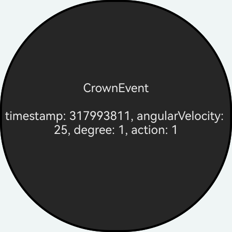

# NdkInputEvent

### 介绍

本示例基于[ui_input_event.h](https://gitcode.com/openharmony/docs/blob/master/zh-cn/application-dev/reference/apis-arkui/capi-ui-input-event-h.md)中的各接口进行构建，以帮助开发者更好地理解输入事件C-API的用法。

### 效果预览

| 首页                                 |
|------------------------------------|
|  |

### 使用说明

1. 在首页可以查看表冠事件的使用示例。

### 工程目录
```
entry/src/main/
├── cpp
│   ├── types
│   │   └── libentry
│   │       └── Index.d.ts          // native函数对应的js映射
│   ├── CMakeLists.txt              // CMake脚本
│   ├── common.h                    // 公共宏、工具函数和常量定义
│   ├── container.cpp
│   ├── container.h
│   ├── function.h                  // 创建文本实现CPP文件
│   ├── infos.h
│   ├── init.cpp
│   ├── manager.cpp                 // 示例入口逻辑实现
│   ├── manager.h
│   └── napi_init.cpp               // NAPI模块注册，导出JS可见的native函数
│
└── ets
    └── pages
        └── Index.ets               // 应用主页面（ArkTS UI），可调用native函数
```

### 相关权限

不涉及。

### 依赖

不涉及。

### 约束与限制

1.本示例仅支持标准系统上运行, 支持设备：手表。

2.本示例为Stage模型，支持API24版本SDK，版本号：6.1.1.33，镜像版本号：OpenHarmony_6.1.1.33。

3.本示例需要使用6.0.2.636，构建 2025年12月31日 及以上版本才可编译运行。

### 下载

如需单独下载本工程，执行如下命令：

````
git init
git config core.sparsecheckout true
echo code/DocsSample/ArkUISample/NdkInputEvent > .git/info/sparse-checkout
git remote add origin https://gitcode.com/openharmony/applications_app_samples.git
git pull origin master
````