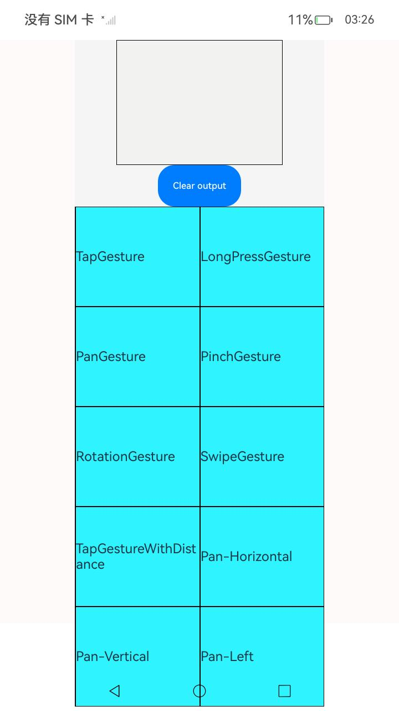

# NdkGestureSetting

### 介绍

本示例基于[native_gesture.h](https://gitcode.com/openharmony/docs/blob/master/zh-cn/application-dev/reference/apis-arkui/capi-native-gesture-h.md)中的各接口进行构建，以帮助开发者更好地理解手势框架C-API的用法。

### 效果预览

| 首页                                 |
|------------------------------------|
||

### 使用说明

1. 在首页可以查看多种手势C-API的使用示例，包括手势绑定、手势移除以及自定义手势判定。

2. 通过自动测试框架可进行测试及维护。

### 工程目录
```
entry/src/main/ets/
|---cpp
|     |---types
|     |---CMakeLists.txt
|     |---container.cpp
|     |---container.h
|     |---init.cpp
|     |---manager.cpp                       // 手势拦截示例代码
|     |---manager.h                         // manager头文件
|     |---napi_init.cpp
|---ets
|   |---pages
|   |   |---Index.ets                       // 应用主页面
entry/src/ohosTest/
|---ets
|   |---index.test.ets                       // 示例代码测试代码
```

### 相关权限

不涉及。

### 依赖

不涉及。

### 约束与限制

1.本示例仅支持标准系统上运行, 支持设备：RK3568。

2.本示例为Stage模型，支持API23版本SDK，版本号：6.1.0.19，镜像版本号：OpenHarmony_6.1.0.19。

3.本示例需要使用DevEco Studio 6.0.1 Beta1 (Build Version: 6.0.1.246, built on October 31, 2025)及以上版本才可编译运行。

### 下载

如需单独下载本工程，执行如下命令：

````
git init
git config core.sparsecheckout true
echo code/DocsSample/ArkUISample/NdkGestureSetting > .git/info/sparse-checkout
git remote add origin https://gitcode.com/openharmony/applications_app_samples.git
git pull origin master
````