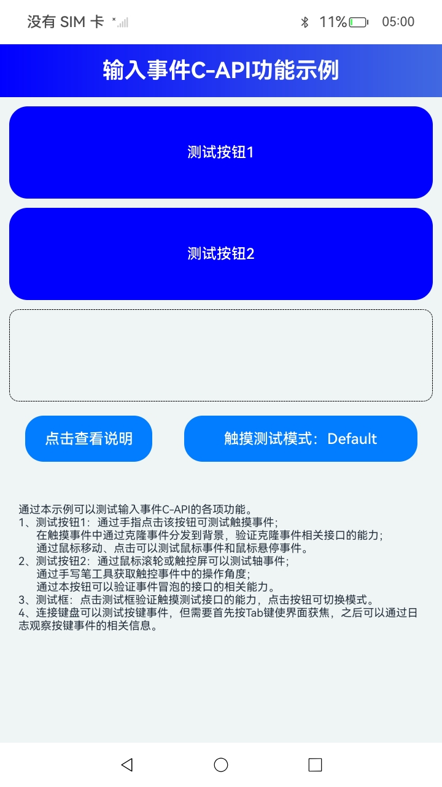

# NdkInputEvent

### 介绍

本示例基于[ui_input_event.h](https://gitcode.com/openharmony/docs/blob/master/zh-cn/application-dev/reference/apis-arkui/capi-ui-input-event-h.md)中的各接口进行构建，以帮助开发者更好地理解输入事件C-API的用法。

### 效果预览

| 首页                                 |
|------------------------------------|
|  |

### 使用说明

1. 在首页可以查看多种输入事件C-API的使用示例，包括单点或多点触摸事件、鼠标事件、轴事件、焦点轴事件等的示例。

2. 通过自动测试框架可进行测试及维护。

### 工程目录
```
entry/src/main/ets/
|---cpp
|     |---types
|     |---CMakeLists.txt
|     |---common.h
|     |---container.cpp
|     |---container.h
|     |---function.h                       // 输入事件示例代码
|     |---infos.h
|     |---init.cpp
|     |---manager.cpp                       // 示例入口
|     |---manager.h                         // manager头文件
|     |---napi_init.cpp
|---ets
|   |---pages
|   |   |---Index.ets                       // 应用主页面
```

### 相关权限

不涉及。

### 依赖

不涉及。

### 约束与限制

1.本示例仅支持标准系统上运行, 支持设备：RK3568。

2.本示例为Stage模型，支持API22版本SDK，版本号：6.0.2.55，镜像版本号：OpenHarmony_6.0.2.55。

3.本示例需要使用DevEco Studio 6.0.0 Release (Build Version: 6.0.0.868, built on October 22, 2025)及以上版本才可编译运行。

### 下载

如需单独下载本工程，执行如下命令：

````
git init
git config core.sparsecheckout true
echo code/DocsSample/ArkUISample/NdkInputEvent > .git/info/sparse-checkout
git remote add origin https://gitcode.com/openharmony/applications_app_samples.git
git pull origin master
````