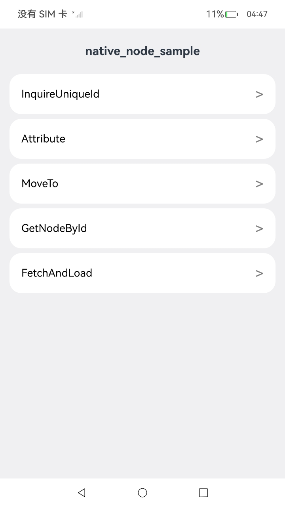
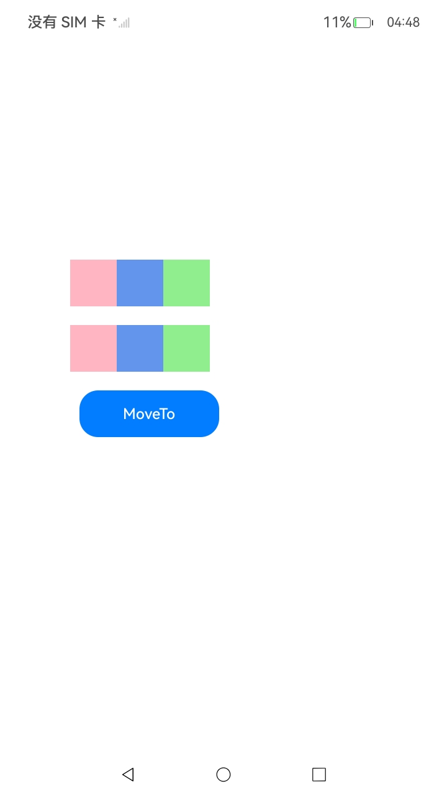
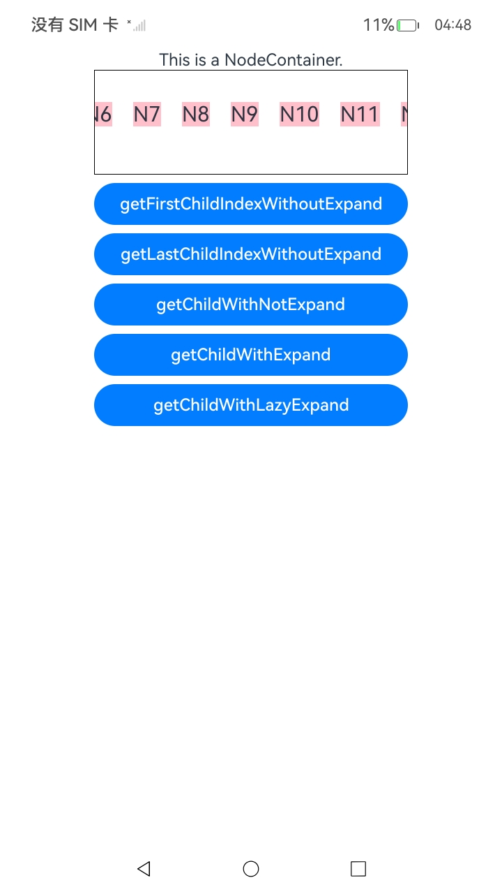

# ArkUI查询和操作自定义节点指南

## 介绍

本示例展示了如何通过使用以下接口，高效地访问和操控节点：

| 接口   | 接口描述     |
|------|--------| 
| OH_ArkUI_NodeUtils_GetNodeUniqueId | 获取目标节点的uniqueId。 |
| OH_ArkUI_NodeUtils_GetNodeHandleByUniqueId | 通过uniqueId获取节点。 |
| OH_ArkUI_NodeUtils_MoveTo | 将节点移动到目标父节点下，作为子节点。 |
| OH_ArkUI_NativeModule_InvalidateAttributes | 在当前帧触发节点属性更新。当前节点的属性在构建阶段之后被修改，这些改动不会立即生效，而是会延迟到下一帧统一处理。此功能会强制当前帧内的即时节点更新，确保同步应用渲染效果。|
| OH_ArkUI_NodeUtils_GetFirstChildIndexWithoutExpand | 获取目标节点在树上的第一个子节点的下标。 |
| OH_ArkUI_NodeUtils_GetLastChildIndexWithoutExpand | 获取目标节点在树上的最后一个子节点的下标。 |
| OH_ArkUI_NodeUtils_GetChildWithExpandMode | 用不同的展开模式获取对应下标的子节点。 |

### 示例文档
[节点查询](https://gitcode.com/openharmony/docs/blob/master/zh-cn/application-dev/ui/ndk-node-query-operate.md)。

## 效果预览
<table>
  <tr>
    <th>首页</th>
    <th>InquireUniqueId</th>
    <th>Attribute</th>
    <th>MoveTo</th>
    <th>GetNodeById</th>
    <th>FetchAndLoad</th>
  </tr>
  <tr>
    <td></td>
    <td></td>
    <td></td>
    <td></td>
    <td></td>
    <td></td>
  </tr>
</table>

## 具体实现

### 查询节点uniqueId及通过uniqueId获取节点信息

1. 基于[ArkTS页面](https://gitcode.com/openharmony/docs/blob/master/zh-cn/application-dev/ui/ndk-access-the-arkts-page.md)，创建前置工程；
2. 调用OH_ArkUI_NodeUtils_GetNodeUniqueId接口和OH_ArkUI_NodeUtils_GetNodeHandleByUniqueId接口；
3. 点击按钮，查看日志；

### 通过用户id获取节点信息

1. 基于[ArkTS页面](https://gitcode.com/openharmony/docs/blob/master/zh-cn/application-dev/ui/ndk-access-the-arkts-page.md)，创建前置工程；
2. ArkTS侧接入Native组件；
3. 创建Text节点并设置id属性，通过OH_ArkUI_NodeUtils_GetAttachedNodeHandleById接口拿到节点；
4. 挂载Native节点；
5. 运行程序，点击按钮，打印节点获取成功信息；

### 移动节点

1. 基于[ArkTS页面](https://gitcode.com/openharmony/docs/blob/master/zh-cn/application-dev/ui/ndk-access-the-arkts-page.md)，创建前置工程；
2. ArkTS侧接入Native组件；
3. 创建Stack节点，通过OH_ArkUI_NodeUtils_MoveTo接口移动Stack节点；
4. 挂载Native节点；
5. 运行程序，点击按钮，Stack节点会移动到目标位置；

### 在当前即时帧触发节点属性更新

1. 基于[ArkTS页面](https://gitcode.com/openharmony/docs/blob/master/zh-cn/application-dev/ui/ndk-access-the-arkts-page.md)，创建前置工程；
2. ArkTS侧接入Native组件；
3. 设置组件属性；
4. 挂载Native节点；
5. 运行程序，点击按钮，切换图片正常展示；

### 用不同的展开模式获取对应下标的子节点

1. 基于[ArkTS页面](https://gitcode.com/openharmony/docs/blob/master/zh-cn/application-dev/ui/ndk-access-the-arkts-page.md)，创建前置工程；
2. 通过ArkTS构造LazyForEach及ArkTS的下树节点；
3. 通过OH_ArkUI_NodeUtils_GetAttachedNodeHandleById接口获取ArkTS组件，并通过懒展开模式获取对应的子组件信息；
4. 查看日志打印的对应错误码返回是否正确；

## 使用说明
1. 安装编译生成的hap包，并打开应用；
2. 进入首页，可选择不同模块页面。
3. 点击Text选择框进入Text组件的CAPI接口展示界面；
4. 点击Swiper选择框进入Swiper组件的CAPI接口展示界面；
5. 点击Public选择框进入通用属性的CAPI接口展示界面；
6. 点击Form选择框进入表单组件的CAPI接口展示界面；
7. 点击ImageSpan选择框进入ImageSpan组件的CAPI接口展示界面；属性值设置为“none”时，图片效果以代码默认值展示。

## 工程目录

```
entry/src/main/cpp/
├── ArkUIBaseNode.h
├── ArkUINode.h
├── Attribute_util.h
├── CMakeLists.txt (CMake脚本)
├── GetNodeByIdExample.h
├── InquireUniqueId.cpp
├── InquireUniqueId.h
├── GridIrregularIndexesMaker.h
├── MoveTo.h
├── napi_init.cpp
├── NativeEntry.cpp
├── NativeEntry.h
├── NativeModule.h
└── ShowSubcomponentInfo.h

entry/src/main/ets/
├── entryability
│   └── EntryAbility.ets
├── entrybackupability
│   └── EntryBackupAbility.ets
└── pages
    ├── Attribute.ets      (Form页面)
    ├── FetchAndLoad.ets      (Form页面)
    ├── GetNodeById.ets      (Form页面)
    ├── Index.ets          (获取导航页面)
    ├── InquireUniqueId.ets  (Grid页面)
    └── MoveTo.ets   (imagespan页面)

entry/src/main/resources/
├── base
│   ├── element
│   │   ├── color.json
│   │   ├── float.json
│   │   └── string.json
│   ├── media
│   │   ├── background.png
│   │   ├── foreground.png
│   │   ├── layered_image.json
│   │   └── startIcon.png
│   └── profile
│       ├── backup_config.json
│       └── main_pages.json
├── dark
│   └── element
│       └── color.json
└── rawfile

entry/src/ohosTest/ets/test
├── Ability.test.ets
├── List.test.ets
└── Public.test.ets (通用属性测试用例)
```

## 相关权限

不涉及

## 依赖

不涉及

## 约束和限制

1. 本示例支持标准系统上运行，支持设备：RK3568;

2. 本示例支持API22版本SDK，版本号：6.0.2.54;

3. 本示例已支持使DevEco Studio 5.1.1 Release (构建版本：5.1.1.840，构建 2025年9月20日)编译运行

## 下载

如需单独下载本工程，执行如下命令：

```
git init
git config core.sparsecheckout true
echo code/DocsSample/ArkUISample/NdkNodeQueryOperate > .git/info/sparse-checkout
git remote add origin https://gitcode.com/openharmony/applications_app_samples.git
git pull origin master
```