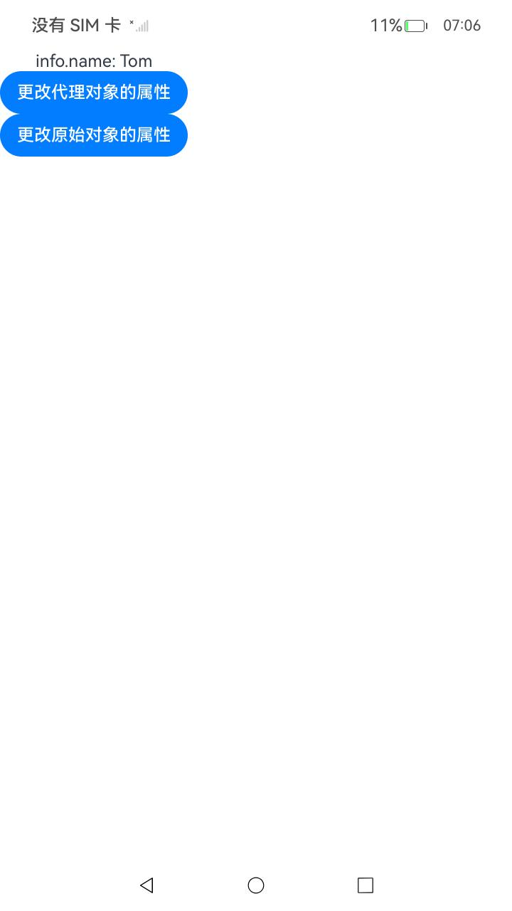
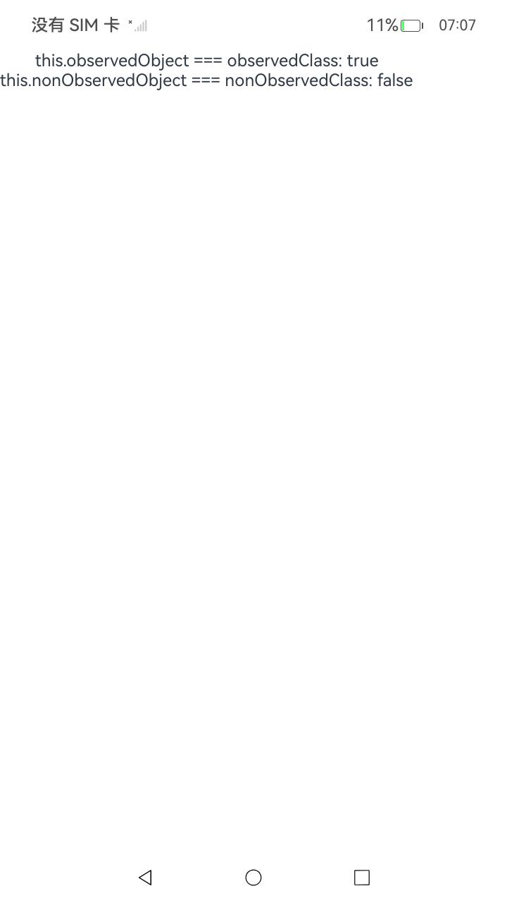
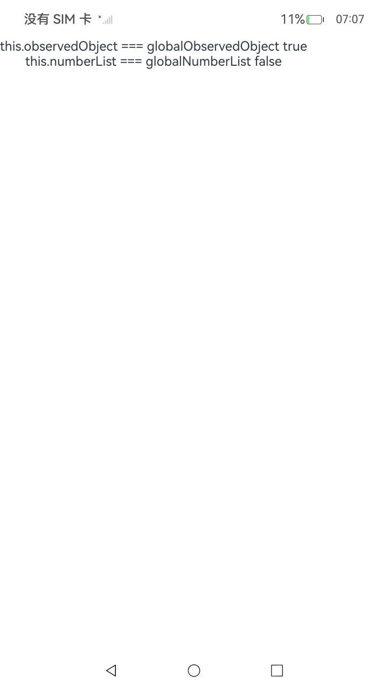
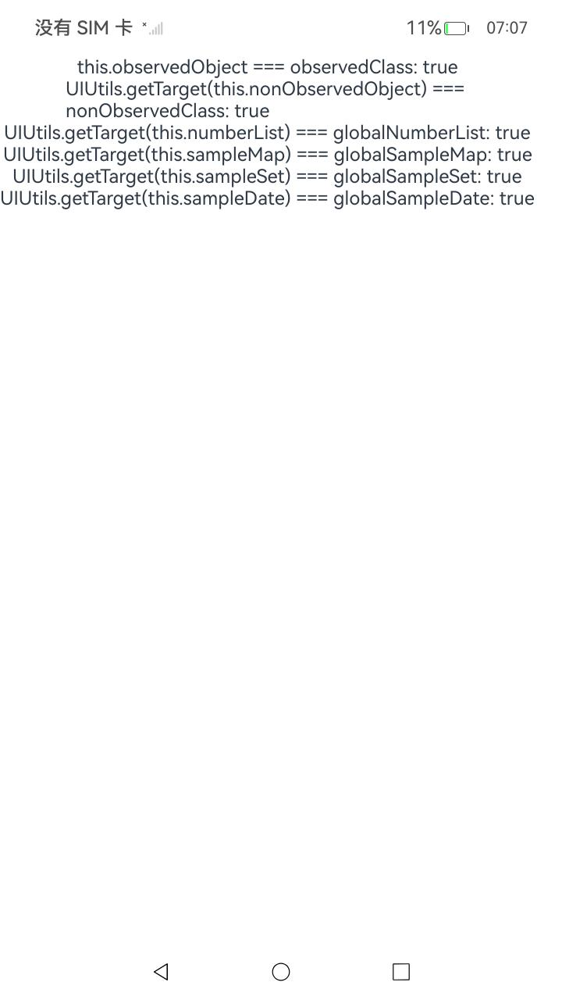

# ArkUI使用模态组件指南文档示例

### 介绍

本示例通过使用[ArkUI指南文档](https://gitcode.com/openharmony/docs/tree/master/zh-cn/application-dev/ui)中各场景的开发示例，展示在工程中，帮助开发者更好地理解ArkUI提供的组件及组件属性并合理使用。该工程中展示的代码详细描述可查如下链接：

### 1.[线性容器(Column)](https://docs.openharmony.cn/pages/v4.1/zh-cn/application-dev/reference/apis-arkui/arkui-ts/ts-container-column.md)

### 2.[文本显示器(Text)](https://docs.openharmony.cn/pages/v5.1/en/application-dev/reference/apis-arkui/arkui-ts/ts-basic-components-text.md)

### 3.[Button](https://docs.openharmony.cn/pages/v4.1/zh-cn/application-dev/reference/apis-arkui/arkui-ts/ts-basic-components-button.md)

### 3[ getTarget接口：获取状态管理框架代理前的原始对象](https://docs.openharmony.cn/pages/v5.1/zh-cn/application-dev/ui/state-management/arkts-new-getTarget.md)

### 效果预览

| 不会触发UI刷新页面                          | 不重复创建代理                             | 使用UIUtils.getTarget接口可以获取代理前的原始对象1  | 获取状态管理V2代理前的原始对象                    | 使用UIUtils.getTarget接口可以获取代理前的原始对象2  |
|-------------------------------------|-------------------------------------|-------------------------------------|-------------------------------------|:------------------------------------|
|  |  |  |  |  |


### 使用说明

1. 在主界面，可以点击对应按钮，选择需要参考的代码示例。

2. 在组件目录选择详细的示例参考。

3. 进入示例界面，查看参考示例。

4. 通过自动测试框架可进行测试及维护。

### 具体实现
1. 基本功能与用途
核心作用：获取状态管理框架代理前的原始对象
解决问题：解决代理导致的类型判断异常和 NAPI 调用问题
适用范围：支持 V1 和 V2 状态管理框架的代理对象
使用方式：UIUtils.getTarget(proxiedObject)
2. 关键限制条件
支持类型：仅支持对象类型（Class、Date、Map、Set、Array）
重要限制：
非对象类型传入会报错
更改原始对象内容不会触发 UI 刷新
使用注意：主要用于类型比较和 NAPI 调用，不用于状态更新
3. 状态管理 V1 使用场景
代理场景：
@Observed 装饰的类实例（new 操作时自动代理）
状态变量装饰器（@State、@Prop 等）装饰的复杂类型
使用示例：获取 @State 装饰的非 @Observed 类对象的原始对象
特点：已被代理的对象不会重复代理
4. 状态管理 V2 使用场景
代理场景：仅代理状态变量装饰器（@Trace、@Local 等）装饰的集合类型
使用示例：获取 @Local 装饰的 Array/Map/Set/Date 的原始对象
特殊处理：
类对象不被代理，直接返回自身
不会处理 @ObservedV2 类的 "_ob" 前缀属性
某些 NAPI 接口需要使用带前缀的属性名

### 工程目录

```
NewGettarget
├─ AppScope
│  ├─ app.json5
│  └─ resources
│     └─ base
│        ├─ element
│        │  └─ string.json
│        └─ media
│           ├─ background.png
│           ├─ foreground.png
│           └─ layered_image.json
├─ code-linter.json5
├─ entry
│  ├─ hvigorfile.ts
│  ├─ obfuscation-rules.txt
│  ├─ oh-package.json5
│  └─ src
│     ├─ main
│     │  ├─ ets
│     │  │  ├─ entryability
│     │  │  │  └─ EntryAbility.ets
│     │  │  ├─ entrybackupability
│     │  │  │  └─ EntryBackupAbility.ets
│     │  │  ├─ model         // 数据类型文件
│     │  │  │  ├─ ModelViewOne.ets
│     │  │  │  └─ ModelViewTwo.ets
│     │  │  ├─ pages
│     │  │  │  └─ Index.ets  // 启动页
│     │  │  └─ View
│     │  │     ├─ GetTargetObject.ets //更改getTarget获取的原始对象中的内容不会被观察到变化，也不会触发UI刷新
│     │  │     ├─ GetTargetNoChange.ets //获取状态管理V1代理前的原始对象
│     │  │     ├─ GetTargetAgent.ets //使用UIUtils.getTarget接口可以获取代理前的原始对象
│     │  │     ├─ GetAgentObject.ets //获取状态管理V2代理前的原始对象
│     │  │     └─ GetBeforeAgent.ets //状态管理V2装饰器会为装饰的变量生成getter和setter方法
│     │  ├─ module.json5
│     │  └─ resources
│     │     ├─ base
│     │     │  ├─ element
│     │     │  │  ├─ color.json
│     │     │  │  ├─ float.json
│     │     │  │  └─ string.json
│     │     │  ├─ media
│     │     │  │  ├─ background.png
│     │     │  │  ├─ foreground.png
│     │     │  │  ├─ layered_image.json
│     │     │  │  └─ startIcon.png
│     │     │  └─ profile
│     │     │     ├─ backup_config.json
│     │     │     └─ main_pages.json
│     │     ├─ dark
│     │     │  └─ element
│     │     │     └─ color.json
│     │     └─ rawfile
│     ├─ mock
│     │  └─ mock-config.json5
│     ├─ ohosTest
│     │  ├─ ets
│     │  │  └─ test
│     │  │     ├─ Ability.test.ets
│     │  │     ├─ index.test.ets
│     │  │     └─ List.test.ets
│     │  └─ module.json5
│     └─ test
│        ├─ List.test.ets
│        └─ LocalUnit.test.ets
├─ hvigor
│  └─ hvigor-config.json5
├─ hvigorfile.ts
├─ oh-package-lock.json5
├─ oh-package.json5
├─ ohosTest.md
├─ README_zh.md
└─ screenshots  // 截图
   └─ device
      ├─ iamge3.jpeg
      ├─ image1.jpeg
      ├─ image2.jpeg
      ├─ image4.jpeg
      └─ image5.jpeg

```

### 相关权限

不涉及。

### 依赖

不涉及。

### 约束与限制

1.本示例仅支持标准系统上运行, 支持设备：RK3568。

2.本示例为Stage模型，支持API20版本SDK，版本号：6.0.0.33，镜像版本号：OpenHarmony_6.0.0.33。

3.本示例需要使用DevEco Studio 6.0.0 Canary1 (Build Version: 6.0.0.270， built on May 9, 2025)及以上版本才可编译运行。

### 下载

如需单独下载本工程，执行如下命令：

````
git init
git config core.sparsecheckout true
echo code/DocsSample/ArkUISample/NewGettarget > .git/info/sparse-checkout
git remote add origin https://gitcode.com/openharmony/applications_app_samples.git
git pull origin master
````