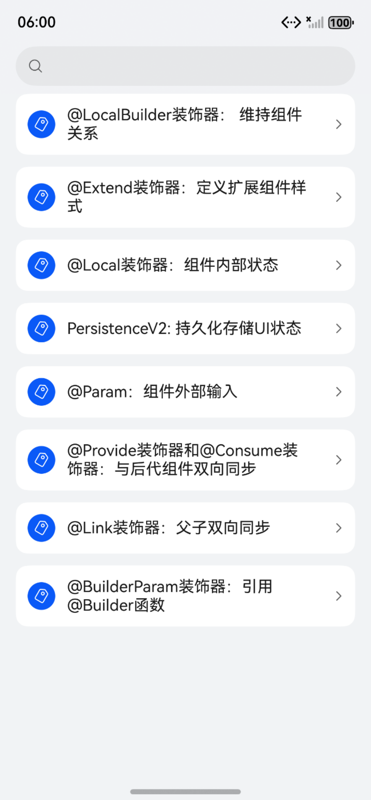
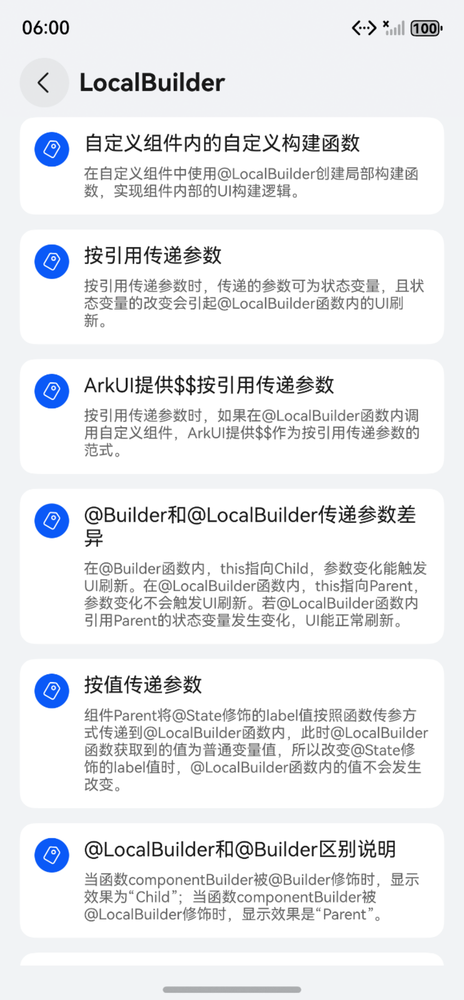
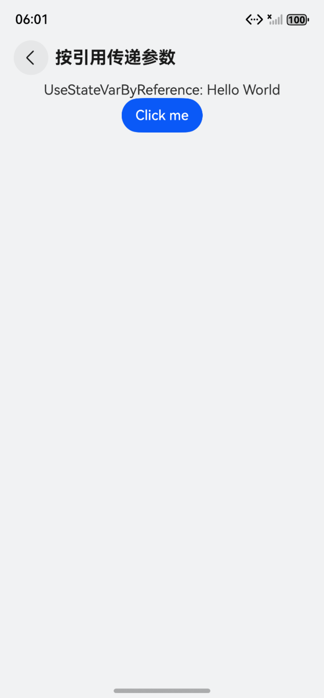

# ArkUI使用组件扩展文档示例

### 介绍

本示例通过使用[ArkUI指南文档](https://gitcode.com/openharmony/docs/tree/master/zh-cn/application-dev/ui)中各场景的开发示例，展示在工程中，帮助开发者更好地理解ArkUI提供的组件及组件属性并合理使用。该工程中展示的代码详细描述可查如下链接：

1. [@LocalBuilder装饰器： 维持组件关系](https://gitcode.com/openharmony/docs/blob/master/zh-cn/application-dev/ui/state-management/arkts-localBuilder.md)
2. [@Extend装饰器：定义扩展组件样式](https://gitcode.com/openharmony/docs/blob/master/zh-cn/application-dev/ui/state-management/arkts-extend.md)
3. [$$语法：系统组件双向同步](https://gitcode.com/openharmony/docs/blob/master/zh-cn/application-dev/ui/state-management/arkts-two-way-sync.md)
4. [@Local装饰器：组件内部状态](https://gitcode.com/openharmony/docs/blob/master/zh-cn/application-dev/ui/state-management/arkts-new-local.md)
5. [数据对象状态变量的迁移指导](https://gitcode.com/openharmony/docs/blob/master/zh-cn/application-dev/ui/state-management/arkts-v1-v2-migration-inner-class.md)
6. [PersistenceV2: 持久化存储UI状态](https://gitcode.com/openharmony/docs/blob/master/zh-cn/application-dev/ui/state-management/arkts-new-persistencev2.md)
7. [@Param：组件外部输入](https://gitcode.com/openharmony/docs/blob/master/zh-cn/application-dev/ui/state-management/arkts-new-param.md)
8. [@Provide装饰器和@Consume装饰器：与后代组件双向同步](https://gitcode.com/openharmony/docs/blob/master/zh-cn/application-dev/ui/state-management/arkts-provide-and-consume.md)
9. [@Monitor装饰器：状态变量修改监听](https://gitcode.com/openharmony/docs/blob/master/zh-cn/application-dev/ui/state-management/arkts-new-monitor.md)
10. [@State装饰器：组件内状态](https://gitcode.com/openharmony/docs/blob/master/zh-cn/application-dev/ui/state-management/arkts-state.md)
11. [应用内状态变量及其它场景迁移指南](https://gitcode.com/openharmony/docs/blob/master/zh-cn/application-dev/ui/state-management/arkts-v1-v2-migration-application-and-others.md)
### 效果预览

| 首页                                 | 列表类组件目录                            | 列表中显示数据示例                            |
|------------------------------------|------------------------------------|------------------------------------|
|  |  |  |

### 使用说明

1. 在主界面，可以点击对应卡片，选择需要参考的组件示例。

2. 在组件目录选择详细的示例参考。

3. 进入示例界面，查看参考示例。

4. 通过自动测试框架可进行测试及维护。

### 工程目录
```
entry/src/main/ets/
|---ParadigmStateManagement
|---pages
|   |---localBuilder                		    //@LocalBuilder装饰器： 维持组件关系  
|   |       |---BuilderLabelDiff.ets
|   |       |---BuilderThisDiff.ets
|   |       |---CustomBuilderInComponent.ets
|   |       |---ParentRefSync.ets
|   |       |---ReferencePassing.ets
|   |       |---V2LocalBuilderUpdate.ets
|   |       |---ValuePassing.ets
|   |       |---index.ets
|   |---extend                       		   //@Extend装饰器：定义扩展组件样式 
|   |       |---ExtendFunctionHandle.ets
|   |       |---ExtendParameterUsage.ets
|   |       |---ExtendPositiveExample.ets
|   |       |---ExtendUIStateVariable.ets
|   |       |---ExtendUsageScenario.ets
|   |       |---ExtendUsageScenariotwo.ets
|   |       |---GlobalFunctionExtension.ets
|   |       |---index.ets 
|   |---syncStateManager              		   //$$语法：系统组件双向同步
|   |       |---SyncUsageExample.ets
|   |       |---index.ets 
|   |---local	                    	       //@Local装饰器：组件内部状态
|   |       |---LocalObserveChangesArray.ets
|   |       |---LocalObserveChangesDecorator.ets
|   |       |---LocalObserveChangesDeepObject.ets
|   |       |---LocalObserveChangesType.ets
|   |       |---LocalQuestionExpectedEffect.ets
|   |       |---LocalQuestionSparkUpdate.ets
|   |       |---LocalQuestionUIUtils.ets
|   |       |---LocalQuestionV2animateTo.ets
|   |       |---LocalUseCaseArray.ets
|   |       |---LocalUseCaseDate.ets
|   |       |---LocalUseCaseJoin.ets
|   |       |---LocalUseCaseMap.ets
|   |       |---LocalUseCaseObject.ets
|   |       |---LocalUseCaseSet.ets
|   |       |---LocalV1StateDecorator.ets
|   |       |---index.ets 
|   |---migrationDataObjectVariables             //数据对象状态变量的迁移指导
|   |       |---MigrationClassAttributeV1.ets
|   |       |---MigrationClassAttributeV2.ets
|   |       |---MigrationNestedObjectPropertiesV1.ets
|   |       |---MigrationNestedObjectPropertiesV2.ets
|   |       |---index.ets 
|   |---persistenceV2                            //PersistenceV2: 持久化存储UI状态
|	|		|---pages
|   |       |	|---Page1.ets
|   |       |	|---Page2.ets
|   |       |---PersistenceV2ConnectMigration1.ets
|   |       |---PersistenceV2ConnectMigration2.ets
|   |       |---PersistenceV2GlobalConnect.ets
|   |       |---PersistenceV2ModuleConnectStorage1.ets
|   |       |---PersistenceV2ModuleConnectStorage2.ets
|   |       |---Sample.ets
|   |       |---index.ets 
|   |---param		                            //@Param：组件外部输入
|   |       |---ParamDecoratorLimitations.ets
|   |       |---ParamObserveChangeArray.ets
|   |       |---ParamObserveChangeClass.ets
|   |       |---ParamObserveChangeNestedClass.ets
|   |       |---ParamObserveChangeVariable.ets
|   |       |---ParamRestrictInitialize.ets
|   |       |---ParamRestrictModifyObject.ets
|   |       |---ParamRestrictV2.ets
|   |       |---ParamUseSceneArray.ets
|   |       |---ParamUseSceneDate.ets
|   |       |---ParamUseSceneMap.ets
|   |       |---ParamUseSceneParentToChild.ets
|   |       |---ParamUseSceneSet.ets
|   |       |---ParamUseSceneUnite.ets
|   |       |---index.ets 
|   |---provideAndConsume                  //@Provide装饰器和@Consume装饰器：与后代组件双向同步
|   |       |---ProvideConsumeBidirectionalSync.ets
|   |       |---ProvideConsumeBuilderNode.ets
|   |       |---ProvideConsumeDateSync.ets
|   |       |---ProvideConsumeDecoratedVariable.ets
|   |       |---ProvideConsumeFederation.ets
|   |       |---ProvideConsumeMapSync.ets
|   |       |---ProvideConsumeProperDemo.ets
|   |       |---ProvideConsumeProperDemoTwo.ets
|   |       |---ProvideConsumeProvideAllowOverride.ets
|   |       |---ProvideConsumeProvideError.ets
|   |       |---ProvideConsumeSetSync.ets
|   |       |---ProvideConsumeThisObject.ets
|   |       |---ProvideConsumeTwoWay.ets
|   |       |---index.ets 
|   |---monitor                            //@Monitor装饰器：状态变量修改监听
|   |       |---MonitorDecoratorArraySupport.ets
|   |       |---MonitorDecoratorInheritanceSupportObservedV2.ets
|   |       |---MonitorDecoratorLastWrite.ets
|   |       |---MonitorDecoratorMultiWatchCompV2.ets
|   |       |---MonitorDecoratorMultiWatchObservedV2.ets
|   |       |---MonitorDecoratorObjectSupport.ets
|   |       |---MonitorDecoratorObjectTraceCompV2.ets
|   |       |---MonitorDecoratorObjectTraceObservedV2.ets
|   |       |---MonitorLimitationCallbackWirelessLoop.ets
|   |       |---MonitorLimitationMultiplePathParams.ets
|   |       |---MonitorLimitationLastListenerWins.ets
|   |       |---MonitorLimitationParameterStringConstraint.ets
|   |       |---MonitorProblemClassDelayed.ets
|   |       |---MonitorProblemClassFailureTimeEmptyObject.ets
|   |       |---MonitorProblemClassFailureTimeSetComp.ets
|   |       |---MonitorProblemEffectTimeClass.ets
|   |       |---MonitorProblemEffectTimeCompV2.ets
|   |       |---MonitorProblemParamCounterExample1.ets
|   |       |---MonitorProblemParamCounterExample2.ets
|   |       |---MonitorProblemParamPositiveExample1.ets
|   |       |---MonitorProblemParamPositiveExample2.ets
|   |       |---MonitorProblemParamStateVariables.ets
|   |       |---MonitorProblemStateChangeUseAddMonitor.ets
|   |       |---MonitorSceneDeepAttributeChanges.ets
|   |       |---WatchDecoratorLimitationsV1.ets
|   |       |---index.ets 
|---pages
|   |---Index.ets                       // 应用主页面
entry/src/ohosTest/
|---ets
|   |---index.test.ets                       // 示例代码测试代码
```
### 具体实现

以下是对各类装饰器及相关机制具体实现的总结：


### 1. @LocalBuilder 装饰器
- **核心功能**：维持组件父子关系，解决局部@Builder使用.bind(this)时上下文变更导致的父子关系与状态管理关系不一致问题。
- **特性**：具备局部@Builder的全部功能，且能更精准地确定组件父子关系及状态管理的对应关系。


### 2. @Extend 装饰器
- **核心功能**：扩展组件样式，在@Styles样式重用的基础上，提供更灵活的组件样式扩展能力，便于统一管理和复用组件样式。


### 3. $$语法
- **核心功能**：为系统组件提供TS变量引用，实现TS变量与系统组件内部状态的双向同步。
- **说明**：内部状态含义因组件而异（如TextInput的text参数），通过该语法自动保持变量与组件状态的一致性。


### 4. @Local 装饰器
- **核心功能**：标记组件内部状态变量，使其具备变化观测能力，驱动UI刷新。
- **关键特性**：
    - 必须在组件内部初始化，无法从外部初始化。
    - 支持基本类型（number、boolean等）、对象、数组及内嵌类型（Array、Set等）的观测。
    - 观测范围：简单类型监测赋值变化；对象类型仅监测整体赋值；数组及内嵌类型可监测整体、元素变化及API调用导致的变化。
    - 触发刷新：变量变化时，自动刷新使用该变量的组件。


### 5. 数据对象状态变量迁移（@ObservedV2/@Trace）
- **迁移背景**：替代V1中的@ObjectLink/@Observed/@Track，优化类对象及嵌套属性的观测能力。
- **核心功能**：
    - @ObservedV2与@Trace配合，实现类对象及嵌套属性的深度观测，无需依赖自定义组件。
    - @Trace替代@Track，支持属性级别的精确更新，简化代码并提升UI刷新效率。
    - 场景优化：直接观测嵌套对象属性，省去V1中多层级组件传递的繁琐。


### 6. PersistenceV2 持久化存储
- **核心功能**：单例对象，持久化存储UI相关状态数据，确保应用重启后数据与关闭时一致。
- **关键特性**：
    - 通过connect（模块级存储）或globalConnect（应用级存储）绑定key，实现状态变化及冷启动时的持久化。
    - 关联@ObservedV2对象时，@Trace属性变化触发自动持久化，非@Trace属性需手动调用API持久化。
    - 支持主线程内多UIAbility实例间的状态共享。


### 7. @Param 装饰器
- **核心功能**：接收组件外部输入，实现父子组件数据同步，支持与@Local变量同步。
- **关键特性**：
    - 支持本地初始化，但内部不可直接修改，值由外部传入数据源同步。
    - 接收任意类型数据源（普通变量、状态变量等），复杂类型（如类对象）接收引用，修改内部属性可同步至数据源。
    - 变量变化时，刷新关联组件。


### 8. @Provide 与 @Consume 装饰器
- **核心功能**：跨层级组件双向数据同步，摆脱父子组件参数传递机制，适用于多层级状态传递。
- **关键特性**：
    - @Provide在祖先组件提供状态，@Consume在后代组件消费状态，双向同步。
    - 通过变量名或别名绑定（类型需一致），支持多种绑定方式（如变量名匹配、别名匹配等）。
    - API 20+支持@Consume设置默认值，跨BuilderNode同步（需配置enableProvideConsumeCrossing）。


### 9. @Monitor 装饰器
- **核心功能**：监听V2状态变量的修改，提供深度监听能力。
- **关键特性**：
    - 适用场景：仅监听被@Local、@Param、@Provide、@Consume、@Computed等装饰的状态变量，或@ObservedV2类中@Trace装饰的属性。
    - 触发机制：属性变化（严格相等判断为false）时调用回调，一次事件中多属性变化仅触发一次回调。
    - 深度监听：支持嵌套类、多维数组、对象数组中指定项的变化（需配合@ObservedV2和@Trace）。
    - 与@Watch对比：直接装饰回调函数，而非指定函数名，功能更聚焦于状态变化监听。


以上机制共同构成了ArkTS中组件状态管理、样式扩展、数据同步及持久化的核心实现，覆盖了从组件内部状态到跨层级、跨实例数据交互的全场景需求。
### 相关权限

不涉及。

### 依赖

不涉及。

### 约束与限制

1.本示例仅支持标准系统上运行, 支持设备：RK3568。

2.本示例为Stage模型，支持API18版本full-SDK，版本号：5.1.0.107，镜像版本号：OpenHarmony_5.1.0 Release。

3.本示例需要使用DevEco Studio 5.0.5 Release (Build Version: 5.0.13.200， built on May 13, 2025)及以上版本才可编译运行。

### 下载

如需单独下载本工程，执行如下命令：

````
git init
git config core.sparsecheckout true
code/DocsSample/ArkUISample/ParadigmStateManagement > .git/info/sparse-checkout
git remote add origin https://gitcode.com/openharmony/applications_app_samples.git
git pull origin master
````